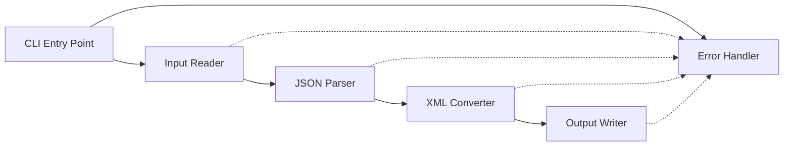
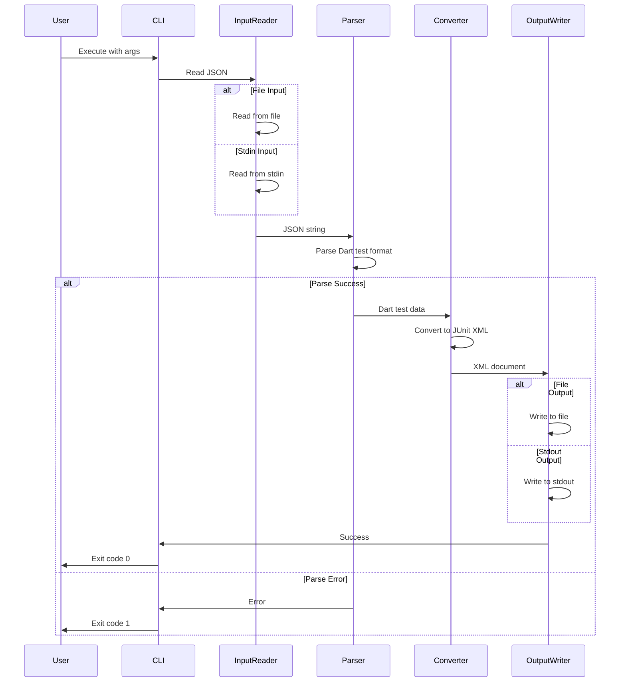
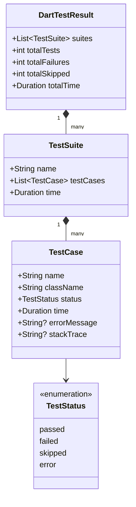
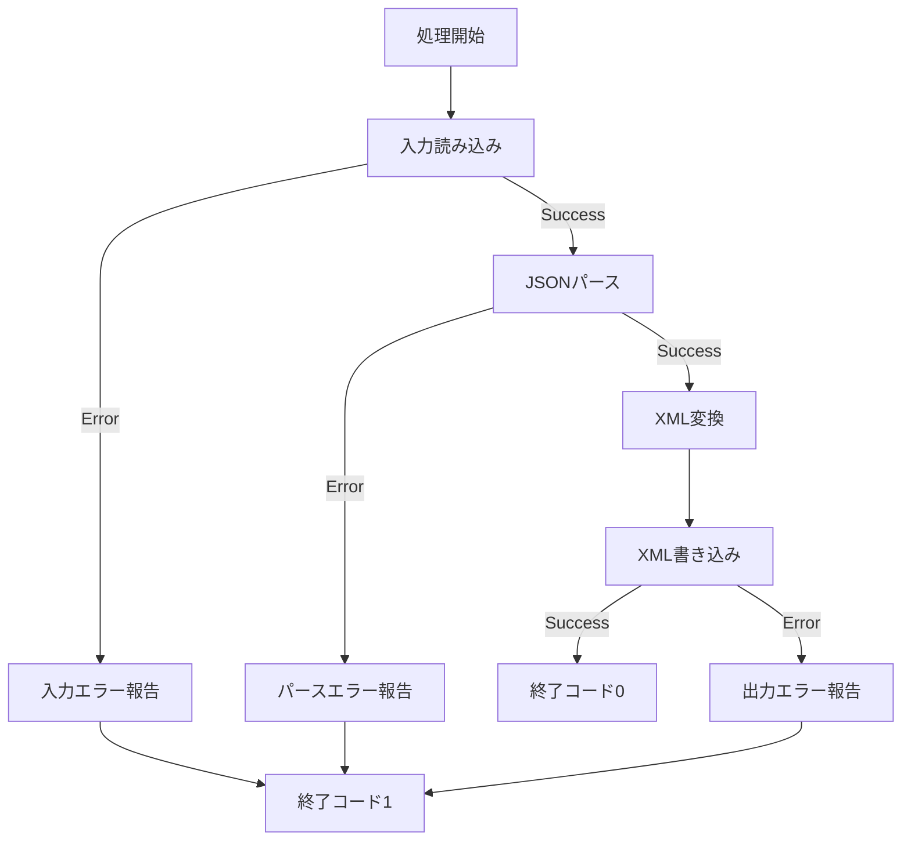

# Design Document

## Overview
junitify-cliは、Dartのテストフレームワークが出力するJSON形式のテスト結果を、JUnit XML形式に変換するコマンドラインツールです。このツールにより、Dartプロジェクトのテスト結果を、Jenkins、GitLab CI、GitHub Actions等の既存のCI/CDパイプラインやテストレポートツールと統合できます。

**Purpose**: CI/CDエコシステムへのシームレスな統合を実現し、Dartプロジェクトのテスト可視化を向上させる。
**Users**: Dart開発者とDevOpsエンジニアがCI/CDパイプライン内でテスト結果を標準化されたフォーマットで取得する。
**Impact**: DartテストをCI/CDツールチェーンの標準的な一部として扱えるようにし、マルチ言語プロジェクトでの統一されたテストレポート体験を提供する。

### Goals
- DartテストJSON出力からJUnit XML形式への完全な変換を実現
- ファイルおよび標準入出力の両方をサポートする柔軟なI/O
- 大規模テストスイート（10,000+テストケース）の効率的な処理
- 明確で実用的なエラーメッセージによる優れた開発者体験

### Non-Goals
- リアルタイムストリーミング変換（バッチ処理のみ）
- JUnit XML以外の出力フォーマット（将来的な拡張として考慮）
- テスト実行機能（変換のみ）
- GUIまたはWebインターフェース

## Architecture

### Architecture Pattern & Boundary Map
**Selected Pattern**: パイプライン/レイヤードアーキテクチャ - 入力→解析→変換→出力の線形フロー



**Architecture Integration**:
- パターン選択理由: 単方向データフローで各段階の責任が明確。テストとメンテナンスが容易。
- ドメイン境界: 入力処理、データ変換、出力処理、エラーハンドリングの4つの明確な境界
- 新規コンポーネントの理由: 各コンポーネントは単一責任を持ち、独立してテスト可能

### Technology Stack

| Layer | Choice / Version | Role in Feature | Notes |
|-------|------------------|-----------------|-------|
| CLI | Dart SDK 3.0+ | ランタイム環境とCLI実行 | 安定版の最新Dart SDK |
| CLI Framework | args ^2.4.0 | コマンドライン引数のパース | Dart公式推奨パッケージ |
| JSON Processing | dart:convert (標準ライブラリ) | JSON入力のパース | 追加依存なし |
| XML Generation | xml ^6.5.0 | JUnit XML出力の生成 | 成熟したDart XMLライブラリ |
| Testing | test ^1.24.0 | ユニット・統合テスト | Dart標準テストフレームワーク |

## System Flows

### Main Conversion Flow



**Flow-level decisions**:
- エラーは早期に検出し、即座に終了（Fail Fast原則）
- 各段階で明示的なバリデーションを実施
- メモリ効率のためストリーミング処理を考慮（大容量ファイル）

## Requirements Traceability

| Requirement | Summary | Components | Interfaces | Flows |
|-------------|---------|------------|------------|-------|
| 1 | JSON入力の処理 | InputReader | InputSource | Main Conversion |
| 2 | Dartテストフォーマットのパース | JsonParser | DartTestParser | Main Conversion |
| 3 | JUnit XML形式への変換 | XmlConverter | JUnitXmlGenerator | Main Conversion |
| 4 | XML出力の生成 | OutputWriter | OutputDestination | Main Conversion |
| 5 | コマンドラインインターフェース | CliEntryPoint | ArgParser | Main Conversion |
| 6 | エラーハンドリングとログ | ErrorHandler | ErrorReporter | All flows |
| 7 | パフォーマンスと制約 | All components | - | Main Conversion |

## Components and Interfaces

| Component | Domain/Layer | Intent | Req Coverage | Key Dependencies | Contracts |
|-----------|--------------|--------|--------------|------------------|-----------|
| CliEntryPoint | CLI | コマンドライン引数解析とフロー制御 | 5, 6 | args (P0), ErrorHandler (P0) | Service |
| InputReader | Input | JSON入力の読み込み | 1, 6 | dart:io (P0) | Service |
| JsonParser | Parsing | Dartテスト結果のパース | 2, 6 | dart:convert (P0) | Service |
| XmlConverter | Conversion | JUnit XMLへの変換 | 3, 6 | xml (P0) | Service |
| OutputWriter | Output | XML出力の書き込み | 4, 6 | dart:io (P0), xml (P0) | Service |
| ErrorHandler | Cross-cutting | エラー処理とログ | 6 | dart:io (P0) | Service |

### CLI Layer

#### CliEntryPoint

| Field | Detail |
|-------|--------|
| Intent | アプリケーションエントリーポイント、引数パースとフロー調整 |
| Requirements | 5, 6 |

**Responsibilities & Constraints**
- コマンドライン引数の解析と検証
- 適切なコンポーネントへの処理委譲
- エラーハンドリングとプログラム終了コードの制御
- ヘルプとバージョン情報の表示

**Dependencies**
- Outbound: InputReader - JSON入力の取得 (P0)
- Outbound: JsonParser - Dart test dataのパース (P0)
- Outbound: XmlConverter - JUnit XMLへの変換 (P0)
- Outbound: OutputWriter - XML出力 (P0)
- Outbound: ErrorHandler - エラー処理 (P0)
- External: args package - 引数パース (P0)

**Contracts**: Service [x]

##### Service Interface

```dart
abstract class CliRunner {
  /// CLIアプリケーションを実行
  /// 
  /// Returns: 終了コード (0: 成功, 1: エラー)
  Future<int> run(List<String> arguments);
}

class CliConfig {
  final String? inputPath;
  final String? outputPath;
  final bool showHelp;
  final bool showVersion;
  final bool debugMode;
  
  CliConfig({
    this.inputPath,
    this.outputPath,
    this.showHelp = false,
    this.showVersion = false,
    this.debugMode = false,
  });
}
```

**Preconditions**: 有効なDart実行環境
**Postconditions**: 適切な終了コードでプログラムが終了
**Invariants**: エラーは標準エラー出力に、結果は標準出力またはファイルに出力

**Implementation Notes**
- Integration: args packageを使用してオプション定義とパース
- Validation: 相互排他的オプション（--helpと--version）の検証
- Risks: 引数パースエラーは即座にキャッチして明確なメッセージを表示

### Input Layer

#### InputReader

| Field | Detail |
|-------|--------|
| Intent | ファイルまたは標準入力からJSON文字列を読み込む |
| Requirements | 1, 6 |

**Responsibilities & Constraints**
- ファイルシステムまたは標準入力からのデータ読み込み
- UTF-8エンコーディングの保証
- ファイル存在確認とI/Oエラーハンドリング
- 大容量ファイルの効率的な読み込み

**Dependencies**
- External: dart:io - ファイル操作と標準入力 (P0)
- Outbound: ErrorHandler - I/Oエラー報告 (P0)

**Contracts**: Service [x]

##### Service Interface

```dart
abstract class InputSource {
  /// JSON入力を文字列として読み込む
  /// 
  /// Returns: Result containing JSON string or error
  Future<Result<String, InputError>> readJson();
}

class FileInputSource implements InputSource {
  final String filePath;
  FileInputSource(this.filePath);
}

class StdinInputSource implements InputSource {
  StdinInputSource();
}

sealed class InputError {
  final String message;
  InputError(this.message);
}

class FileNotFoundError extends InputError {
  final String path;
  FileNotFoundError(this.path) : super('File not found: $path');
}

class FileReadError extends InputError {
  final String path;
  final String reason;
  FileReadError(this.path, this.reason) : super('Failed to read file $path: $reason');
}

class EncodingError extends InputError {
  EncodingError(String reason) : super('Encoding error: $reason');
}
```

**Preconditions**: ファイルの場合、読み取り権限が必要
**Postconditions**: UTF-8エンコードされた文字列またはエラー
**Invariants**: 読み込み失敗時は明確なエラー情報を返す

**Implementation Notes**
- Integration: File.readAsString()とstdin.transformを使用
- Validation: ファイル存在確認とアクセス権限チェック
- Risks: 大容量ファイル（数百MB）の場合はメモリ使用量に注意

### Parsing Layer

#### JsonParser

| Field | Detail |
|-------|--------|
| Intent | Dart test JSON形式を構造化データにパース |
| Requirements | 2, 6 |

**Responsibilities & Constraints**
- JSON構文の検証とパース
- Dart test formatの構造検証
- テストスイート、テストケース、ステータス、時間情報の抽出
- 不正なフォーマットの詳細なエラー報告

**Dependencies**
- External: dart:convert - JSONデコーディング (P0)
- Outbound: ErrorHandler - パースエラー報告 (P0)

**Contracts**: Service [x]

##### Service Interface

```dart
abstract class DartTestParser {
  /// Dart test JSON文字列をパースして構造化データに変換
  /// 
  /// Returns: Result containing parsed test data or error
  Result<DartTestResult, ParseError> parse(String jsonString);
}

class DartTestResult {
  final List<TestSuite> suites;
  final int totalTests;
  final int totalFailures;
  final int totalSkipped;
  final Duration totalTime;
  
  DartTestResult({
    required this.suites,
    required this.totalTests,
    required this.totalFailures,
    required this.totalSkipped,
    required this.totalTime,
  });
}

class TestSuite {
  final String name;
  final List<TestCase> testCases;
  final Duration time;
  
  TestSuite({
    required this.name,
    required this.testCases,
    required this.time,
  });
}

class TestCase {
  final String name;
  final String className;
  final TestStatus status;
  final Duration time;
  final String? errorMessage;
  final String? stackTrace;
  
  TestCase({
    required this.name,
    required this.className,
    required this.status,
    required this.time,
    this.errorMessage,
    this.stackTrace,
  });
}

enum TestStatus {
  passed,
  failed,
  skipped,
  error,
}

sealed class ParseError {
  final String message;
  ParseError(this.message);
}

class JsonSyntaxError extends ParseError {
  final int? line;
  final int? column;
  JsonSyntaxError(String message, {this.line, this.column}) : super(message);
}

class InvalidFormatError extends ParseError {
  final String field;
  InvalidFormatError(this.field, String reason) : super('Invalid field "$field": $reason');
}

class MissingFieldError extends ParseError {
  final String field;
  MissingFieldError(this.field) : super('Required field missing: $field');
}
```

**Preconditions**: 有効なUTF-8文字列
**Postconditions**: 完全に検証されたDartTestResultまたは詳細なエラー
**Invariants**: すべての必須フィールドが存在し、型が正しい

**Implementation Notes**
- Integration: jsonDecode()でパースし、手動でフィールド検証
- Validation: スキーマバリデーションで各フィールドの型と存在を確認
- Risks: Dartテストフォーマットの将来的な変更に対応するためバージョン検出が必要

### Conversion Layer

#### XmlConverter

| Field | Detail |
|-------|--------|
| Intent | DartTestResultをJUnit XML形式に変換 |
| Requirements | 3, 6 |

**Responsibilities & Constraints**
- JUnit XMLスキーマに準拠したXML構造の生成
- テストスイート、テストケース、失敗、スキップ情報のマッピング
- XML宣言とエンコーディング指定
- 人間が読みやすいフォーマット（インデント）

**Dependencies**
- External: xml package - XML生成 (P0)
- Inbound: JsonParser - DartTestResultの受け取り (P0)

**Contracts**: Service [x]

##### Service Interface

```dart
abstract class JUnitXmlGenerator {
  /// DartTestResultをJUnit XML文書に変換
  /// 
  /// Returns: XML document as XmlDocument
  XmlDocument convert(DartTestResult testResult);
}

// JUnit XMLスキーマ構造
// <?xml version="1.0" encoding="UTF-8"?>
// <testsuites>
//   <testsuite name="..." tests="..." failures="..." errors="..." skipped="..." time="...">
//     <testcase name="..." classname="..." time="...">
//       <failure message="..." type="...">stacktrace</failure>
//       <skipped/>
//     </testcase>
//   </testsuite>
// </testsuites>
```

**Preconditions**: 有効なDartTestResult
**Postconditions**: JUnit XMLスキーマ準拠のXmlDocument
**Invariants**: すべての必須属性が設定され、階層構造が正しい

**Implementation Notes**
- Integration: xml packageのXmlBuilderを使用して構造を構築
- Validation: JUnit XMLスキーマ要件に準拠（testsuite/testcase階層）
- Risks: 特殊文字（<, >, &, ", '）のエスケープ処理が必要

### Output Layer

#### OutputWriter

| Field | Detail |
|-------|--------|
| Intent | XML文書をファイルまたは標準出力に書き込む |
| Requirements | 4, 6 |

**Responsibilities & Constraints**
- XmlDocumentの文字列化（pretty print）
- ファイルシステムまたは標準出力への書き込み
- UTF-8エンコーディングの保証
- 書き込みエラーのハンドリング

**Dependencies**
- External: dart:io - ファイル操作と標準出力 (P0)
- External: xml package - XML文字列化 (P0)
- Outbound: ErrorHandler - I/Oエラー報告 (P0)

**Contracts**: Service [x]

##### Service Interface

```dart
abstract class OutputDestination {
  /// XML文書を出力先に書き込む
  /// 
  /// Returns: Result indicating success or error
  Future<Result<void, OutputError>> writeXml(XmlDocument document);
}

class FileOutputDestination implements OutputDestination {
  final String filePath;
  FileOutputDestination(this.filePath);
}

class StdoutOutputDestination implements OutputDestination {
  StdoutOutputDestination();
}

sealed class OutputError {
  final String message;
  OutputError(this.message);
}

class FileWriteError extends OutputError {
  final String path;
  final String reason;
  FileWriteError(this.path, this.reason) : super('Failed to write file $path: $reason');
}

class PermissionError extends OutputError {
  final String path;
  PermissionError(this.path) : super('Permission denied: $path');
}
```

**Preconditions**: 有効なXmlDocument、ファイルの場合は書き込み権限
**Postconditions**: XMLがUTF-8で出力されるか、エラー
**Invariants**: インデント付きのフォーマット済みXML

**Implementation Notes**
- Integration: document.toXmlString(pretty: true, indent: '  ')を使用
- Validation: ファイルパスの妥当性とディレクトリ存在確認
- Risks: ディスク容量不足やパーミッションエラーの適切な処理

### Cross-cutting Layer

#### ErrorHandler

| Field | Detail |
|-------|--------|
| Intent | 統一されたエラー処理とログ出力 |
| Requirements | 6 |

**Responsibilities & Constraints**
- エラーの種類に応じた適切なメッセージ生成
- 標準エラー出力への一貫したフォーマットでの出力
- デバッグモードでのスタックトレース出力
- ログレベルの制御

**Dependencies**
- External: dart:io - 標準エラー出力 (P0)

**Contracts**: Service [x]

##### Service Interface

```dart
abstract class ErrorReporter {
  /// エラーを標準エラー出力に報告
  void reportError(AppError error, {bool includeStackTrace = false});
  
  /// デバッグ情報を出力
  void debug(String message);
  
  /// 情報メッセージを出力
  void info(String message);
}

sealed class AppError {
  final String message;
  final StackTrace? stackTrace;
  
  AppError(this.message, [this.stackTrace]);
  
  /// エラーの段階を返す
  ErrorPhase get phase;
}

enum ErrorPhase {
  input,    // 読み込み段階
  parsing,  // パース段階
  conversion, // 変換段階
  output,   // 書き込み段階
}

class InputPhaseError extends AppError {
  final InputError cause;
  InputPhaseError(this.cause) : super('Input error: ${cause.message}');
  
  @override
  ErrorPhase get phase => ErrorPhase.input;
}

class ParsingPhaseError extends AppError {
  final ParseError cause;
  ParsingPhaseError(this.cause) : super('Parsing error: ${cause.message}');
  
  @override
  ErrorPhase get phase => ErrorPhase.parsing;
}

class OutputPhaseError extends AppError {
  final OutputError cause;
  OutputPhaseError(this.cause) : super('Output error: ${cause.message}');
  
  @override
  ErrorPhase get phase => ErrorPhase.output;
}
```

**Preconditions**: エラーオブジェクトが適切に初期化されている
**Postconditions**: エラーが標準エラー出力に表示される
**Invariants**: エラーメッセージは明確で実用的

**Implementation Notes**
- Integration: stderr.writeを使用してエラー出力
- Validation: エラーメッセージの可読性とアクション性を確保
- Risks: デバッグモードの切り替えロジックが環境変数またはフラグで制御可能

## Data Models

### Domain Model

主要なドメインエンティティ：
- **DartTestResult**: Dart test実行の完全な結果を表現する集約ルート
- **TestSuite**: 関連するテストケースのグループ
- **TestCase**: 個別のテストの実行結果（値オブジェクト）
- **TestStatus**: テスト状態の列挙型（passed/failed/skipped/error）



**Business Rules & Invariants**:
- DartTestResultのtotalTests = 全TestSuiteのtestCases合計
- DartTestResultのtotalFailures = statusがfailedまたはerrorのTestCase数
- DartTestResultのtotalSkipped = statusがskippedのTestCase数
- TestCaseがfailedまたはerrorの場合、errorMessageは必須
- すべてのDuration値は非負

### Logical Data Model

**Structure Definition**:
- DartTestResult (1) → TestSuite (many): コンポジション関係
- TestSuite (1) → TestCase (many): コンポジション関係
- TestCase → TestStatus: 参照関係（列挙型）

**Consistency & Integrity**:
- トランザクション境界: DartTestResultが集約ルート、不変オブジェクトとして扱う
- カスケード規則: DartTestResult削除時にすべてのTestSuiteとTestCaseが削除
- 時制的側面: テスト結果は時点スナップショット、バージョニング不要

### Data Contracts & Integration

**Input Contract (Dart Test JSON)**:
```json
{
  "protocolVersion": "0.1.1",
  "type": "suite",
  "suite": {
    "id": 0,
    "platform": "vm",
    "path": "test/example_test.dart"
  },
  "tests": [
    {
      "id": 1,
      "name": "example test",
      "suiteID": 0,
      "groupIDs": [],
      "metadata": {},
      "line": 5,
      "column": 3
    }
  ],
  "testStart": {"time": 0, "test": {"id": 1}},
  "testDone": {
    "testID": 1,
    "result": "success",
    "hidden": false,
    "skipped": false,
    "time": 150
  }
}
```

**Output Contract (JUnit XML)**:
```xml
<?xml version="1.0" encoding="UTF-8"?>
<testsuites>
  <testsuite name="test/example_test.dart" tests="1" failures="0" errors="0" skipped="0" time="0.150">
    <testcase name="example test" classname="test.example_test" time="0.150"/>
  </testsuite>
</testsuites>
```

**Validation Rules**:
- 入力: JSON構文検証、必須フィールド存在確認、型チェック
- 出力: JUnit XMLスキーマ準拠、属性値の範囲チェック

## Error Handling

### Error Strategy
エラーはFail Fast原則に従い、早期検出・即時報告を行います。すべてのエラーは型安全なResult型で表現され、エラーの種類に応じた適切な処理を実施します。

### Error Categories and Responses

**Input Errors (ファイル・標準入力読み込み)**:
- FileNotFoundError → ファイルパスを含む明確なエラーメッセージ、終了コード1
- FileReadError → 失敗理由と対処方法を含むメッセージ、終了コード1
- EncodingError → UTF-8エンコーディング要件を説明、終了コード1

**Parsing Errors (JSON解析)**:
- JsonSyntaxError → 行/列番号付きの構文エラー説明、終了コード1
- InvalidFormatError → 不正なフィールドと期待される形式を説明、終了コード1
- MissingFieldError → 欠落フィールド名を明記、終了コード1

**Output Errors (ファイル・標準出力書き込み)**:
- FileWriteError → 失敗理由（ディスク容量等）を説明、終了コード1
- PermissionError → パーミッション問題と解決方法を説明、終了コード1

**Process Flow**:


### Monitoring
- エラーログ: 標準エラー出力に構造化されたエラーメッセージ
- デバッグモード: --debugフラグでスタックトレースと詳細情報を出力
- ログフォーマット: `[PHASE] Error: <message>`（例: `[PARSING] Error: Invalid field "name": expected string, got null`）

## Testing Strategy

### Unit Tests
- **InputReader**: ファイル読み込み、標準入力読み込み、エラーケース（ファイル不存在、権限なし）
- **JsonParser**: 有効なDart test JSON、不正なJSON構文、欠落フィールド、不正な型
- **XmlConverter**: 成功テスト、失敗テスト、スキップテスト、複数スイート、特殊文字エスケープ
- **OutputWriter**: ファイル書き込み、標準出力書き込み、エラーケース（書き込み失敗）
- **ErrorHandler**: 各エラー型のメッセージフォーマット、デバッグモード

### Integration Tests
- **End-to-end変換**: ファイル入力→変換→ファイル出力の完全フロー
- **標準I/O**: 標準入力→変換→標準出力のパイプラインテスト
- **エラーハンドリング**: 各段階でのエラー発生と適切な報告
- **大規模テスト**: 10,000テストケースの処理時間とメモリ使用量

### Performance Tests
- **10,000テストケース**: 処理時間が10秒以内
- **メモリ使用量**: 入力ファイルサイズの3倍以内
- **大容量ファイル**: 100MBファイルの処理
- **ストリーミング効率**: メモリピーク値の測定

## Performance & Scalability

### Target Metrics
- 処理速度: 10,000テストケース/10秒以内
- メモリ効率: 入力ファイルサイズの3倍以内
- 起動時間: 100ms以内（コールドスタート）

### Optimization Techniques
- JSON/XMLパース: 効率的なライブラリ使用（dart:convert、xml package）
- 大容量ファイル: ストリーミング処理の検討（必要に応じて）
- メモリ管理: 不要なオブジェクトの早期解放

### Scaling Approach
現時点では水平/垂直スケーリングは不要（単一プロセスCLIツール）。将来的な拡張として、並列処理や分散変換を検討可能。

