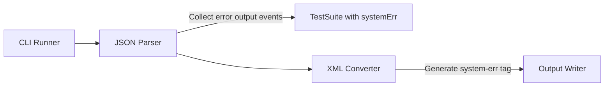
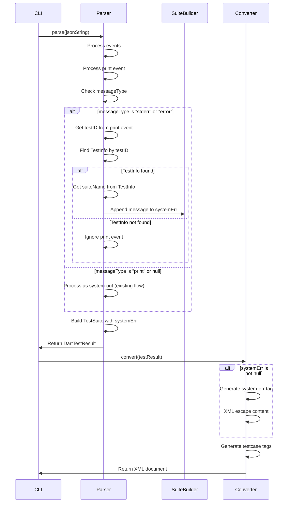

# Design Document

## Overview
testsuite-system-error-support機能は、DartテストJSON出力のエラー出力イベント（`print`イベントの`messageType`が`"stderr"`または`"error"`の場合）を収集し、テストスイートレベルでJUnit XMLの`<system-err>`タグとして出力する機能を追加します。これにより、CI/CDツールでテストスイートの標準エラー出力を確認できるようになります。

**Purpose**: テストスイートの標準エラー出力をJUnit XMLに含め、CI/CDツールでのデバッグと可視性を向上させる。
**Users**: Dart開発者がテストスイートの標準エラー出力をCI/CDレポートで確認したい場合に使用する。
**Impact**: パーサーでエラー出力イベントを収集し、TestSuiteモデルに追加、XMLジェネレーターで`<system-err>`タグを生成する。

### Goals
- TestSuiteモデルに`systemErr`フィールドを追加する
- パーサーでエラー出力イベントを収集し、テストスイートに紐付ける
- JUnit XMLの`<testsuite>`要素内に`<system-err>`タグを生成する
- 既存のAPIインターフェースとの後方互換性を維持する
- 既存の`system-out`機能と独立して動作する
- パフォーマンスへの影響を最小化する

### Non-Goals
- テストケースレベルの`<system-err>`タグ（テストスイートレベルのみ）
- エラー出力イベントのフィルタリング機能（すべてのエラー出力イベントを収集）
- エラー出力イベントの順序変更機能（時系列順のみ）

## Architecture

### Existing Architecture Analysis
現在のアーキテクチャはレイヤードアーキテクチャを採用しており、以下の流れで処理が行われます：
1. **Input Layer**: JSON入力を読み込む
2. **Parser Layer**: JSONをDartTestResultに変換
3. **Converter Layer**: DartTestResultをJUnit XMLに変換
4. **Output Layer**: XMLを出力

system-err機能の処理は**Parser Layer**と**Converter Layer**で実装します。Parser Layerでエラー出力イベントを収集し、Converter LayerでXMLタグを生成します。

### Architecture Pattern & Boundary Map
**Selected Pattern**: 既存のレイヤードアーキテクチャを維持し、Parser LayerとConverter Layerに機能を追加



**Architecture Integration**:
- パターン選択理由: 既存のアーキテクチャパターンを維持し、最小限の変更で機能を追加
- ドメイン境界: Parser Layerでエラー出力イベントを収集、Converter LayerでXML生成
- 既存パターンの維持: レイヤードアーキテクチャ、エラーハンドリング、Result型パターンを維持
- 新規コンポーネントの理由: `_SuiteBuilder`にエラー出力を蓄積する機能を追加
- Steering compliance: レイヤードアーキテクチャ、単一責任の原則、依存関係の一方向性を維持

### Technology Stack
既存の技術スタックを維持します。追加の依存関係は不要です。

| Layer | Choice / Version | Role in Feature | Notes |
|-------|------------------|-----------------|-------|
| Parser | Dart SDK 3.8+ | エラー出力イベントの収集とテストスイートへの紐付け | 既存のParserを拡張 |
| Models | Dart SDK 3.8+ | TestSuiteモデルにsystemErrフィールドを追加 | 既存のモデルを拡張 |
| Converter | xml package | system-errタグの生成とXMLエスケープ | 既存のConverterを拡張 |

## System Flows

### Error Output Event Processing Flow



**Flow-level decisions**:
- `print`イベントの処理は`_processPrintEvent`メソッド内で実施
- `messageType`フィールドをチェックし、`"stderr"`または`"error"`の場合はエラー出力として扱う
- `testID`から`_TestInfo`を取得し、そこから`suiteName`を取得
- `_SuiteBuilder`に`systemErr`フィールドを追加し、エラー出力を蓄積
- 複数のエラー出力イベントは時系列順に改行区切りで連結
- XML生成時、`systemErr`がnullでない場合のみ`<system-err>`タグを生成
- `<system-err>`タグは`<system-out>`タグの後に、`<testcase>`要素の前に配置（JUnit XMLスキーマ準拠）

## Requirements Traceability

| Requirement | Summary | Components | Interfaces | Flows |
|-------------|---------|------------|------------|-------|
| 1.1 | TestSuiteにsystemErrフィールド追加 | TestSuite | TestSuite constructor | Error Output Event Processing Flow |
| 1.2-1.5 | systemErrフィールドの動作 | TestSuite | - | Error Output Event Processing Flow |
| 2.1 | エラー出力イベントのtestIDからスイート特定 | DefaultDartTestParser | - | Error Output Event Processing Flow |
| 2.2-2.7 | エラー出力イベントの収集と連結 | DefaultDartTestParser, _SuiteBuilder | - | Error Output Event Processing Flow |
| 3.1-3.7 | system-errタグの生成 | DefaultJUnitXmlGenerator | - | Error Output Event Processing Flow |
| 4.1-4.6 | 後方互換性の維持 | DefaultDartTestParser, TestSuite | - | Error Output Event Processing Flow |
| 5.1-5.4 | パフォーマンスへの影響最小化 | DefaultDartTestParser | - | Error Output Event Processing Flow |

## Components and Interfaces

### Models Layer

#### TestSuite

| Field | Detail |
|-------|--------|
| Intent | テストスイートを表現し、system-err情報を保持する |
| Requirements | 1.1, 1.2, 1.3, 1.4, 1.5 |
| Owner / Reviewers | - |

**Responsibilities & Constraints**
- テストスイートの基本情報（name、testCases、time）を保持する
- オプショナルな`systemErr`フィールドで標準エラー出力を保持する
- `systemErr`がnullの場合、従来通り動作する
- `systemOut`と`systemErr`は独立して動作する（両方同時に設定可能）

**Dependencies**
- Inbound: なし
- Outbound: TestCase — テストケースのリスト（P0）

**Contracts**: Data Model [ ]

##### Data Model Interface
```dart
class TestSuite {
  const TestSuite({
    required this.name,
    required this.testCases,
    required this.time,
    this.systemOut,  // 既存: オプショナル
    this.systemErr,  // 新規追加: オプショナル
  });

  final String name;
  final List<TestCase> testCases;
  final Duration time;
  final String? systemOut;  // 既存
  final String? systemErr;  // 新規追加
}
```

- Preconditions:
  - `name`、`testCases`、`time`は必須
  - `systemErr`はオプショナル（null可）
- Postconditions:
  - `systemErr`がnullでない場合、改行区切りで連結されたエラー出力を含む
- Invariants:
  - 既存のAPIインターフェースとの後方互換性を維持（systemErrはオプショナル）
  - `systemOut`と`systemErr`は独立して動作する

**Implementation Notes**
- `systemErr`フィールドをオプショナルパラメータとして追加
- `equals`、`hashCode`、`toString`メソッドに`systemErr`を含める必要がある
- 空文字列も有効な値として扱う（nullと区別）

### Parser Layer

#### DefaultDartTestParser

| Field | Detail |
|-------|--------|
| Intent | DartテストJSONをパースし、エラー出力イベントを収集してテストスイートに紐付ける |
| Requirements | 2.1, 2.2, 2.3, 2.4, 2.5, 2.6, 2.7, 4.1, 4.2, 4.3, 4.6, 5.1, 5.2, 5.4 |
| Owner / Reviewers | - |

**Responsibilities & Constraints**
- JSONイベントをパースし、DartTestResultを生成する
- `print`イベントの`messageType`をチェックし、`"stderr"`または`"error"`の場合はエラー出力として扱う
- `testID`から対応するテストスイートを特定する
- 同じテストスイートのエラー出力を時系列順に改行区切りで連結する
- エラー出力イベントの`testID`が存在しない、または対応するテストケースが見つからない場合は無視する

**Dependencies**
- Inbound: ErrorReporter（オプショナル）— デバッグログの出力（P1）
- Outbound: DartTestResult, TestCase, TestSuite — テスト結果モデル（P0）
- External: dart:convert — JSONパース（P0）

**Contracts**: Service [ ]

##### Service Interface
```dart
abstract class DartTestParser {
  /// Parses a JSON string into a DartTestResult.
  Result<DartTestResult, ParseError> parse(
    String jsonString, {
    ErrorReporter? errorReporter,
  });
}
```

- Preconditions:
  - `jsonString`は有効なJSON文字列であること
- Postconditions:
  - エラー出力イベントが存在する場合、対応するテストスイートの`systemErr`に含まれる
  - エラー出力イベントが存在しない場合、`systemErr`はnullのまま
- Invariants:
  - 既存のAPIインターフェースとの後方互換性を維持

**Implementation Notes**
- `_processPrintEvent`メソッドを修正し、`messageType`フィールドをチェック
- `messageType`が`"stderr"`または`"error"`の場合、`systemErr`に追加
- `messageType`が`"print"`またはnullの場合、既存の`systemOut`処理を実行
- `_SuiteBuilder`クラスに`systemErr`フィールド（StringBuffer型）を追加
- `testID`から`_TestInfo`を取得し、そこから`suiteName`を取得
- `_SuiteBuilder`の`systemErr`にエラーメッセージを追加（改行区切り）
- `_buildResult`メソッドで`TestSuite`を作成する際、`systemErr`を設定
- 効率的な文字列連結のため、`StringBuffer`を使用

#### _SuiteBuilder

| Field | Detail |
|-------|--------|
| Intent | テストスイート構築中の情報を保持し、エラー出力を蓄積する |
| Requirements | 2.3, 2.4, 5.1 |
| Owner / Reviewers | - |

**Responsibilities & Constraints**
- テストスイートの構築中にエラー出力を蓄積する
- 複数のエラー出力イベントを時系列順に改行区切りで連結する

**Dependencies**
- Inbound: なし
- Outbound: TestCase — テストケースのリスト（P0）

**Implementation Notes**
- `systemErr`フィールドを`StringBuffer?`型で追加
- エラー出力イベントが来るたびに、`systemErr`にメッセージを追加（改行区切り）
- `_buildResult`で`TestSuite`を作成する際、`systemErr.toString()`を使用（nullの場合はnull）

### Converter Layer

#### DefaultJUnitXmlGenerator

| Field | Detail |
|-------|--------|
| Intent | DartTestResultをJUnit XMLに変換し、system-errタグを生成する |
| Requirements | 3.1, 3.2, 3.3, 3.4, 3.5, 3.6, 3.7 |
| Owner / Reviewers | - |

**Responsibilities & Constraints**
- TestSuiteの`systemErr`フィールドがnullでない場合、`<system-err>`タグを生成する
- XMLエスケープ（&lt;, &gt;, &amp;等）を適切に処理する
- `<system-err>`タグを`<system-out>`タグの後に、`<testcase>`要素の前に配置する

**Dependencies**
- Inbound: DartTestResult, TestSuite — テスト結果モデル（P0）
- Outbound: XmlDocument — XMLドキュメント（P0）
- External: xml package — XML生成（P0）

**Contracts**: Service [ ]

##### Service Interface
```dart
abstract class JUnitXmlGenerator {
  /// Converts a DartTestResult to a JUnit XML document.
  XmlDocument convert(DartTestResult testResult);
}
```

- Preconditions:
  - `testResult`は有効なDartTestResultであること
- Postconditions:
  - `systemErr`がnullでない場合、`<system-err>`タグが生成される
  - XMLエスケープが適切に処理される
- Invariants:
  - 既存のAPIインターフェースとの後方互換性を維持

**Implementation Notes**
- `_buildTestSuite`メソッド内で、`system-out`タグの後に`system-err`タグを生成
- `systemErr`がnullでない場合のみ`<system-err>`タグを生成
- `xml`パッケージの`XmlBuilder`を使用してXMLエスケープを自動処理
- `builder.text()`メソッドを使用してテキストコンテンツを設定（自動エスケープ）

## Data Models

### Domain Model
TestSuiteモデルに`systemErr`フィールド（String?型）を追加します。

### Logical Data Model
**変更内容**: TestSuiteモデルに`systemErr`フィールドを追加

```dart
class TestSuite {
  final String name;
  final List<TestCase> testCases;
  final Duration time;
  final String? systemOut;  // 既存
  final String? systemErr;  // 新規追加
}
```

### Physical Data Model
**該当なし**: 永続化層は存在しません。

### Data Contracts & Integration
**JSONイベント構造**:
- `print`イベントの構造（エラー出力の場合）:
  ```json
  {
    "type": "print",
    "testID": 40,
    "message": "Error: Something went wrong",
    "messageType": "stderr",
    "time": 585
  }
  ```
- `messageType`フィールドが`"stderr"`または`"error"`の場合、エラー出力として扱う
- `testID`フィールドから対応するテストケースを特定
- `message`フィールドがエラー出力の内容
- `message`が空文字列の場合は改行として扱う

**後方互換性**:
- エラー出力イベントが存在しないJSONも正常に処理される
- `testID`が存在しない、または対応するテストケースが見つからない場合は無視される
- `systemErr`がnullの場合は従来通り動作する
- `messageType`が`"print"`またはnullの場合は、既存の`system-out`処理を実行

## Error Handling

### Error Strategy
エラー出力イベントの処理はエラーを発生させません。以下の場合でも正常に処理されます：
- `testID`フィールドが存在しない
- `testID`に対応する`_TestInfo`が見つからない
- `message`フィールドが存在しない（空文字列として扱う）
- `messageType`フィールドが存在しない（既存の`system-out`処理を実行）
- エラー出力イベントの構造が不正（そのイベントを無視）

### Error Categories and Responses
**該当なし**: エラー出力イベントの処理はエラーを発生させない設計です。

### Monitoring
デバッグモードが有効な場合、エラー出力イベントの処理状況をログ出力することも可能ですが、現時点では実装しません（要件外）。

## Testing Strategy

### Unit Tests
1. **TestSuiteモデルのsystemErrフィールド**
   - `systemErr`がnullの場合の動作を確認
   - `systemErr`が空文字列の場合の動作を確認
   - `systemErr`が有効な値の場合の動作を確認
   - `equals`、`hashCode`、`toString`に`systemErr`が含まれることを確認
   - `systemOut`と`systemErr`が同時に設定可能であることを確認

2. **パーサーでのエラー出力イベント収集**
   - `print`イベントの`messageType`が`"stderr"`の場合、`systemErr`に含まれることを確認
   - `print`イベントの`messageType`が`"error"`の場合、`systemErr`に含まれることを確認
   - `print`イベントの`messageType`が`"print"`またはnullの場合、`systemOut`に含まれることを確認（既存の動作）
   - 複数のエラー出力イベントが時系列順に改行区切りで連結されることを確認
   - `testID`が存在しない場合、イベントが無視されることを確認
   - `testID`に対応するテストケースが見つからない場合、イベントが無視されることを確認
   - `message`が空文字列の場合、改行として扱われることを確認

3. **XMLジェネレーターでのsystem-errタグ生成**
   - `systemErr`がnullでない場合、`<system-err>`タグが生成されることを確認
   - `systemErr`がnullの場合、`<system-err>`タグが生成されないことを確認
   - `systemErr`が空文字列の場合、`<system-err>`タグが生成されないことを確認
   - XMLエスケープが適切に処理されることを確認（&lt;, &gt;, &amp;等）
   - `<system-err>`タグが`<system-out>`タグの後に配置されることを確認
   - `<system-err>`タグが`<testcase>`要素の前に配置されることを確認
   - `systemOut`と`systemErr`が両方存在する場合、両方のタグが生成されることを確認

4. **後方互換性**
   - エラー出力イベントが存在しないJSONが正常に処理されることを確認
   - 既存のテストケースの動作に影響がないことを確認
   - `system-out`機能と独立して動作することを確認

5. **パフォーマンス**
   - 大量のエラー出力イベントが存在する場合の処理時間を測定
   - StringBufferを使用した効率的な文字列連結を確認

### Integration Tests
1. **エンドツーエンドテスト: system-errタグの生成**
   - JSON入力にエラー出力イベントが含まれる場合、XML出力に`<system-err>`タグが含まれることを確認
   - 複数のテストスイートがある場合、それぞれのスイートに`<system-err>`タグが生成されることを確認
   - `system-out`と`system-err`が両方存在する場合、両方のタグが正しい順序で生成されることを確認

2. **CLI統合テスト: エラー出力イベントの処理**
   - エラー出力イベントを含むJSONを処理した場合、正常にXMLが生成されることを確認
   - 既存のCI/CDツールとの互換性を確認

### Performance Tests
1. **大規模テストスイートでのパフォーマンス**
   - 10,000件のテストケースに大量のエラー出力イベントが含まれる場合の処理時間を測定
   - エラー出力イベントの処理によるオーバーヘッドが最小限であることを確認
   - メモリ使用量が適切に管理されることを確認

## Optional Sections

### Backward Compatibility
既存のAPIインターフェースを維持するため、`TestSuite`コンストラクタにオプショナルパラメータ`systemErr`を追加します。これにより：
- 既存のコードは変更なしで動作する（`systemErr`はnullのまま）
- 新しいコードは`systemErr`を設定することで標準エラー出力を保持できる
- デフォルトの動作（`systemErr`なし）では従来通り動作する
- `system-out`機能と独立して動作する（両方同時に設定可能）

### Migration Strategy
**該当なし**: 既存のコードへの変更は不要です。新機能はオプショナルな動作として追加されます。

