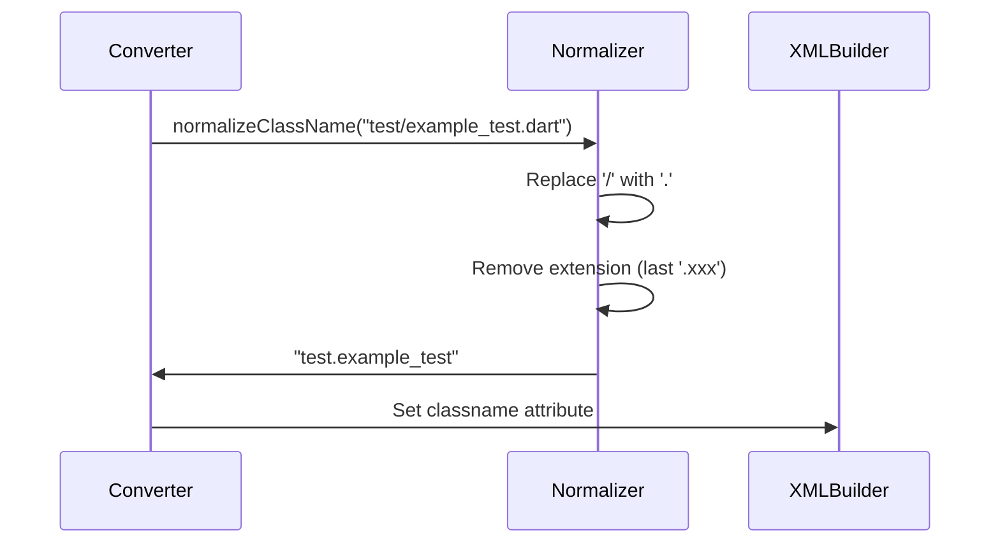
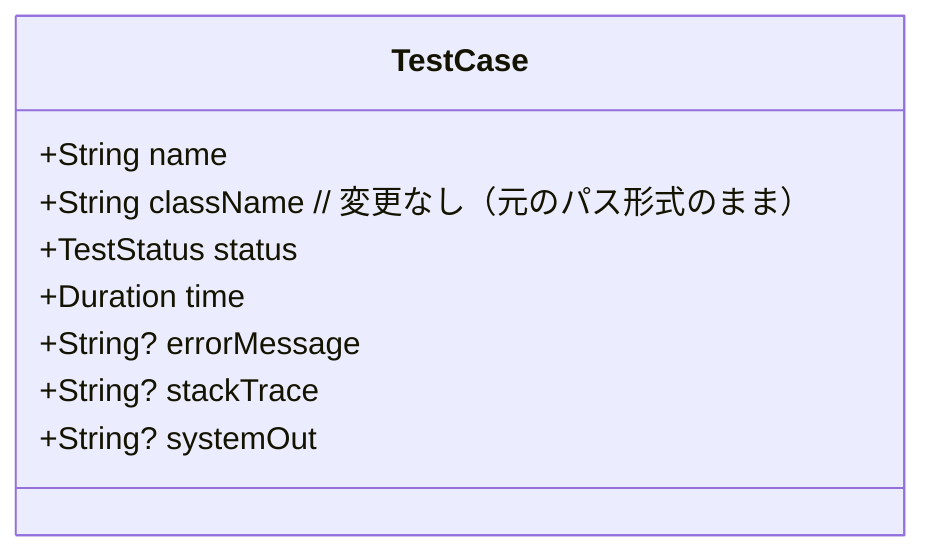
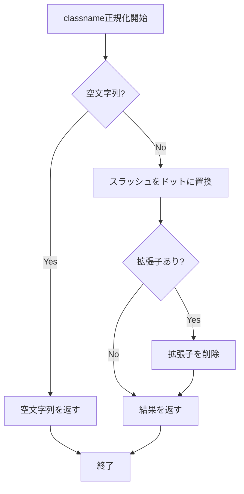

# Design Document

## Overview
classname正規化機能は、JUnit XML出力の`classname`属性を標準的なJavaクラス名形式に変換する機能です。Dartテストのファイルパス形式（例：`test/example_test.dart`）を、ドット区切りのクラス名形式（例：`test.example_test`）に変換し、CI/CDツールでのテスト結果の分類と表示を改善します。

**Purpose**: JUnit XMLのclassname属性を標準的な形式に正規化し、CI/CDツールでのテスト結果の可視化と分類を向上させる。
**Users**: Dart開発者とDevOpsエンジニアがCI/CDパイプライン内で標準化されたclassname形式のテスト結果を取得する。
**Impact**: テスト結果がより適切に分類され、CI/CDツールでのテストレポートの可読性と組織化が向上する。

### Goals
- classname属性のスラッシュ（`/`）をドット（`.`）に変換
- ファイル拡張子（`.dart`など）の削除
- 既存のTestCaseモデルへの影響を最小限に抑える
- エッジケースの適切な処理

### Non-Goals
- TestCaseモデルの変更（出力時のみ変換）
- 他のJUnit XML属性への影響
- パフォーマンスへの大きな影響

## Architecture

### Architecture Pattern & Boundary Map
**Selected Pattern**: 既存のパイプライン/レイヤードアーキテクチャに統合 - 変換レイヤーでのみ処理を追加


**Architecture Integration**:
- パターン選択理由: 既存のアーキテクチャパターンを維持し、変換レイヤー内でのみ処理を追加
- ドメイン境界: 変換レイヤー内のユーティリティ関数として実装
- 新規コンポーネントの理由: classname正規化ロジックを独立した関数として分離し、テスト容易性を向上

### Technology Stack

| Component | Choice / Version | Role in Feature | Notes |
|-----------|------------------|-----------------|-------|
| String Processing | Dart標準ライブラリ | classname文字列の変換 | `replaceAll`, `lastIndexOf`, `substring`等を使用 |

## System Flows

### Classname Normalization Flow



**Flow-level decisions**:
- 変換処理はJUnit XML生成時のみ実行（出力時変換）
- TestCaseモデルの`className`フィールドは変更しない
- エッジケースは明確なルールに従って処理

## Requirements Traceability

| Requirement | Summary | Components | Interfaces | Flows |
|-------------|---------|------------|------------|-------|
| 1 | classname属性の正規化処理 | ClassNameNormalizer | normalizeClassName | Classname Normalization |
| 2 | 既存機能への影響回避 | DefaultJUnitXmlGenerator | - | Classname Normalization |
| 3 | エッジケースの処理 | ClassNameNormalizer | normalizeClassName | Classname Normalization |

## Components and Interfaces

| Component | Domain/Layer | Intent | Req Coverage | Key Dependencies | Contracts |
|-----------|--------------|--------|--------------|------------------|-----------|
| ClassNameNormalizer | Conversion | classname文字列の正規化 | 1, 3 | Dart標準ライブラリ (P0) | Utility Function |
| DefaultJUnitXmlGenerator | Conversion | JUnit XML生成（拡張） | 1, 2 | ClassNameNormalizer (P0) | Service |

### Conversion Layer

#### ClassNameNormalizer

| Field | Detail |
|-------|--------|
| Intent | classname文字列を正規化（スラッシュ→ドット、拡張子削除） |
| Requirements | 1, 3 |

**Responsibilities & Constraints**
- スラッシュ（`/`）をドット（`.`）に変換
- 最後の拡張子部分（`.dart`など）を削除
- エッジケースの適切な処理
- パフォーマンスの最適化（O(n)時間）

**Dependencies**
- External: Dart標準ライブラリ - 文字列操作 (P0)

**Contracts**: Utility Function [x]

##### Utility Function Interface

```dart
/// classname文字列を正規化する
/// 
/// スラッシュ（`/`）をドット（`.`）に変換し、
/// 最後の拡張子部分（例：`.dart`）を削除する
/// 
/// Examples:
///   - `test/example_test.dart` → `test.example_test`
///   - `lib/src/converter/junit_xml_generator.dart` → `lib.src.converter.junit_xml_generator`
///   - `test/example_test` → `test.example_test`
///   - `example_test.dart` → `example_test`
///   - `example_test` → `example_test`
///   - `///` → `` (empty string)
///   - `/test/example.dart` → `.test.example`
///   - `test/example/` → `test.example.`
///   - `test//example.dart` → `test..example`
/// 
/// Parameters:
///   [className] - 正規化するclassname文字列
/// 
/// Returns:
///   正規化されたclassname文字列
String normalizeClassName(String className);
```

**Preconditions**: 有効な文字列（nullでない）
**Postconditions**: 正規化されたclassname文字列
**Invariants**: 入力が空文字列の場合、空文字列を返す

**Implementation Notes**
- Integration: `DefaultJUnitXmlGenerator._buildTestCase`メソッド内で呼び出し
- Validation: 入力文字列のnullチェック（Dartのnull安全性により保証）
- Algorithm:
  1. 空文字列の場合はそのまま返す
  2. スラッシュ（`/`）をすべてドット（`.`）に置換
  3. 最後のドット以降が拡張子とみなせる場合（例：`.dart`、`.js`）、削除
  4. 拡張子の判定は最後のドット以降が1文字以上の場合に適用
- Risks: 連続するスラッシュは連続するドットになる（要件3.5より意図的）

#### DefaultJUnitXmlGenerator (拡張)

| Field | Detail |
|-------|--------|
| Intent | JUnit XML生成時にclassnameを正規化 |
| Requirements | 1, 2 |

**Responsibilities & Constraints**
- `_buildTestCase`メソッド内でclassnameを正規化
- TestCaseモデルの`className`フィールドは変更しない
- 他の属性（name、time等）に影響を与えない

**Dependencies**
- Inbound: ClassNameNormalizer - classname正規化 (P0)
- Inbound: TestCase - テストケースデータ (P0)

**Contracts**: Service [x]

##### Service Interface (変更)

```dart
void _buildTestCase(XmlBuilder builder, TestCase testCase) {
  builder.element(
    'testcase',
    nest: () {
      // Attributes
      builder.attribute('name', testCase.name);
      // classnameを正規化してから設定
      builder.attribute('classname', normalizeClassName(testCase.className));
      builder.attribute('time', _formatDuration(testCase.time));
      // ... 残りの処理
    },
  );
}

/// classnameを正規化するプライベートメソッド
String _normalizeClassName(String className) {
  // 実装詳細
}
```

**Preconditions**: 有効なTestCase
**Postconditions**: 正規化されたclassname属性を持つXML要素
**Invariants**: TestCaseの`className`フィールドは変更されない

**Implementation Notes**
- Integration: `_buildTestCase`メソッド内で`normalizeClassName`を呼び出し
- Validation: 既存のテストケースがすべて正常に動作することを確認
- Risks: 既存のテストが正規化後のclassnameを期待するように更新が必要

## Data Models

### Domain Model

**変更なし**: TestCaseモデルは変更しない。classname正規化は出力時のみ実行される。



**Business Rules & Invariants**:
- TestCaseの`className`フィールドは元の形式（パス形式）のまま保持される
- 正規化はJUnit XML生成時のみ実行される
- 正規化処理は副作用を持たない（純粋関数）

### Logical Data Model

**Structure Definition**:
- TestCase → className: 変更なし（元のパス形式）
- JUnit XML → classname属性: 正規化された形式（ドット区切り、拡張子なし）

**Consistency & Integrity**:
- トランザクション境界: 変換処理は単一のXML生成処理内で完結
- 不変性: TestCaseモデルは変更されない
- 時制的側面: 変換は出力時にのみ実行される

### Data Contracts & Integration

**Input Contract (TestCase.className)**:
- 形式: ファイルパス形式（例：`test/example_test.dart`）
- 変更: なし

**Output Contract (JUnit XML classname属性)**:
- 形式: ドット区切り、拡張子なし（例：`test.example_test`）
- 変更: 正規化処理により変換

**Validation Rules**:
- 入力: TestCaseの`className`は任意の文字列（nullでない）
- 出力: 正規化されたclassnameは有効なXML属性値

## Error Handling

### Error Strategy
classname正規化処理は純粋関数として実装され、エラーを発生させません。すべての入力に対して有効な出力を返します。

### Error Categories and Responses

**Normalization Errors**:
- なし: すべての入力に対して有効な出力を返す
- エッジケースは要件に従って処理される

**Process Flow**:


### Monitoring
- ログ: なし（純粋関数のため）
- デバッグ: 必要に応じて変換前後の値をログ出力可能

## Testing Strategy

### Unit Tests
- **ClassNameNormalizer**: 
  - 基本的な変換ケース（`test/example_test.dart` → `test.example_test`）
  - 拡張子なしのケース（`test/example_test` → `test.example_test`）
  - スラッシュなしのケース（`example_test.dart` → `example_test`）
  - 空文字列のケース（`` → ``）
  - エッジケース:
    - `/`のみ（`///` → ``）
    - `.`のみ（`...` → ``）
    - 先頭スラッシュ（`/test/example.dart` → `.test.example`）
    - 末尾スラッシュ（`test/example/` → `test.example.`）
    - 連続スラッシュ（`test//example.dart` → `test..example`）
    - 複数ドット（`test/example.test.dart` → `test.example.test`）

### Integration Tests
- **DefaultJUnitXmlGenerator**: 
  - classname正規化がXML出力に反映されることを確認
  - TestCaseモデルの`className`フィールドが変更されないことを確認
  - 他の属性（name、time等）に影響がないことを確認

### Performance Tests
- **Normalization Performance**: 
  - 10,000回の正規化処理が1秒以内に完了することを確認
  - メモリ使用量への影響が最小限であることを確認

## Performance & Scalability

### Target Metrics
- 処理速度: 1回の正規化が1マイクロ秒以内
- メモリ効率: 追加のメモリ割り当てなし（文字列操作のみ）
- スケーラビリティ: 10,000テストケースでもパフォーマンスへの影響なし

### Optimization Techniques
- 文字列操作: Dart標準ライブラリの効率的なメソッドを使用
- メモリ管理: 新しい文字列オブジェクトの作成を最小限に

### Scaling Approach
単一プロセス内での文字列操作のため、スケーリングの考慮は不要。

