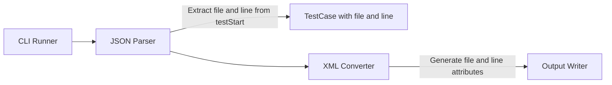
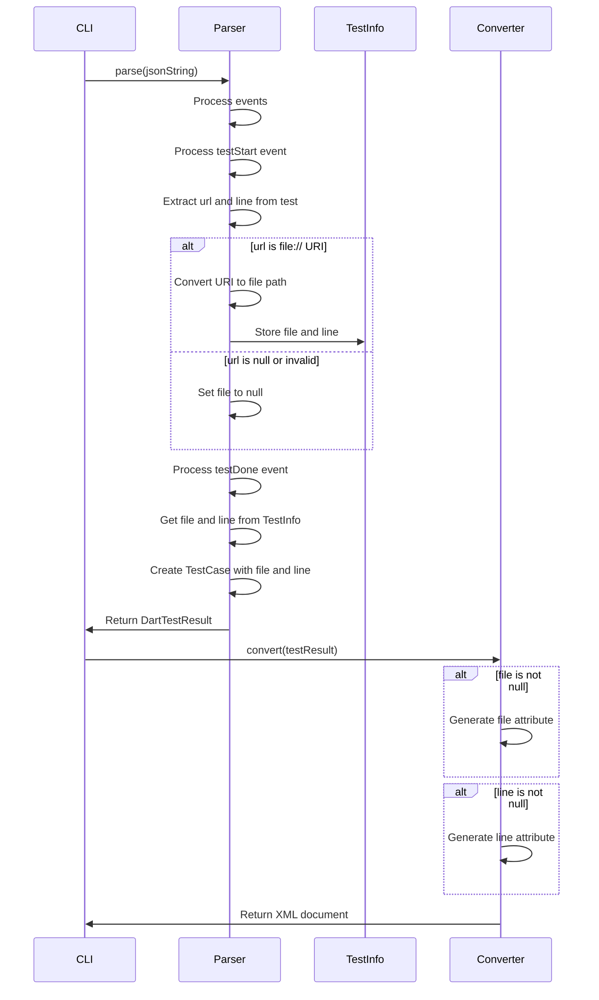

# Design Document

## Overview
testcase-file-line-attributes機能は、DartテストJSON出力の`testStart`イベントからファイルパスと行番号情報を取得し、JUnit XMLの`<testcase>`要素に`file`と`line`属性として出力する機能を追加します。これにより、CI/CDツールで各テストケースのソース位置を確認できるようになります。

**Purpose**: テストケースのソースファイル位置をJUnit XMLに含め、CI/CDツールでのデバッグと可視性を向上させる。各テストケースがどのファイルの何行目で定義されているかを追跡可能にする。
**Users**: Dart開発者がテストケースのソース位置をCI/CDレポートで確認したい場合に使用する。
**Impact**: パーサーでtestStartイベントからfileとline情報を取得し、TestCaseモデルに追加、XMLジェネレーターで`<testcase>`要素に`file`と`line`属性を生成する。

### Goals
- TestCaseモデルに`file`と`line`フィールドを追加する
- パーサーでtestStartイベントから`url`と`line`を取得し、ファイルパスに変換する
- JUnit XMLの`<testcase>`要素に`file`と`line`属性を生成する
- 既存のAPIインターフェースとの後方互換性を維持する
- パフォーマンスへの影響を最小化する

### Non-Goals
- 絶対パスから相対パスへの自動変換（可能な場合のみ試行）
- URL形式の検証と変換（`file://`形式のみ処理）
- ファイルパスの正規化（元の形式を可能な限り保持）

## Architecture

### Existing Architecture Analysis
現在のアーキテクチャはレイヤードアーキテクチャを採用しており、以下の流れで処理が行われます：
1. **Input Layer**: JSON入力を読み込む
2. **Parser Layer**: JSONをDartTestResultに変換
3. **Converter Layer**: DartTestResultをJUnit XMLに変換
4. **Output Layer**: XMLを出力

現在、testStartイベントは`_TestInfo`に基本情報（id、name、suiteName、startTime）のみを保存しています。本機能では、`url`と`line`フィールドも保存し、TestCaseに設定します。

### Architecture Pattern & Boundary Map
**Selected Pattern**: 既存のレイヤードアーキテクチャを維持し、Parser LayerとConverter Layerに機能を追加



**Architecture Integration**:
- パターン選択理由: 既存のアーキテクチャパターンを維持し、最小限の変更で機能を追加
- ドメイン境界: Parser LayerでtestStartイベントからfileとline情報を取得、Converter LayerでXML生成
- 既存パターンの維持: レイヤードアーキテクチャ、エラーハンドリング、Result型パターンを維持
- 新規コンポーネントの理由: URLからファイルパスへの変換ロジックを追加
- Steering compliance: レイヤードアーキテクチャ、単一責任の原則、依存関係の一方向性を維持

### Technology Stack
既存の技術スタックを維持します。追加の依存関係は不要です。

| Layer | Choice / Version | Role in Feature | Notes |
|-------|------------------|-----------------|-------|
| Parser | Dart SDK 3.8+ | testStartイベントからfileとline情報を取得 | 既存のParserを拡張 |
| Models | Dart SDK 3.8+ | TestCaseモデルにfileとlineフィールドを追加 | 既存のモデルを拡張 |
| Converter | xml package | fileとline属性の生成とXMLエスケープ | 既存のConverterを拡張 |

## System Flows

### File and Line Information Processing Flow



**Flow-level decisions**:
- testStartイベントの処理は`_processTestStartEvent`メソッド内で実施
- `url`フィールドからファイルパスを抽出し、`_TestInfo`に保存
- `line`フィールドを`_TestInfo`に保存
- testDoneイベント時に、保存されたfileとline情報をTestCaseに設定
- XML生成時、`file`と`line`がnullでない場合のみ`<testcase>`要素に属性を生成
- `file`と`line`属性は既存の属性（name、classname、time等）と共に出力される

## Requirements Traceability

| Requirement | Summary | Components | Interfaces | Flows |
|-------------|---------|------------|------------|-------|
| 1.1-1.8 | TestCaseにfileとlineフィールド追加 | TestCase | TestCase constructor | File and Line Information Processing Flow |
| 2.1-2.10 | testStartイベントからfileとline情報の取得 | DefaultDartTestParser, _TestInfo | - | File and Line Information Processing Flow |
| 3.1-3.10 | testcase要素にfileとline属性生成 | DefaultJUnitXmlGenerator | - | File and Line Information Processing Flow |
| 4.1-4.7 | 後方互換性の維持 | DefaultDartTestParser, TestCase | - | File and Line Information Processing Flow |
| 5.1-5.8 | エッジケースの処理 | DefaultDartTestParser | - | File and Line Information Processing Flow |
| 6.1-6.5 | パフォーマンスへの影響最小化 | DefaultDartTestParser | - | File and Line Information Processing Flow |

## Components and Interfaces

### Models Layer

#### TestCase

| Field | Detail |
|-------|--------|
| Intent | テストケースを表現し、fileとline情報を保持する |
| Requirements | 1.1, 1.2, 1.3, 1.4, 1.5, 1.6, 1.7, 1.8 |
| Owner / Reviewers | - |

**Responsibilities & Constraints**
- テストケースの基本情報（name、className、status、time）を保持する
- オプショナルな`file`フィールドでソースファイルパスを保持する
- オプショナルな`line`フィールドでソースファイル内の行番号を保持する
- `file`と`line`がnullの場合、従来通り動作する

**Dependencies**
- Inbound: なし
- Outbound: TestStatus — テストステータス（P0）

**Contracts**: Data Model [ ]

##### Data Model Interface
```dart
class TestCase {
  const TestCase({
    required this.name,
    required this.className,
    required this.status,
    required this.time,
    this.errorMessage,
    this.stackTrace,
    this.systemOut,
    this.file,  // 新規追加: オプショナル
    this.line,  // 新規追加: オプショナル
  });

  final String name;
  final String className;
  final TestStatus status;
  final Duration time;
  final String? errorMessage;
  final String? stackTrace;
  final String? systemOut;
  final String? file;  // 新規追加
  final int? line;  // 新規追加
}
```

- Preconditions:
  - `name`、`className`、`status`、`time`は必須
  - `file`と`line`はオプショナル（null可）
- Postconditions:
  - `file`がnullでない場合、ソースファイルのパスを含む
  - `line`がnullでない場合、ソースファイル内の行番号を含む
- Invariants:
  - 既存のAPIインターフェースとの後方互換性を維持（fileとlineはオプショナル）

**Implementation Notes**
- `file`と`line`フィールドをオプショナルパラメータとして追加
- `equals`、`hashCode`、`toString`メソッドに`file`と`line`を含める必要がある
- `line`は0以上の整数値として扱う（0も有効な値として許容）

### Parser Layer

#### DefaultDartTestParser

| Field | Detail |
|-------|--------|
| Intent | DartテストJSONをパースし、testStartイベントからfileとline情報を取得してテストケースに紐付ける |
| Requirements | 2.1, 2.2, 2.3, 2.4, 2.5, 2.6, 2.7, 2.8, 2.9, 2.10, 4.1, 4.2, 4.3, 4.4, 4.5, 4.6, 4.7, 5.1, 5.2, 5.3, 5.4, 5.5, 5.6, 5.7, 5.8, 6.1, 6.2, 6.3, 6.4, 6.5 |
| Owner / Reviewers | - |

**Responsibilities & Constraints**
- JSONイベントをパースし、DartTestResultを生成する
- `testStart`イベントを処理し、`test`オブジェクトから`url`と`line`フィールドを取得する
- `url`フィールドが`file://`形式の場合、ファイルパスに変換する
- `line`フィールドを数値として保存する
- `testDone`イベント時に、保存されたfileとline情報をTestCaseに設定する
- testStartイベントの`test`オブジェクトが存在しない、または必要なフィールドが存在しない場合は無視する

**Dependencies**
- Inbound: ErrorReporter（オプショナル）— デバッグログの出力（P1）
- Outbound: DartTestResult, TestCase, TestSuite — テスト結果モデル（P0）
- External: dart:convert — JSONパース（P0）
- External: dart:io — URI処理（P0）

**Contracts**: Service [ ]

##### Service Interface
```dart
abstract class DartTestParser {
  /// Parses a JSON string into a DartTestResult.
  Result<DartTestResult, ParseError> parse(
    String jsonString, {
    ErrorReporter? errorReporter,
  });
}
```

- Preconditions:
  - `jsonString`は有効なJSON文字列であること
- Postconditions:
  - testStartイベントが存在し、`url`と`line`が有効な場合、対応するテストケースの`file`と`line`に含まれる
  - testStartイベントが存在しない、または`url`と`line`が無効な場合、`file`と`line`はnullのまま
- Invariants:
  - 既存のAPIインターフェースとの後方互換性を維持

**Implementation Notes**
- `_processTestStartEvent`メソッドを修正し、`url`と`line`フィールドを取得して`_TestInfo`に保存
- `_extractFilePathFromUrl`メソッドを追加し、`file://`形式のURIをファイルパスに変換
- `_processTestDoneEvent`メソッドを修正し、保存されたfileとline情報をTestCaseに設定
- `url`が`file://`で始まらない場合、または`line`が無効な値の場合はnullとして扱う
- エッジケースの処理（負の行番号、空文字列、型不一致等）を適切に処理

#### _TestInfo (拡張)

| Field | Detail |
|-------|--------|
| Intent | テストケース構築中の情報を保持し、fileとline情報を蓄積する |
| Requirements | 2.8, 2.10 |
| Owner / Reviewers | - |

**Responsibilities & Constraints**
- テストケースの構築中にfileとline情報を保持する
- testStartイベントから取得したfileとline情報を保存する

**Dependencies**
- Inbound: なし
- Outbound: TestCase — テストケース（P0）

**Implementation Notes**
- `_TestInfo`クラスに`file`と`line`フィールドを追加
- testStartイベント時に`url`と`line`を取得し、`_TestInfo`に保存
- testDoneイベント時に、保存されたfileとline情報をTestCaseに設定

### Converter Layer

#### DefaultJUnitXmlGenerator

| Field | Detail |
|-------|--------|
| Intent | DartTestResultをJUnit XMLに変換し、testcase要素にfileとline属性を生成する |
| Requirements | 3.1, 3.2, 3.3, 3.4, 3.5, 3.6, 3.7, 3.8, 3.9, 3.10 |
| Owner / Reviewers | - |

**Responsibilities & Constraints**
- TestCaseの`file`フィールドがnullでない場合、`<testcase>`要素に`file`属性を生成する
- TestCaseの`line`フィールドがnullでない場合、`<testcase>`要素に`line`属性を生成する
- XMLエスケープ（&lt;, &gt;, &amp;等）を適切に処理する
- `file`と`line`属性を既存の属性（name、classname、time等）と共に出力する

**Dependencies**
- Inbound: DartTestResult, TestCase, TestSuite — テスト結果モデル（P0）
- Outbound: XmlDocument — XMLドキュメント（P0）
- External: xml package — XML生成（P0）

**Contracts**: Service [ ]

##### Service Interface
```dart
abstract class JUnitXmlGenerator {
  /// Converts a DartTestResult to a JUnit XML document.
  XmlDocument convert(DartTestResult testResult);
}
```

- Preconditions:
  - `testResult`は有効なDartTestResultであること
- Postconditions:
  - `file`がnullでない場合、`<testcase>`要素に`file`属性が生成される
  - `line`がnullでない場合、`<testcase>`要素に`line`属性が生成される
  - XMLエスケープが適切に処理される
- Invariants:
  - 既存のAPIインターフェースとの後方互換性を維持

**Implementation Notes**
- `_buildTestCase`メソッド内で、既存の属性設定後に`file`と`line`属性を生成
- `file`がnullでない場合のみ`file`属性を生成
- `line`がnullでない場合のみ`line`属性を生成
- `xml`パッケージの`XmlBuilder`を使用してXMLエスケープを自動処理
- `builder.attribute()`メソッドを使用して属性を設定（自動エスケープ）

## Data Models

### Domain Model
TestCaseモデルに`file`フィールド（String?型）と`line`フィールド（int?型）を追加します。

### Logical Data Model
**変更内容**: TestCaseモデルに`file`と`line`フィールドを追加

```dart
class TestCase {
  final String name;
  final String className;
  final TestStatus status;
  final Duration time;
  final String? errorMessage;
  final String? stackTrace;
  final String? systemOut;
  final String? file;  // 新規追加
  final int? line;  // 新規追加
}
```

### Physical Data Model
**該当なし**: 永続化層は存在しません。

### Data Contracts & Integration
**JSONイベント構造**:
- `testStart`イベントの構造:
  ```json
  {
    "type": "testStart",
    "test": {
      "id": 6,
      "name": "test example",
      "suiteID": 0,
      "line": 28,
      "url": "file:///home/user/project/test/example_test.dart"
    },
    "time": 28051
  }
  ```
- `test`オブジェクトの`url`フィールドからファイルパスを抽出
- `test`オブジェクトの`line`フィールドから行番号を取得
- `url`が`file://`形式の場合、ファイルパスに変換
- `line`が数値の場合、そのまま使用

**後方互換性**:
- `testStart`イベントに`url`または`line`フィールドが存在しないJSONも正常に処理される
- `url`が`file://`で始まらない場合、または`line`が無効な値の場合は無視される
- `file`と`line`がnullの場合は従来通り動作する

## Error Handling

### Error Strategy
testStartイベントの処理はエラーを発生させません。以下の場合でも正常に処理されます：
- `test`オブジェクトが存在しない
- `url`フィールドが存在しない、または`file://`で始まらない
- `line`フィールドが存在しない、または無効な値（負の値、非数値等）
- testStartイベントの構造が不正（そのイベントを無視）

### Error Categories and Responses
**該当なし**: testStartイベントの処理はエラーを発生させない設計です。

### Monitoring
デバッグモードが有効な場合、testStartイベントの処理状況をログ出力することも可能ですが、現時点では実装しません（要件外）。

## Testing Strategy

### Unit Tests
1. **TestCaseモデルのfileとlineフィールド**
   - `file`がnullの場合の動作を確認
   - `line`がnullの場合の動作を確認
   - `file`が有効な値の場合の動作を確認
   - `line`が有効な値の場合の動作を確認
   - `equals`、`hashCode`、`toString`に`file`と`line`が含まれることを確認

2. **パーサーでのtestStartイベント処理**
   - `testStart`イベントが存在し、`url`と`line`が有効な場合、対応するテストケースの`file`と`line`に含まれることを確認
   - `url`が`file://`形式の場合、ファイルパスに変換されることを確認
   - `url`が`file://`で始まらない場合、`file`がnullのままであることを確認
   - `line`が数値の場合、そのまま使用されることを確認
   - `line`が負の値の場合、`line`がnullのままであることを確認
   - `line`が0の場合、有効な値として扱われることを確認
   - `url`がnullまたは空文字列の場合、`file`がnullのままであることを確認
   - `line`が文字列形式で数値が含まれている場合、数値に変換されることを確認
   - `line`が数値でない型の場合、`line`がnullのままであることを確認
   - 複数のtestStartイベントが同じテストIDに対して発生する場合、最初のイベントの情報が使用されることを確認

3. **XMLジェネレーターでのfileとline属性生成**
   - `file`がnullでない場合、`<testcase>`要素に`file`属性が生成されることを確認
   - `line`がnullでない場合、`<testcase>`要素に`line`属性が生成されることを確認
   - `file`がnullの場合、`file`属性が生成されないことを確認
   - `line`がnullの場合、`line`属性が生成されないことを確認
   - XMLエスケープが適切に処理されることを確認（&lt;, &gt;, &amp;等）
   - `file`と`line`属性が既存の属性と共に出力されることを確認

4. **後方互換性**
   - `testStart`イベントに`url`または`line`フィールドが存在しないJSONが正常に処理されることを確認
   - 既存のテストケースの動作に影響がないことを確認
   - `file`と`line`がnullの場合、XML出力が従来通りであることを確認

5. **パフォーマンス**
   - 大量のtestStartイベントが存在する場合の処理時間を測定
   - URLからファイルパスへの変換が効率的であることを確認
   - テストケースごとのfileとline情報の保持が効率的であることを確認

### Integration Tests
1. **エンドツーエンドテスト: fileとline属性の生成**
   - JSON入力にtestStartイベントが含まれ、`url`と`line`が有効な場合、XML出力に各テストケースの`file`と`line`属性が含まれることを確認
   - 複数のテストケースがある場合、それぞれのテストケースに`file`と`line`属性が生成されることを確認
   - `url`が`file://`で始まらない場合、`file`属性が生成されないことを確認
   - `line`が無効な値の場合、`line`属性が生成されないことを確認

2. **CLI統合テスト: testStartイベントの処理**
   - testStartイベントを含むJSONを処理した場合、正常にXMLが生成されることを確認
   - 既存のCI/CDツールとの互換性を確認

### Performance Tests
1. **大規模テストスイートでのパフォーマンス**
   - 10,000件のテストケースにtestStartイベントが含まれる場合の処理時間を測定
   - fileとline情報の処理によるオーバーヘッドが最小限であることを確認
   - メモリ使用量が適切に管理されることを確認

## Optional Sections

### Backward Compatibility
既存のAPIインターフェースを維持するため、`TestCase`コンストラクタにオプショナルパラメータ`file`と`line`を追加します。これにより：
- 既存のコードは変更なしで動作する（`file`と`line`はnullのまま）
- 新しいコードは`file`と`line`を設定することでソース位置を保持できる
- デフォルトの動作（`file`と`line`なし）では従来通り動作する

### Migration Strategy
**該当なし**: 既存のコードへの変更は不要です。新機能はオプショナルな動作として追加されます。

