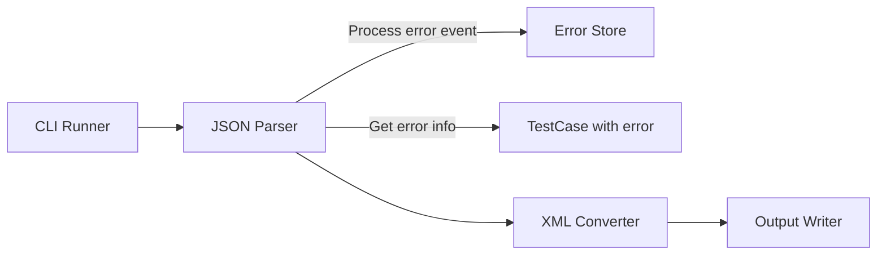
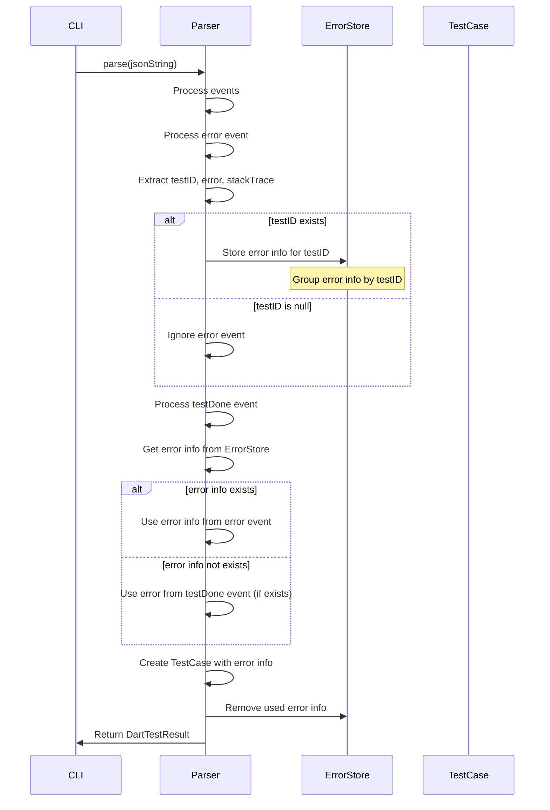

# Design Document

## Overview
error-event-handling機能は、DartテストJSON出力の`type: "error"`イベントを処理し、失敗したテストケースのエラーメッセージとスタックトレースを取得してTestCaseに設定する機能を追加します。これにより、`testDone`イベントに`error`フィールドが含まれていない場合でも、失敗したテストケースのエラー情報を正しく取得できるようになります。

**Purpose**: 失敗したテストケースのエラー情報を正しく取得し、JUnit XMLに含めることで、CI/CDツールでのデバッグと可視性を向上させる。
**Users**: Dart開発者が失敗したテストケースのエラー情報をCI/CDレポートで確認したい場合に使用する。
**Impact**: パーサーでerrorイベントからエラー情報を取得し、TestCaseモデルに設定、XMLジェネレーターで既存のfailure/error要素にエラー情報を出力する。

### Goals
- errorイベントを処理してエラー情報を取得する
- errorイベントから取得したエラー情報を一時保存する
- testDoneイベント時にエラー情報をTestCaseに設定する
- 既存のAPIインターフェースとの後方互換性を維持する
- パフォーマンスへの影響を最小化する

### Non-Goals
- errorイベントのフィルタリング機能（すべてのerrorイベントを処理）
- エラーメッセージの変換や正規化（元の形式をそのまま保持）
- エラーメッセージの検証や検証機能

## Architecture

### Existing Architecture Analysis
現在のアーキテクチャはレイヤードアーキテクチャを採用しており、以下の流れで処理が行われます：
1. **Input Layer**: JSON入力を読み込む
2. **Parser Layer**: JSONをDartTestResultに変換
3. **Converter Layer**: DartTestResultをJUnit XMLに変換
4. **Output Layer**: XMLを出力

現在、`testDone`イベントから`error`フィールドと`stackTrace`フィールドを取得していますが、実際のデータでは`error`イベントが別途存在し、`testDone`イベントには`error`フィールドが含まれない場合があります。本機能では、`error`イベントからエラー情報を取得し、`testDone`イベント時に使用します。

### Architecture Pattern & Boundary Map
**Selected Pattern**: 既存のレイヤードアーキテクチャを維持し、Parser Layerに機能を追加



**Architecture Integration**:
- パターン選択理由: 既存のアーキテクチャパターンを維持し、最小限の変更で機能を追加
- ドメイン境界: Parser Layerでerrorイベントからエラー情報を取得、testDoneイベント時にTestCaseに設定
- 既存パターンの維持: レイヤードアーキテクチャ、エラーハンドリング、Result型パターンを維持
- 新規コンポーネントの理由: errorイベント情報を一時保存するデータ構造を追加
- Steering compliance: レイヤードアーキテクチャ、単一責任の原則、依存関係の一方向性を維持

### Technology Stack
既存の技術スタックを維持します。追加の依存関係は不要です。

| Layer | Choice / Version | Role in Feature | Notes |
|-------|------------------|-----------------|-------|
| Parser | Dart SDK 3.8+ | errorイベントからエラー情報を取得 | 既存のParserを拡張 |
| Models | Dart SDK 3.8+ | TestCaseモデルは変更なし（既存のerrorMessageとstackTraceフィールドを使用） | 既存のモデルを使用 |
| Converter | xml package | 既存のfailure/error要素にエラー情報を出力 | 既存のConverterを使用 |

## System Flows

### Error Event Processing Flow



**Flow-level decisions**:
- errorイベントの処理は`_parseEvents`メソッド内で実施
- `testID`から対応するテストケースを特定し、エラー情報を一時保存
- errorイベントは`testDone`イベントより前に発生する可能性があるため、`testID`でグループ化して保持
- `testDone`イベント時に、保存されたエラー情報を取得してTestCaseに設定
- `testDone`イベントの`error`フィールドが存在する場合、それを優先（errorイベントの情報より優先）
- 使用済みのエラー情報はメモリ効率のため即座に削除

## Requirements Traceability

| Requirement | Summary | Components | Interfaces | Flows |
|-------------|---------|------------|------------|-------|
| 1.1-1.10 | errorイベントの処理 | DefaultDartTestParser | - | Error Event Processing Flow |
| 2.1-2.10 | errorイベント情報の保存と取得 | DefaultDartTestParser | - | Error Event Processing Flow |
| 3.1-3.9 | TestCaseへのエラー情報の設定 | DefaultDartTestParser, TestCase | - | Error Event Processing Flow |
| 4.1-4.6 | 後方互換性の維持 | DefaultDartTestParser, TestCase | - | Error Event Processing Flow |
| 5.1-5.10 | エッジケースの処理 | DefaultDartTestParser | - | Error Event Processing Flow |
| 6.1-6.5 | パフォーマンスへの影響最小化 | DefaultDartTestParser | - | Error Event Processing Flow |

## Components and Interfaces

### Parser Layer

#### DefaultDartTestParser

| Field | Detail |
|-------|--------|
| Intent | DartテストJSONをパースし、errorイベントからエラー情報を取得してテストケースに紐付ける |
| Requirements | 1.1-1.10, 2.1-2.10, 3.1-3.9, 4.1-4.6, 5.1-5.10, 6.1-6.5 |
| Owner / Reviewers | - |

**Responsibilities & Constraints**
- JSONイベントをパースし、DartTestResultを生成する
- `error`イベントを処理し、`testID`から対応するテストケースを特定する
- エラー情報を`testID`でグループ化して一時保存する
- `testDone`イベント時に、保存されたエラー情報を取得してTestCaseに設定する
- `testDone`イベントの`error`フィールドが存在する場合、それを優先する

**Dependencies**
- Inbound: ErrorReporter（オプショナル）— デバッグログの出力（P1）
- Outbound: DartTestResult, TestCase, TestSuite — テスト結果モデル（P0）
- External: dart:convert — JSONパース（P0）

**Contracts**: Service [ ]

##### Service Interface
```dart
abstract class DartTestParser {
  /// Parses a JSON string into a DartTestResult.
  Result<DartTestResult, ParseError> parse(
    String jsonString, {
    ErrorReporter? errorReporter,
  });
}
```

- Preconditions:
  - `jsonString`は有効なJSON文字列であること
- Postconditions:
  - errorイベントが存在し、`testID`が有効な場合、対応するテストケースの`errorMessage`と`stackTrace`に含まれる
  - errorイベントが存在しない場合、従来通り動作する
- Invariants:
  - 既存のAPIインターフェースとの後方互換性を維持

**Implementation Notes**
- `_parseEvents`メソッド内で、errorイベント情報を`testID`でグループ化して保持するマップを追加（`Map<int, Map<String, String?>>`）
- `_processErrorEvent`メソッドを追加し、errorイベントを処理してエラー情報を保存
- `_processTestDoneEvent`メソッドを修正し、保存されたエラー情報を取得してTestCaseに設定
- `testDone`イベントの`error`フィールドが存在する場合、それを優先（errorイベントの情報より優先）
- 使用済みのエラー情報はメモリ効率のため即座に削除

#### _processErrorEvent (新規メソッド)

| Field | Detail |
|-------|--------|
| Intent | errorイベントを処理し、エラー情報を一時保存する |
| Requirements | 1.1-1.10, 2.1-2.3, 5.1-5.10 |
| Owner / Reviewers | - |

**Responsibilities & Constraints**
- errorイベントから`testID`、`error`、`stackTrace`フィールドを取得する
- エラー情報を`testID`でグループ化して保存する
- `testID`が存在しない場合、イベントを無視する
- `error`フィールドが存在しない場合、nullとして扱う
- `stackTrace`フィールドが存在しない場合、nullとして扱う
- `isFailure`フィールドは無視する

**Dependencies**
- Inbound: errorイベント（Map<String, dynamic>）
- Outbound: testErrorsマップ（Map<int, Map<String, String?>>）

**Implementation Notes**
- `testID`がnullの場合、イベントを無視
- `error`フィールドと`stackTrace`フィールドを取得してマップに保存
- 複数のerrorイベントが同じ`testID`に対して発生する場合、最後のイベントの情報を使用（上書き）

## Data Models

### Domain Model
TestCaseモデルは変更しません。既存の`errorMessage`と`stackTrace`フィールドを使用します。

### Logical Data Model
**変更内容**: errorイベント情報を一時保存するデータ構造を追加

```dart
// 一時保存用のデータ構造（_parseEventsメソッド内）
final testErrors = <int, Map<String, String?>>{};

// エラー情報の構造
{
  'error': String?,      // エラーメッセージ
  'stackTrace': String?, // スタックトレース
}
```

### Physical Data Model
**該当なし**: 永続化層は存在しません。

### Data Contracts & Integration
**JSONイベント構造**:
- `error`イベントの構造:
  ```json
  {
    "testID": 40,
    "error": "Expected: '9_multi_master_test'\n  Actual: '\"9_multi_master_test\"'\n   Which: is different.\n          Expected: 9_multi_ma ...\n            Actual: \"9_multi_ma ...\n                    ^\n           Differ at offset 0\n",
    "stackTrace": "package:matcher                                                            expect\ntest/src/cron_command/master_data_common/master_data_sync_test.dart 135:7  main.<fn>.<fn>\n",
    "isFailure": true,
    "type": "error",
    "time": 29476
  }
  ```
- `testDone`イベントの構造（エラー情報が含まれない場合）:
  ```json
  {
    "testID": 40,
    "result": "failure",
    "skipped": false,
    "hidden": false,
    "type": "testDone",
    "time": 29477
  }
  ```
- `testID`フィールドから対応するテストケースを特定
- `error`フィールドがエラーメッセージの内容（複数行を含む可能性がある）
- `stackTrace`フィールドがスタックトレースの内容（複数行を含む可能性がある）
- `isFailure`フィールドは無視する

**後方互換性**:
- `error`イベントが存在しないJSONも正常に処理される
- `testDone`イベントに`error`フィールドが含まれている場合、従来通りそれを使用する
- `testDone`イベントに`error`フィールドが含まれていない場合、errorイベントから取得したエラー情報を使用する

## Error Handling

### Error Strategy
errorイベントの処理はエラーを発生させません。以下の場合でも正常に処理されます：
- `testID`フィールドが存在しない
- `error`フィールドが存在しない（nullとして扱う）
- `stackTrace`フィールドが存在しない（nullとして扱う）
- `testID`に対応する`_TestInfo`が見つからない（エラー情報は保存し、後で`testDone`イベント時に使用）
- errorイベントの構造が不正（そのイベントを無視）

### Error Categories and Responses
**該当なし**: errorイベントの処理はエラーを発生させない設計です。

### Monitoring
デバッグモードが有効な場合、errorイベントの処理状況をログ出力することも可能ですが、現時点では実装しません（要件外）。

## Testing Strategy

### Unit Tests
1. **errorイベントの処理**
   - `error`イベントが存在し、`testID`が有効な場合、エラー情報が保存されることを確認
   - `error`イベントの`testID`が存在しない場合、イベントが無視されることを確認
   - `error`イベントの`error`フィールドが存在しない場合、nullとして扱われることを確認
   - `error`イベントの`stackTrace`フィールドが存在しない場合、nullとして扱われることを確認
   - `error`イベントの`isFailure`フィールドが無視されることを確認
   - 複数のerrorイベントが同じ`testID`に対して発生する場合、最後のイベントの情報が使用されることを確認

2. **errorイベント情報の保存と取得**
   - `error`イベントから取得したエラー情報が`testID`でグループ化されて保存されることを確認
   - `testDone`イベント時に、保存されたエラー情報が取得されることを確認
   - `testDone`イベントの`error`フィールドが存在する場合、それが優先されることを確認
   - `testDone`イベントの`error`フィールドが存在しない場合、errorイベントから取得したエラー情報が使用されることを確認
   - `testDone`イベント処理後、使用済みのエラー情報が削除されることを確認

3. **TestCaseへのエラー情報の設定**
   - `error`イベントから取得したエラー情報がTestCaseに設定されることを確認
   - エラーメッセージが複数行を含む場合、そのまま保持されることを確認
   - スタックトレースが複数行を含む場合、そのまま保持されることを確認
   - テストケースのステータスが`failed`の場合、エラーメッセージが設定されていることを確認（TestCase.isValidの要件）

4. **後方互換性**
   - `error`イベントが存在しないJSONが正常に処理されることを確認
   - `testDone`イベントに`error`フィールドが含まれている場合、従来通りそれを使用することを確認
   - 既存のテストケースの動作に影響がないことを確認

5. **パフォーマンス**
   - 大量のerrorイベントが存在する場合の処理時間を測定
   - エラー情報の保存と取得が効率的であることを確認
   - 使用済みのエラー情報が即座に削除されることを確認

### Integration Tests
1. **エンドツーエンドテスト: errorイベントの処理**
   - JSON入力にerrorイベントが含まれ、`testDone`イベントに`error`フィールドが含まれていない場合、XML出力にエラー情報が含まれることを確認
   - 複数のテストケースがある場合、それぞれのテストケースにエラー情報が正しく設定されることを確認
   - `testDone`イベントに`error`フィールドが含まれている場合、それが優先されることを確認

2. **CLI統合テスト: errorイベントの処理**
   - errorイベントを含むJSONを処理した場合、正常にXMLが生成されることを確認
   - 既存のCI/CDツールとの互換性を確認

### Performance Tests
1. **大規模テストスイートでのパフォーマンス**
   - 10,000件のテストケースにerrorイベントが含まれる場合の処理時間を測定
   - errorイベントの処理によるオーバーヘッドが最小限であることを確認
   - メモリ使用量が適切に管理されることを確認

## Optional Sections

### Backward Compatibility
既存のAPIインターフェースを維持するため、`_processTestDoneEvent`メソッドのシグネチャを変更しますが、既存の動作は維持されます。これにより：
- 既存のコードは変更なしで動作する
- `testDone`イベントに`error`フィールドが含まれている場合、従来通りそれを使用する
- `testDone`イベントに`error`フィールドが含まれていない場合、errorイベントから取得したエラー情報を使用する
- デフォルトの動作（errorイベントなし）では従来通り動作する

### Migration Strategy
**該当なし**: 既存のコードへの変更は不要です。新機能は既存の動作を拡張する形で追加されます。

