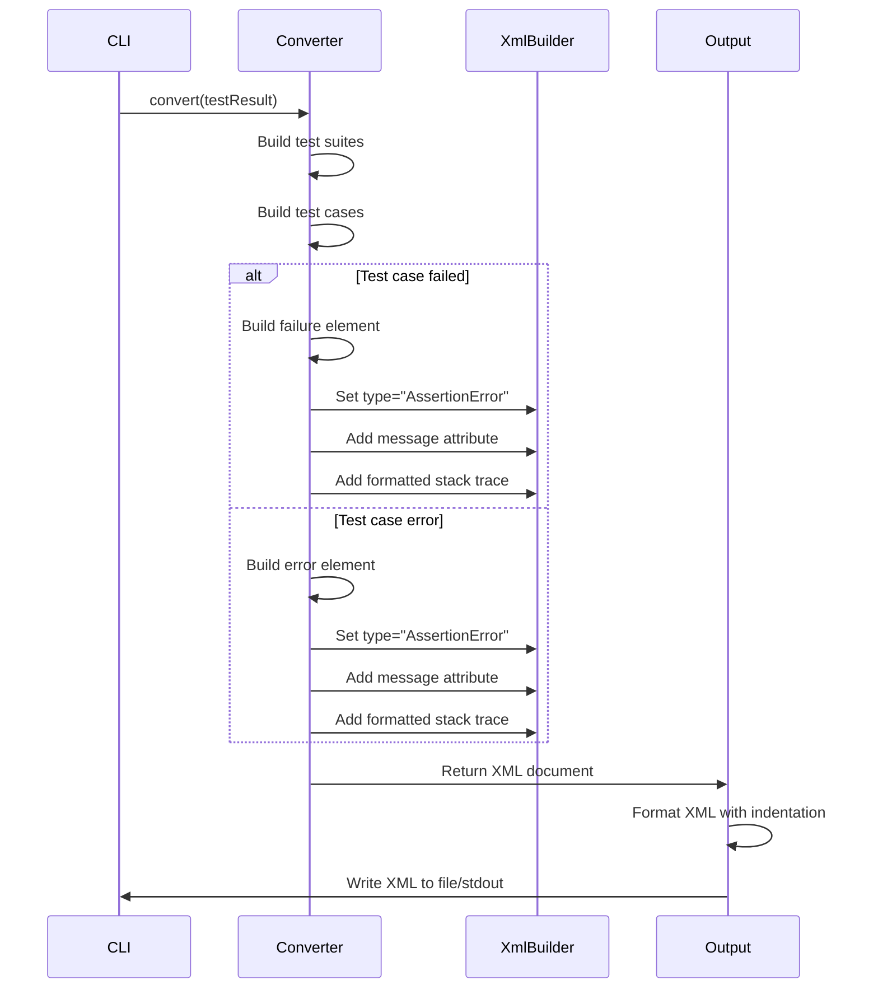

# Design Document

## Overview
failure-xml-output-format機能は、テスト失敗時のXML出力フォーマットを修正し、`failure`要素と`error`要素の`type`属性を変更し、スタックトレースの表示形式を改善する機能を追加します。これにより、JUnit XMLの標準的な形式に準拠し、スタックトレースが読みやすくなります。

**Purpose**: テスト失敗時のXML出力を標準的な形式に準拠させ、スタックトレースを読みやすくすることで、CI/CDツールでのデバッグと可視性を向上させる。
**Users**: Dart開発者が失敗したテストケースのエラー情報をCI/CDレポートで確認したい場合に使用する。
**Impact**: XMLジェネレーターでfailure要素とerror要素の`type`属性を変更し、フォーマットを改善する。

### Goals
- failure要素の`type`属性を`AssertionError`に変更する
- failure要素とerror要素のフォーマットを改善する（改行とインデントの追加）
- スタックトレースの前に複数の空行を追加する
- 既存のAPIインターフェースとの後方互換性を維持する
- XML出力の可読性を向上させる

### Non-Goals
- XMLパーサーの変更（既存のパーサーは変更しない）
- エラーメッセージの変換や正規化（元の形式をそのまま保持）
- XMLスキーマの変更（JUnit XMLスキーマに準拠）

## Architecture

### Existing Architecture Analysis
現在のアーキテクチャはレイヤードアーキテクチャを採用しており、以下の流れで処理が行われます：
1. **Input Layer**: JSON入力を読み込む
2. **Parser Layer**: JSONをDartTestResultに変換
3. **Converter Layer**: DartTestResultをJUnit XMLに変換
4. **Output Layer**: XMLを出力

現在、`_buildFailureElement`と`_buildErrorElement`メソッドでfailure要素とerror要素を生成していますが、`type`属性が`TestFailure`と`TestError`となっており、フォーマットも改善の余地があります。本機能では、これらのメソッドを修正して、`type`属性を`AssertionError`に変更し、フォーマットを改善します。

### Architecture Pattern & Boundary Map
**Selected Pattern**: 既存のレイヤードアーキテクチャを維持し、Converter LayerのXML生成ロジックを修正


**Architecture Integration**:
- パターン選択理由: 既存のアーキテクチャパターンを維持し、最小限の変更で機能を追加
- ドメイン境界: Converter LayerでXML生成ロジックを修正
- 既存パターンの維持: レイヤードアーキテクチャ、エラーハンドリング、Result型パターンを維持
- 新規コンポーネントの理由: XMLフォーマット改善のためのヘルパーメソッドを追加
- Steering compliance: レイヤードアーキテクチャ、単一責任の原則、依存関係の一方向性を維持

### Technology Stack
既存の技術スタックを維持します。追加の依存関係は不要です。

| Layer | Choice / Version | Role in Feature | Notes |
|-------|------------------|-----------------|-------|
| Converter | xml package | failure要素とerror要素のフォーマットを改善 | 既存のConverterを修正 |
| Models | Dart SDK 3.8+ | TestCaseモデルは変更なし | 既存のモデルを使用 |

## System Flows

### XML Generation Flow



**Flow-level decisions**:
- XML生成は`DefaultJUnitXmlGenerator`クラスで実施
- `_buildFailureElement`と`_buildErrorElement`メソッドを修正してフォーマットを改善
- `type`属性を`AssertionError`に変更
- スタックトレースの前に複数の空行を追加（改行文字を含むテキストとして）
- XMLフォーマッター（`toXmlString`）が自動的にインデントを追加

## Requirements Traceability

| Requirement | Summary | Components | Interfaces | Flows |
|-------------|---------|------------|------------|-------|
| 1.1-1.3 | failure要素のtype属性の変更 | DefaultJUnitXmlGenerator | - | XML Generation Flow |
| 2.1-2.6 | failure要素のフォーマット変更 | DefaultJUnitXmlGenerator | - | XML Generation Flow |
| 3.1-3.6 | error要素のフォーマット変更 | DefaultJUnitXmlGenerator | - | XML Generation Flow |
| 4.1-4.4 | 後方互換性の維持 | DefaultJUnitXmlGenerator | - | XML Generation Flow |
| 5.1-5.5 | エッジケースの処理 | DefaultJUnitXmlGenerator | - | XML Generation Flow |
| 6.1-6.4 | XML出力の可読性向上 | DefaultJUnitXmlGenerator, OutputDestination | - | XML Generation Flow |

## Components and Interfaces

### Converter Layer

#### DefaultJUnitXmlGenerator

| Field | Detail |
|-------|--------|
| Intent | DartTestResultをJUnit XMLに変換し、failure要素とerror要素のフォーマットを改善する |
| Requirements | 1.1-1.3, 2.1-2.6, 3.1-3.6, 4.1-4.4, 5.1-5.5, 6.1-6.4 |
| Owner / Reviewers | - |

**Responsibilities & Constraints**
- DartTestResultをJUnit XMLに変換する
- `failure`要素の`type`属性を`AssertionError`に設定する
- `error`要素の`type`属性を`AssertionError`に設定する
- `failure`要素の`message`属性にfailure数を含むメッセージを設定する（例: "1 failure, see stacktrace for details"）
- `error`要素の`message`属性にerror数を含むメッセージを設定する（例: "1 error, see stacktrace for details"）
- 要素の内容として"Failure:\n"または"Error:\n"プレフィックスとエラーメッセージ全体を出力する
- 適切なインデントとフォーマットを維持する

**Dependencies**
- Inbound: DartTestResult, TestCase, TestSuite — テスト結果モデル（P0）
- Outbound: XmlDocument — XMLドキュメント（P0）
- External: xml package — XML生成（P0）

**Contracts**: Service [ ]

##### Service Interface
```dart
abstract class JUnitXmlGenerator {
  /// Converts a DartTestResult to a JUnit XML document.
  XmlDocument convert(DartTestResult testResult);
}
```

- Preconditions:
  - `testResult`は有効なDartTestResultであること
- Postconditions:
  - `failure`要素の`type`属性が`AssertionError`であること
  - `error`要素の`type`属性が`AssertionError`であること
  - スタックトレースの前に複数の空行が含まれること
- Invariants:
  - 既存のAPIインターフェースとの後方互換性を維持

**Implementation Notes**
- `_buildFailureElement`メソッドを修正して`type`属性を`AssertionError`に変更
- `_buildErrorElement`メソッドを修正して`type`属性を`AssertionError`に変更
- `_buildTestCase`メソッドに`TestSuite`パラメータを追加して、failure/error数にアクセス可能にする
- `_buildFailureElement`メソッドに`TestSuite`パラメータを追加し、`message`属性に`"${suite.totalFailures} failure${suite.totalFailures != 1 ? 's' : ''}, see stacktrace for details"`を設定
- `_buildErrorElement`メソッドに`TestSuite`パラメータを追加し、`message`属性に`"${suite.totalErrors} error${suite.totalErrors != 1 ? 's' : ''}, see stacktrace for details"`を設定
- 要素の内容として`"Failure:\n${testCase.errorMessage!}"`または`"Error:\n${testCase.errorMessage!}"`を出力
- `builder.text()`メソッドを使用してテキストコンテンツを追加
- XMLフォーマッター（`toXmlString`）が自動的にインデントを追加するため、手動でのインデント制御は不要

#### _buildFailureElement (修正メソッド)

| Field | Detail |
|-------|--------|
| Intent | failure要素を生成し、指定されたフォーマットで出力する |
| Requirements | 1.1-1.3, 2.1-2.6, 5.1-5.5, 6.1-6.4 |
| Owner / Reviewers | - |

**Responsibilities & Constraints**
- `failure`要素を生成する
- `type`属性を`AssertionError`に設定する
- `message`属性にfailure数を含むメッセージを設定する（例: "1 failure, see stacktrace for details"）
- 要素の内容として"Failure:\n"プレフィックスとエラーメッセージ全体を出力する
- エラーメッセージがnullの場合、要素の内容を出力しない

**Dependencies**
- Inbound: TestCase — テストケースモデル、TestSuite — テストスイートモデル（failure数取得のため）
- Outbound: XmlBuilder — XMLビルダー

**Implementation Notes**
- `builder.element('failure', nest: () { ... })`を使用して要素を生成
- `builder.attribute('type', 'AssertionError')`でtype属性を設定
- `builder.attribute('message', '${suite.totalFailures} failure${suite.totalFailures != 1 ? 's' : ''}, see stacktrace for details')`でmessage属性を設定（エラーメッセージが存在する場合）
- `builder.text('Failure:\n${testCase.errorMessage!}')`でエラーメッセージを追加（エラーメッセージが存在する場合）

#### _buildErrorElement (修正メソッド)

| Field | Detail |
|-------|--------|
| Intent | error要素を生成し、指定されたフォーマットで出力する |
| Requirements | 3.1-3.6, 5.1-5.5, 6.1-6.4 |
| Owner / Reviewers | - |

**Responsibilities & Constraints**
- `error`要素を生成する
- `type`属性を`AssertionError`に設定する
- `message`属性にerror数を含むメッセージを設定する（例: "1 error, see stacktrace for details"）
- failure要素と同様のフォーマットを適用する
- 要素の内容として"Error:\n"プレフィックスとエラーメッセージ全体を出力する
- エラーメッセージがnullの場合、要素の内容を出力しない

**Dependencies**
- Inbound: TestCase — テストケースモデル、TestSuite — テストスイートモデル（error数取得のため）
- Outbound: XmlBuilder — XMLビルダー

**Implementation Notes**
- `_buildFailureElement`と同様の実装を適用
- `builder.element('error', nest: () { ... })`を使用して要素を生成
- `builder.attribute('type', 'AssertionError')`でtype属性を設定
- `builder.attribute('message', '${suite.totalErrors} error${suite.totalErrors != 1 ? 's' : ''}, see stacktrace for details')`でmessage属性を設定（エラーメッセージが存在する場合）
- `builder.text('Error:\n${testCase.errorMessage!}')`でエラーメッセージを追加（エラーメッセージが存在する場合）

## Data Models

### Domain Model
TestCaseモデルは変更しません。既存の`errorMessage`と`stackTrace`フィールドを使用します。

### Logical Data Model
**変更内容**: XML出力フォーマットの改善

```dart
// XML出力の構造（変更なし、フォーマットのみ変更）
<failure message="..." type="AssertionError">
  
  
  
  <!-- Stack trace here -->
  
</failure>
```

### Physical Data Model
**該当なし**: 永続化層は存在しません。

### Data Contracts & Integration
**XML出力構造**:
- `failure`要素の構造:
  ```xml
  <failure message="1 failure, see stacktrace for details" type="AssertionError">
  Failure:
  Expected: '9_multi_master_test'
    Actual: '"9_multi_master_test"'
     Which: is different.
  </failure>
  ```
- `error`要素の構造（failure要素と同様）:
  ```xml
  <error message="1 error, see stacktrace for details" type="AssertionError">
  Error:
  Exception: Something went wrong
  </error>
  ```
- `type`属性は`AssertionError`に統一
- `message`属性はfailure/error数を含むメッセージを設定（例: "1 failure, see stacktrace for details"、複数の場合は"3 failures, see stacktrace for details"）
- 要素の内容として"Failure:\n"または"Error:\n"プレフィックスとエラーメッセージ全体を出力
- エラーメッセージがnullの場合、要素の内容は出力しない

**後方互換性**:
- XMLスキーマは変更されない（JUnit XMLスキーマに準拠）
- 既存のXMLパーサーが正常に処理できる
- `type`属性の値が変更されるが、XMLパーサーには影響しない
- フォーマットの変更は可読性の向上のみで、構造的な変更はない

## Error Handling

### Error Strategy
XML生成時のエラーハンドリングは既存の実装を維持します。以下の場合でも正常に処理されます：
- エラーメッセージがnullの場合（`message`属性を出力しない、要素の内容も出力しない）
- エラーメッセージが複数行を含む場合（そのまま保持）
- TestSuiteのtotalFailures/totalErrorsが0の場合でも、メッセージは正しく生成される

### Error Categories and Responses
**該当なし**: XML生成時のエラーは発生しない設計です。

### Monitoring
デバッグモードが有効な場合、XML生成の状況をログ出力することも可能ですが、現時点では実装しません（要件外）。

## Testing Strategy

### Unit Tests
1. **failure要素のtype属性変更**
   - `type`属性が`AssertionError`に設定されることを確認
   - `message`属性がfailure数を含むメッセージに設定されることを確認（例: "1 failure, see stacktrace for details"）
   - エラーメッセージが正しく出力されることを確認

2. **failure要素のフォーマット変更**
   - 要素の内容として"Failure:\n"プレフィックスとエラーメッセージ全体が出力されることを確認
   - 複数のfailureがある場合、`message`属性に複数形が使用されることを確認（例: "3 failures, see stacktrace for details"）
   - エラーメッセージがnullの場合、要素の内容が出力されないことを確認

3. **error要素のフォーマット変更**
   - `type`属性が`AssertionError`に設定されることを確認
   - `message`属性がerror数を含むメッセージに設定されることを確認（例: "1 error, see stacktrace for details"）
   - failure要素と同様のフォーマットが適用されることを確認
   - 要素の内容として"Error:\n"プレフィックスとエラーメッセージ全体が出力されることを確認

4. **エッジケース**
   - エラーメッセージがnullの場合の処理を確認
   - エラーメッセージが複数行を含む場合の処理を確認
   - 複数のfailure/errorがある場合の複数形処理を確認

5. **後方互換性**
   - 既存のテストケースの動作に影響がないことを確認
   - XMLパーサーが正常に処理できることを確認

### Integration Tests
1. **エンドツーエンドテスト: XML出力フォーマット**
   - 失敗したテストケースのXML出力が正しいフォーマットであることを確認
   - エラーが発生したテストケースのXML出力が正しいフォーマットであることを確認
   - 複数のテストケースがある場合、それぞれのフォーマットが正しいことを確認

2. **CLI統合テスト: XML出力フォーマット**
   - XML出力が正しいフォーマットであることを確認
   - 既存のCI/CDツールとの互換性を確認

### Performance Tests
1. **大規模テストスイートでのパフォーマンス**
   - 10,000件のテストケースにfailure要素が含まれる場合の処理時間を測定
   - フォーマット変更によるオーバーヘッドが最小限であることを確認

## Optional Sections

### Backward Compatibility
既存のAPIインターフェースを維持するため、`_buildFailureElement`と`_buildErrorElement`メソッドのシグネチャを変更しません。これにより：
- 既存のコードは変更なしで動作する
- XML出力のフォーマットのみが変更される
- XMLスキーマは変更されない（JUnit XMLスキーマに準拠）
- 既存のXMLパーサーが正常に処理できる

### Migration Strategy
**該当なし**: 既存のコードへの変更は不要です。新機能は既存の動作を拡張する形で追加されます。

