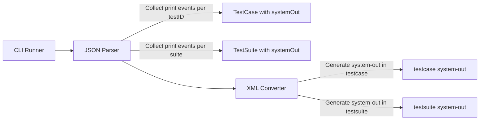
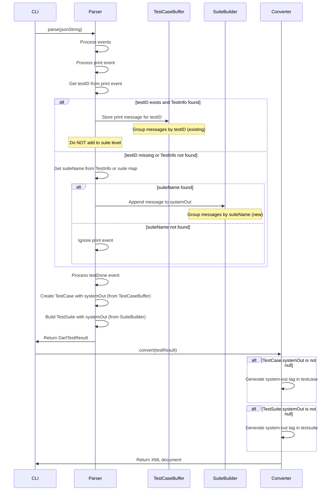

# Design Document

## Overview
testsuite-system-out-support機能は、DartテストJSON出力の`print`イベントのうち、testcaseに紐付かないもの（testIDが存在しない、または対応するテストケースが見つからないもの）をテストスイートレベルで収集し、JUnit XMLの`<testsuite>`要素内に`<system-out>`タグとして出力する機能を追加します。これにより、CI/CDツールでテストスイートレベルの標準出力を確認できるようになります。testcaseに紐付くprintイベントはtestsuiteレベルには含めず、testcaseレベルの`<system-out>`タグのみに含めます。

**Purpose**: testcaseに紐付かないprintイベントをテストスイートレベルで収集し、JUnit XMLに含めることで、CI/CDツールでのデバッグと可視性を向上させる。testcaseレベルのsystem-out機能は維持し、testcaseに紐付くprintイベントはtestsuiteレベルに含めない。
**Users**: Dart開発者がテストスイートレベルの標準出力（testcaseに紐付かないもの）をCI/CDレポートで確認したい場合に使用する。
**Impact**: パーサーでtestcaseに紐付かないprintイベントのみをテストスイートレベルで収集し、TestSuiteモデルに設定、XMLジェネレーターで`<testsuite>`要素内に`<system-out>`タグを生成する。testcaseに紐付くprintイベントはtestcaseレベルのsystem-outのみに含める。

### Goals
- パーサーでtestcaseに紐付かないprintイベントのみをテストスイートレベルで収集する
- testcaseに紐付くprintイベントはtestsuiteレベルに含めない
- TestSuiteモデルの`systemOut`フィールドに値を設定する
- JUnit XMLの`<testsuite>`要素内に`<system-out>`タグを生成する
- 既存のテストケースレベルのsystem-out機能に影響を与えない
- 既存のAPIインターフェースとの後方互換性を維持する
- パフォーマンスへの影響を最小化する

### Non-Goals
- テストケースレベルの`<system-out>`タグの変更（既存の機能を維持）
- testcaseに紐付くprintイベントをtestsuiteレベルに含めること（除外する）
- printイベントのフィルタリング機能（testIDの有無による分離のみ）
- printイベントの順序変更機能（時系列順のみ）
- system-errタグの対応（本機能では対象外）

## Architecture

### Existing Architecture Analysis
現在のアーキテクチャはレイヤードアーキテクチャを採用しており、以下の流れで処理が行われます：
1. **Input Layer**: JSON入力を読み込む
2. **Parser Layer**: JSONをDartTestResultに変換
3. **Converter Layer**: DartTestResultをJUnit XMLに変換
4. **Output Layer**: XMLを出力

現在、printイベントはテストケースレベルでのみ収集されています（`Map<int, StringBuffer> printMessages`）。本機能では、testcaseに紐付かないprintイベント（testIDが存在しない、または対応するテストケースが見つからないもの）のみをテストスイートレベルで収集します。

### Architecture Pattern & Boundary Map
**Selected Pattern**: 既存のレイヤードアーキテクチャを維持し、Parser LayerとConverter Layerに機能を追加



**Architecture Integration**:
- パターン選択理由: 既存のアーキテクチャパターンを維持し、最小限の変更で機能を追加
- ドメイン境界: Parser Layerでprintイベントをテストケースレベルとテストスイートレベルの両方で収集、Converter LayerでXML生成
- 既存パターンの維持: レイヤードアーキテクチャ、エラーハンドリング、Result型パターンを維持
- 新規コンポーネントの理由: `_SuiteBuilder`にprint出力を蓄積する機能を追加（既存のテストケースレベルの処理は維持）
- Steering compliance: レイヤードアーキテクチャ、単一責任の原則、依存関係の一方向性を維持

### Technology Stack
既存の技術スタックを維持します。追加の依存関係は不要です。

| Layer | Choice / Version | Role in Feature | Notes |
|-------|------------------|-----------------|-------|
| Parser | Dart SDK 3.8+ | printイベントの収集とテストスイートへの紐付け | 既存のParserを拡張 |
| Models | Dart SDK 3.8+ | TestSuiteモデルにsystemOutフィールドを設定 | 既存のモデルを使用 |
| Converter | xml package | testsuiteレベルのsystem-outタグの生成とXMLエスケープ | 既存のConverterを拡張 |

## System Flows

### Print Event Processing Flow (Both Test Case and Test Suite Level)



**Flow-level decisions**:
- printイベントの処理は`_parseEvents`メソッド内で実施
- `testID`の有無と対応するテストケースの存在を確認する
- `testID`が存在し、対応するテストケースが見つかる場合、printメッセージをテストケース用バッファにのみ保存（既存の処理、testsuiteレベルには含めない）
- `testID`が存在しない、または対応するテストケースが見つからない場合、printメッセージをテストスイート用バッファに保存（新規追加）
- テストケースレベルのprintイベント処理は既存の処理を維持
- テストスイートレベルのprintイベント処理は、testcaseに紐付かないprintイベントのみを処理
- XML生成時、`TestCase.systemOut`がnullでない場合、`<testcase>`要素内に`<system-out>`タグを生成（既存の処理）
- XML生成時、`TestSuite.systemOut`がnullでない場合、`<testsuite>`要素内に`<system-out>`タグを生成（新規追加）
- `<testsuite>`要素内の`<system-out>`タグは`<testcase>`要素の前に配置（JUnit XMLスキーマ準拠）

## Requirements Traceability

| Requirement | Summary | Components | Interfaces | Flows |
|-------------|---------|------------|------------|-------|
| 1.1-1.11 | パーサーでのTestSuiteレベルのprintイベント収集 | DefaultDartTestParser, _SuiteBuilder | - | Print Event Processing Flow |
| 2.1-2.7 | testsuiteレベルのsystem-outタグ生成 | DefaultJUnitXmlGenerator | - | Print Event Processing Flow |
| 3.1-3.4 | testcaseレベルのprintイベントの除外 | DefaultDartTestParser | - | Print Event Processing Flow |
| 4.1-4.6 | 後方互換性の維持 | DefaultDartTestParser, TestSuite | - | Print Event Processing Flow |
| 5.1-5.5 | パフォーマンスへの影響最小化 | DefaultDartTestParser | - | Print Event Processing Flow |

## Components and Interfaces

### Models Layer

#### TestSuite

| Field | Detail |
|-------|--------|
| Intent | テストスイートを表現し、system-out情報を保持する |
| Requirements | 1.9 |
| Owner / Reviewers | - |

**Responsibilities & Constraints**
- テストスイートの基本情報（name、testCases、time）を保持する
- オプショナルな`systemOut`フィールドで標準出力を保持する（既存のフィールドを使用）
- `systemOut`がnullの場合、従来通り動作する

**Dependencies**
- Inbound: なし
- Outbound: TestCase — テストケースのリスト（P0）

**Contracts**: Data Model [ ]

##### Data Model Interface
```dart
class TestSuite {
  const TestSuite({
    required this.name,
    required this.testCases,
    required this.time,
    this.systemOut,  // 既存フィールドを使用
    this.systemErr,
  });

  final String name;
  final List<TestCase> testCases;
  final Duration time;
  final String? systemOut;  // 既存フィールド
  final String? systemErr;
}
```

- Preconditions:
  - `name`、`testCases`、`time`は必須
  - `systemOut`はオプショナル（null可）
- Postconditions:
  - `systemOut`がnullでない場合、改行区切りで連結されたprint出力を含む
- Invariants:
  - 既存のAPIインターフェースとの後方互換性を維持（systemOutはオプショナル）

**Implementation Notes**
- TestSuiteモデルには既に`systemOut`フィールドが存在するため、モデルの変更は不要
- パーサーで`systemOut`に値を設定する処理を追加する

### Parser Layer

#### DefaultDartTestParser

| Field | Detail |
|-------|--------|
| Intent | DartテストJSONをパースし、printイベントをテストケースレベルとテストスイートレベルの両方で収集する |
| Requirements | 1.1, 1.2, 1.3, 1.4, 1.5, 1.6, 1.7, 1.8, 1.9, 3.1, 3.2, 3.3, 3.4, 3.5, 3.6, 4.1, 4.2, 4.3, 4.4, 4.5 |
| Owner / Reviewers | - |

**Responsibilities & Constraints**
- JSONイベントをパースし、DartTestResultを生成する
- `print`イベントを処理し、`testID`から対応するテストケースとテストスイートの両方を特定する
- テストケースレベルのprintイベント処理は既存の処理を維持
- テストスイートレベルのprintイベント処理を追加（同じprintイベントを両方で処理）
- 同じテストスイートのprint出力を時系列順に改行区切りで連結する

**Dependencies**
- Inbound: ErrorReporter（オプショナル）— デバッグログの出力（P1）
- Outbound: DartTestResult, TestCase, TestSuite — テスト結果モデル（P0）
- External: dart:convert — JSONパース（P0）

**Contracts**: Service [ ]

##### Service Interface
```dart
abstract class DartTestParser {
  /// Parses a JSON string into a DartTestResult.
  Result<DartTestResult, ParseError> parse(
    String jsonString, {
    ErrorReporter? errorReporter,
  });
}
```

- Preconditions:
  - `jsonString`は有効なJSON文字列であること
- Postconditions:
  - testcaseに紐付くprintイベントが存在する場合、対応するテストケースの`systemOut`にのみ含まれる（testsuiteレベルには含まれない）
  - testcaseに紐付かないprintイベントが存在する場合、対応するテストスイートの`systemOut`に含まれる
  - printイベントが存在しない場合、`systemOut`はnullのまま
- Invariants:
  - 既存のAPIインターフェースとの後方互換性を維持
  - テストケースレベルのsystem-out機能は変更しない
  - testcaseに紐付くprintイベントはtestsuiteレベルに含めない

**Implementation Notes**
- `_parseEvents`メソッド内で、printイベントの`testID`の有無と対応するテストケースの存在を確認
- `testID`が存在し、対応するテストケースが見つかる場合、printイベントをテストケースレベルの`printMessages`にのみ追加（testsuiteレベルには追加しない）
- `testID`が存在しない、または対応するテストケースが見つからない場合、printイベントをテストスイートレベルの`_SuiteBuilder.systemOut`に追加
- `_processPrintEvent`メソッドを修正し、testIDの有無とテストケースの存在に基づいて処理を分岐
- `_SuiteBuilder`クラスに`systemOut`フィールド（StringBuffer型）を追加
- testcaseに紐付かないprintイベントの場合、`suiteName`を特定して`_SuiteBuilder`を取得し、`systemOut`にprintメッセージを追加（改行区切り）
- `_buildResult`メソッドで`TestSuite`を作成する際、`systemOut`を設定
- 効率的な文字列連結のため、`StringBuffer`を使用

#### _SuiteBuilder

| Field | Detail |
|-------|--------|
| Intent | テストスイート構築中の情報を保持し、testcaseに紐付かないprint出力を蓄積する |
| Requirements | 1.9, 1.10, 3.1, 3.2, 3.3, 3.4, 5.1 |
| Owner / Reviewers | - |

**Responsibilities & Constraints**
- テストスイートの構築中にtestcaseに紐付かないprint出力を蓄積する
- 複数のprintイベントを時系列順に改行区切りで連結する
- testcaseに紐付くprintイベントは含めない

**Dependencies**
- Inbound: なし
- Outbound: TestCase — テストケースのリスト（P0）

**Implementation Notes**
- `systemOut`フィールドを`StringBuffer?`型で追加
- testcaseに紐付かないprintイベントが来るたびに、`systemOut`にメッセージを追加（改行区切り）
- `_buildResult`で`TestSuite`を作成する際、`systemOut.toString()`を使用（nullの場合はnull）
- testcaseに紐付くprintイベントは処理しない（テストケースレベルの処理のみ）

### Converter Layer

#### DefaultJUnitXmlGenerator

| Field | Detail |
|-------|--------|
| Intent | DartTestResultをJUnit XMLに変換し、testsuiteレベルのsystem-outタグを生成する |
| Requirements | 2.1, 2.2, 2.3, 2.4, 2.5, 2.6, 2.7 |
| Owner / Reviewers | - |

**Responsibilities & Constraints**
- TestSuiteの`systemOut`フィールドがnullでない場合、`<testsuite>`要素内に`<system-out>`タグを生成する
- XMLエスケープ（&lt;, &gt;, &amp;等）を適切に処理する
- `<system-out>`タグを`<testcase>`要素の前に配置する
- 既存のテストケースレベルの`<system-out>`タグの生成に影響を与えない

**Dependencies**
- Inbound: DartTestResult, TestSuite — テスト結果モデル（P0）
- Outbound: XmlDocument — XMLドキュメント（P0）
- External: xml package — XML生成（P0）

**Contracts**: Service [ ]

##### Service Interface
```dart
abstract class JUnitXmlGenerator {
  /// Converts a DartTestResult to a JUnit XML document.
  XmlDocument convert(DartTestResult testResult);
}
```

- Preconditions:
  - `testResult`は有効なDartTestResultであること
- Postconditions:
  - `systemOut`がnullでない場合、`<testsuite>`要素内に`<system-out>`タグが生成される
  - XMLエスケープが適切に処理される
  - テストケースレベルの`<system-out>`タグの生成は変更されない
- Invariants:
  - 既存のAPIインターフェースとの後方互換性を維持

**Implementation Notes**
- `_buildTestSuite`メソッド内で、`testcase`要素の前に`system-out`タグを生成
- `systemOut`がnullでない場合のみ`<system-out>`タグを生成
- `xml`パッケージの`XmlBuilder`を使用してXMLエスケープを自動処理
- `builder.text()`メソッドを使用してテキストコンテンツを設定（自動エスケープ）
- 既存の`_buildTestCase`メソッドの`<system-out>`タグ生成処理は変更しない

## Data Models

### Domain Model
TestSuiteモデルには既に`systemOut`フィールド（String?型）が存在するため、モデルの変更は不要です。

### Logical Data Model
**変更内容**: TestSuiteモデルは既に`systemOut`フィールドを持っているため、モデルの変更は不要。パーサーで値を設定する処理を追加する。

```dart
class TestSuite {
  final String name;
  final List<TestCase> testCases;
  final Duration time;
  final String? systemOut;  // 既存フィールド
  final String? systemErr;
}
```

### Physical Data Model
**該当なし**: 永続化層は存在しません。

### Data Contracts & Integration
**JSONイベント構造**:
- `print`イベントの構造:
  ```json
  {
    "type": "print",
    "testID": 40,
    "message": "Usage: junitify [options]",
    "messageType": "print",
    "time": 585
  }
  ```
- `testID`フィールドの有無と対応するテストケースの存在に基づいて、テストケースレベルまたはテストスイートレベルで処理を分岐
- `message`フィールドがprint出力の内容
- `message`が空文字列の場合は改行として扱う

**後方互換性**:
- `print`イベントが存在しないJSONも正常に処理される
- `testID`が存在しない、または対応するテストケースが見つからないprintイベントはテストスイートレベルで処理される
- `testID`が存在し、対応するテストケースが見つかるprintイベントはテストケースレベルのみで処理される（testsuiteレベルには含めない）
- `systemOut`がnullの場合は従来通り動作する
- テストケースレベルのsystem-out機能は変更されない

## Error Handling

### Error Strategy
printイベントの処理はエラーを発生させません。以下の場合でも正常に処理されます：
- `testID`フィールドが存在しない
- `testID`に対応する`_TestInfo`が見つからない
- `suiteName`に対応する`_SuiteBuilder`が見つからない
- `message`フィールドが存在しない（空文字列として扱う）
- printイベントの構造が不正（そのイベントを無視）

### Error Categories and Responses
**該当なし**: printイベントの処理はエラーを発生させない設計です。

### Monitoring
デバッグモードが有効な場合、printイベントの処理状況をログ出力することも可能ですが、現時点では実装しません（要件外）。

## Testing Strategy

### Unit Tests
1. **パーサーでのTestSuiteレベルのprintイベント収集**
   - `testID`が存在しないprintイベントが存在する場合、対応するテストスイートの`systemOut`に含まれることを確認
   - `testID`が存在するが、対応するテストケースが見つからないprintイベントが存在する場合、対応するテストスイートの`systemOut`に含まれることを確認
   - `testID`が存在し、対応するテストケースが見つかるprintイベントが存在する場合、テストケースレベルの`systemOut`にのみ含まれ、テストスイートレベルの`systemOut`には含まれないことを確認
   - 複数のtestcaseに紐付かないprintイベントが時系列順に改行区切りで連結されることを確認
   - `message`が空文字列の場合、改行として扱われることを確認
   - testcaseに紐付かないprintイベントが存在しない場合、`systemOut`が`null`のままであることを確認
   - テストケースレベルのprintイベント処理が影響を受けないことを確認

2. **XMLジェネレーターでのtestsuiteレベルのsystem-outタグ生成**
   - `systemOut`がnullでない場合、`<testsuite>`要素内に`<system-out>`タグが生成されることを確認
   - `systemOut`がnullの場合、`<system-out>`タグが生成されないことを確認
   - `systemOut`が空文字列の場合、`<system-out>`タグが生成されないことを確認
   - XMLエスケープが適切に処理されることを確認（&lt;, &gt;, &amp;等）
   - `<system-out>`タグが`<testcase>`要素の前に配置されることを確認
   - テストケースレベルの`<system-out>`タグの生成が影響を受けないことを確認

3. **後方互換性**
   - `print`イベントが存在しないJSONが正常に処理されることを確認
   - 既存のテストケースの動作に影響がないことを確認
   - テストケースレベルのsystem-out機能が変更されないことを確認

4. **パフォーマンス**
   - 大量のprintイベントが存在する場合の処理時間を測定
   - StringBufferを使用した効率的な文字列連結を確認
   - テストケースレベルとテストスイートレベルの両方でprintイベントを処理する場合のオーバーヘッドを確認

### Integration Tests
1. **エンドツーエンドテスト: testsuiteレベルのsystem-outタグの生成**
   - JSON入力にtestcaseに紐付かないprintイベントが含まれる場合、XML出力に`<testsuite>`要素内に`<system-out>`タグが含まれることを確認
   - JSON入力にtestcaseに紐付くprintイベントのみが含まれる場合、XML出力に`<testsuite>`要素内に`<system-out>`タグが含まれないことを確認
   - 複数のテストスイートがある場合、それぞれのスイートに`<system-out>`タグが生成されることを確認
   - テストケースレベルの`<system-out>`タグも同時に生成されることを確認

2. **CLI統合テスト: printイベントの処理**
   - printイベントを含むJSONを処理した場合、正常にXMLが生成されることを確認
   - 既存のCI/CDツールとの互換性を確認

### Performance Tests
1. **大規模テストスイートでのパフォーマンス**
   - 10,000件のテストケースに大量のprintイベントが含まれる場合の処理時間を測定
   - printイベントの処理によるオーバーヘッドが最小限であることを確認
   - メモリ使用量が適切に管理されることを確認
   - テストケースレベルとテストスイートレベルの両方でprintイベントを処理する場合のパフォーマンスを確認

## Optional Sections

### Backward Compatibility
既存のAPIインターフェースを維持するため、`TestSuite`モデルには既に`systemOut`フィールドが存在します。これにより：
- 既存のコードは変更なしで動作する（`systemOut`はnullのままでも動作）
- 新しいコードは`systemOut`を設定することで標準出力を保持できる
- テストケースレベルのsystem-out機能は変更されない
- デフォルトの動作（`systemOut`なし）では従来通り動作する

### Migration Strategy
**該当なし**: 既存のコードへの変更は不要です。新機能はオプショナルな動作として追加されます。テストケースレベルのsystem-out機能は維持されるため、既存のワークフローに影響はありません。

