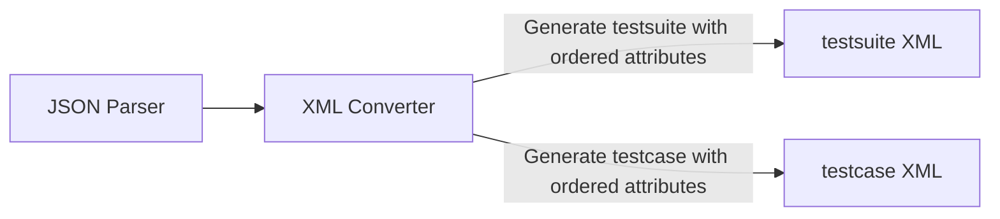
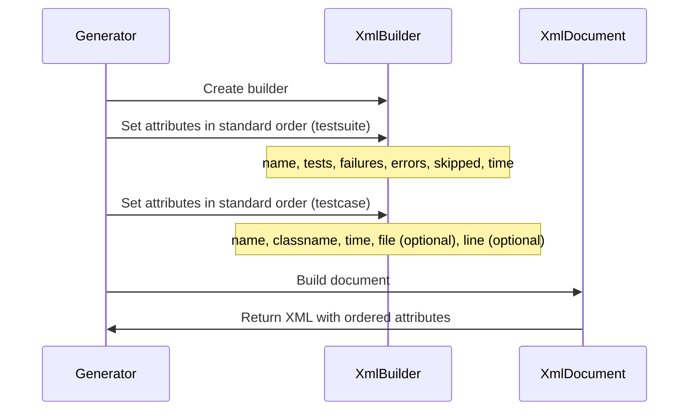

# Design Document

## Overview
XML属性の順序修正機能は、JUnit XMLの`<testsuite>`要素と`<testcase>`要素の属性を、testmoapp/junitxmlリポジトリで推奨される標準的な順序で出力する機能を追加します。これにより、CI/CDツールやテスト管理ツールとの互換性を向上させ、可読性を向上させます。

**Purpose**: JUnit XMLの属性を標準的な順序で出力することで、CI/CDツールやテスト管理ツールとの互換性を向上させ、可読性を向上させる。属性の値は変更せず、順序のみを修正する。
**Users**: Dart開発者が生成したJUnit XMLをCI/CDツールやテスト管理ツールで使用する場合に、標準的な形式に準拠したXMLを期待する。
**Impact**: XMLジェネレーターで属性を設定する順序を修正し、標準的なJUnit XML形式に準拠した出力を生成する。既存の属性の値は変更しない。

### Goals
- `<testsuite>`要素の属性を標準的な順序（`name`, `tests`, `failures`, `errors`, `skipped`, `time`, `timestamp`（オプション））で出力する
- `<testcase>`要素の属性を標準的な順序（`name`, `classname`, `time`, `file`（オプション）, `line`（オプション））で出力する
- xmlパッケージが属性の順序を保持することを確認する
- 属性の値は変更せず、順序のみを修正する
- 既存のCI/CDツールとの互換性を維持する
- パフォーマンスへの影響を最小化する

### Non-Goals
- 属性の値の変更（順序のみを修正）
- 新しい属性の追加（既存の属性のみを対象）
- XMLスキーマの変更（既存のスキーマを維持）
- 他のXML要素（failure、error、skipped等）の属性順序の変更（本機能では対象外）

## Architecture

### Existing Architecture Analysis
現在のアーキテクチャはレイヤードアーキテクチャを採用しており、以下の流れで処理が行われます：
1. **Input Layer**: JSON入力を読み込む
2. **Parser Layer**: JSONをDartTestResultに変換
3. **Converter Layer**: DartTestResultをJUnit XMLに変換
4. **Output Layer**: XMLを出力

現在、`DefaultJUnitXmlGenerator`クラスで`XmlBuilder`を使用してXMLを生成しています。属性は`builder.attribute()`メソッドで設定されますが、設定順序がXML出力に反映されるかどうかはxmlパッケージの実装に依存します。

### Architecture Pattern & Boundary Map
**Selected Pattern**: 既存のレイヤードアーキテクチャを維持し、Converter Layerのみを修正



**Architecture Integration**:
- パターン選択理由: 既存のアーキテクチャパターンを維持し、最小限の変更で機能を追加
- ドメイン境界: Converter Layerのみを修正し、他のレイヤーには影響を与えない
- 既存パターンの維持: レイヤードアーキテクチャ、エラーハンドリング、Result型パターンを維持
- 新規コンポーネントの理由: なし（既存のコンポーネントを修正）
- Steering compliance: レイヤードアーキテクチャ、単一責任の原則、依存関係の一方向性を維持

### Technology Stack
既存の技術スタックを維持します。追加の依存関係は不要です。

| Layer | Choice / Version | Role in Feature | Notes |
|-------|------------------|-----------------|-------|
| Converter | xml package 6.6.1+ | XML属性の順序制御とXML生成 | 既存のConverterを修正 |

## System Flows

### XML Attribute Ordering Flow



**Flow-level decisions**:
- 属性を設定する順序がXML出力に反映されることを確認する
- xmlパッケージが属性の順序を保持しない場合、代替手段を検討する
- 属性の値は変更せず、順序のみを修正する
- オプショナルな属性（`timestamp`、`file`、`line`）は、存在する場合のみ設定する

## Requirements Traceability

| Requirement | Summary | Components | Interfaces | Flows |
|-------------|---------|------------|------------|-------|
| 1.1-1.6 | testsuite要素の属性順序の修正 | DefaultJUnitXmlGenerator | - | XML Attribute Ordering Flow |
| 2.1-2.7 | testcase要素の属性順序の修正 | DefaultJUnitXmlGenerator | - | XML Attribute Ordering Flow |
| 3.1-3.5 | XML属性の順序制御の実装 | DefaultJUnitXmlGenerator | - | XML Attribute Ordering Flow |
| 4.1-4.5 | 後方互換性の維持 | DefaultJUnitXmlGenerator | - | XML Attribute Ordering Flow |
| 5.1-5.5 | テストと検証 | DefaultJUnitXmlGenerator, Test Suite | - | XML Attribute Ordering Flow |

## Components and Interfaces

### Converter Layer

#### DefaultJUnitXmlGenerator

| Field | Detail |
|-------|--------|
| Intent | JUnit XMLを生成し、属性を標準的な順序で出力する |
| Requirements | 1.1, 1.2, 1.3, 1.4, 1.5, 1.6, 2.1, 2.2, 2.3, 2.4, 2.5, 2.6, 2.7, 3.1, 3.2, 3.3, 3.4, 3.5 |
| Owner / Reviewers | - |

**Responsibilities & Constraints**
- `<testsuite>`要素の属性を標準的な順序で設定する
- `<testcase>`要素の属性を標準的な順序で設定する
- オプショナルな属性（`timestamp`、`file`、`line`）は、存在する場合のみ設定する
- 属性の値は変更せず、順序のみを修正する
- xmlパッケージが属性の順序を保持することを確認する

**Dependencies**
- Inbound: DartTestResult, TestCase, TestSuite — テスト結果モデル（P0）
- Outbound: XmlDocument — XMLドキュメント（P0）
- External: xml package — XML生成（P0）

**Contracts**: Service [ ]

##### Service Interface
```dart
abstract class JUnitXmlGenerator {
  /// Converts a DartTestResult to a JUnit XML document.
  XmlDocument convert(DartTestResult testResult);
}
```

- Preconditions:
  - `testResult`は有効なDartTestResultであること
- Postconditions:
  - `<testsuite>`要素の属性が標準的な順序で出力される
  - `<testcase>`要素の属性が標準的な順序で出力される
  - 属性の値は変更されない
- Invariants:
  - 既存のAPIインターフェースとの後方互換性を維持
  - 属性の値は変更しない

**Implementation Notes**
- `_buildTestSuite`メソッドで、属性を標準的な順序で設定する
  - 順序: `name`, `tests`, `failures`, `errors`, `skipped`, `time`, `timestamp`（オプション）
- `_buildTestCase`メソッドで、属性を標準的な順序で設定する
  - 順序: `name`, `classname`, `time`, `file`（オプション）, `line`（オプション）
- xmlパッケージの`XmlBuilder`が属性の順序を保持することを確認する
- 属性を設定する順序がXML出力に反映されることをテストで検証する
- オプショナルな属性は、存在する場合のみ設定する

## Data Models

### Domain Model
既存のデータモデルを維持します。変更はありません。

- `DartTestResult`: テスト結果のルートモデル
- `TestSuite`: テストスイートモデル（属性順序の変更は影響しない）
- `TestCase`: テストケースモデル（属性順序の変更は影響しない）

### Logical Data Model
既存の論理データモデルを維持します。変更はありません。

### Physical Data Model
XML出力の物理的な構造は変更されません。属性の順序のみが変更されます。

## Error Handling

### Error Strategy
既存のエラーハンドリング戦略を維持します。XML属性の順序修正は、属性の値に影響を与えないため、エラーハンドリングへの影響はありません。

### Error Categories and Responses
- **XML生成エラー**: xmlパッケージのエラーは既存のエラーハンドリングで処理される
- **属性順序の不一致**: テストで検証し、順序が正しくない場合はテストが失敗する

### Monitoring
既存のモニタリングを維持します。属性の順序修正は、パフォーマンスへの影響が最小限であるため、追加のモニタリングは不要です。

## Testing Strategy

### Unit Tests
- `<testsuite>`要素の属性順序の検証
  - 属性が`name`, `tests`, `failures`, `errors`, `skipped`, `time`の順序で出力されることを確認
  - `timestamp`属性が存在する場合、`time`属性の後に配置されることを確認
- `<testcase>`要素の属性順序の検証
  - 属性が`name`, `classname`, `time`の順序で出力されることを確認
  - `file`属性が存在する場合、`time`属性の後に配置されることを確認
  - `line`属性が存在する場合、`file`属性の後に配置されることを確認
  - `file`属性が存在せず`line`属性が存在する場合、`time`属性の後に`line`属性が配置されることを確認
- 属性の値が変更されないことを確認
  - 既存のテストケースで属性の値が変更されないことを確認

### Integration Tests
- 生成されたXMLファイルが既存のCI/CDツールで正常に処理されることを確認
- testmoapp/junitxmlリポジトリの例と比較して順序が一致することを確認

### Performance Tests
- 属性の順序修正がパフォーマンスに大きな影響を与えないことを確認（既存の処理時間の10%以内の増加）

## Performance & Scalability

### Target Metrics
- 属性の順序修正による処理時間の増加: 既存の処理時間の10%以内
- メモリ使用量: 既存と同等（属性の順序のみを変更するため、追加のメモリは不要）

### Optimization Techniques
- xmlパッケージの`XmlBuilder`を使用して属性を設定する順序を制御する
- 属性の順序を変更するだけで、追加の処理は不要

## Supporting References

### XML Attribute Ordering
- testmoapp/junitxmlリポジトリ: https://github.com/testmoapp/junitxml
- Dart xmlパッケージのドキュメント: xmlパッケージが属性の順序を保持するかどうかを確認する必要がある

