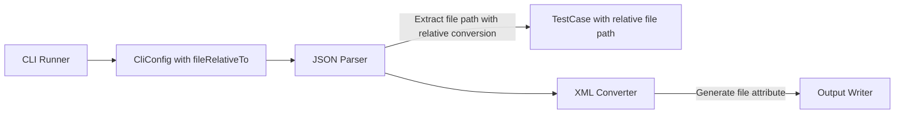
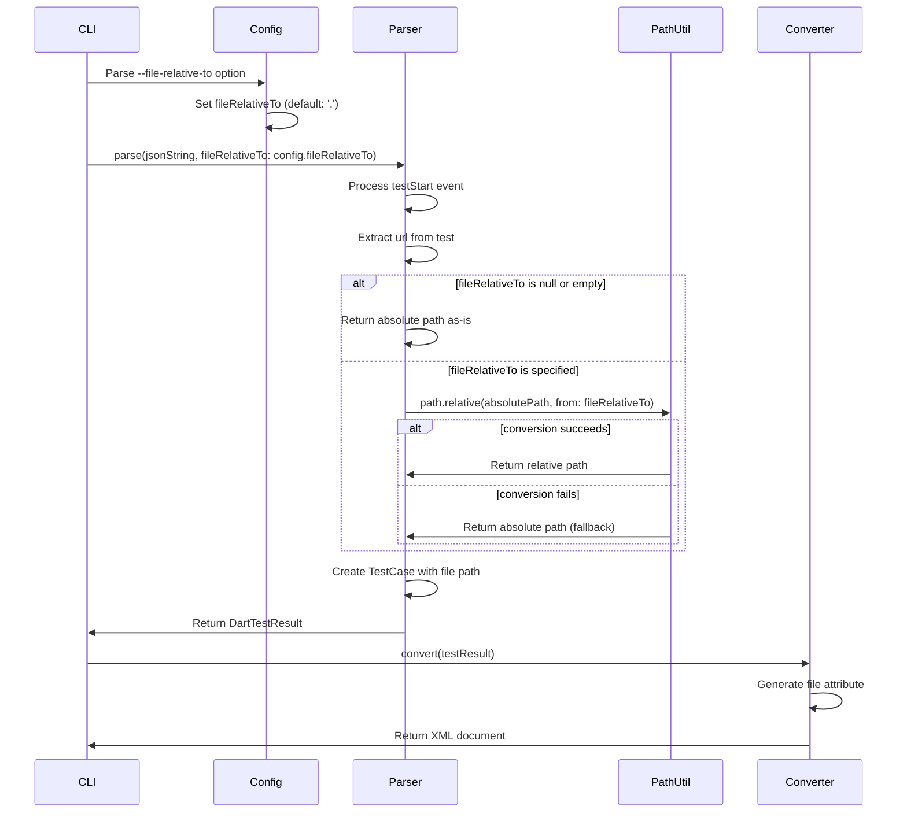
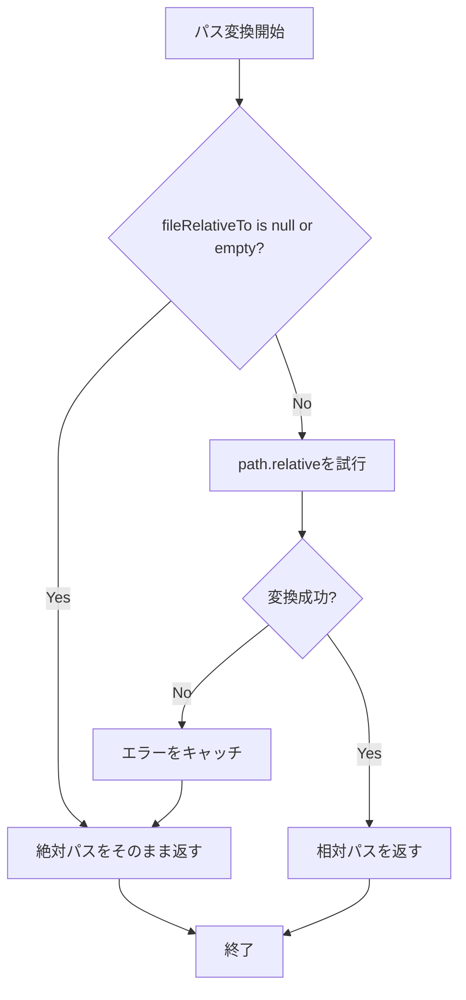

# Design Document

## Overview
file-relative-path-option機能は、CLIに`--file-relative-to`オプションを追加し、JUnit XML出力の`file`属性を指定したディレクトリからの相対パスとして出力できるようにする機能です。これにより、CI/CDツールでテストケースのソースファイル位置を相対パス形式で確認できるようになります。

**Purpose**: file属性を相対パス形式で出力し、CI/CDツールでのテスト結果の可視化とデバッグを向上させる。ユーザーが基準ディレクトリを指定することで、プロジェクトルートからの相対パスとして出力できる。
**Users**: Dart開発者とDevOpsエンジニアがCI/CDパイプライン内で相対パス形式のfile属性を取得する。
**Impact**: CLIに`--file-relative-to`オプションを追加し、パーサーで`path.relative`を使用して絶対パスを相対パスに変換する。

### Goals
- CLIに`--file-relative-to`オプション（短縮形: `-r`）を追加する
- `CliConfig`に`fileRelativeTo`フィールドを追加する
- パーサーの`parse`メソッドに`fileRelativeTo`パラメータを追加する
- `_extractFilePathFromUrl`メソッドで`path.relative`を使用して相対パスに変換する
- 既存のAPIインターフェースとの後方互換性を維持する

### Non-Goals
- file属性の自動検出と変換（ユーザーが明示的にオプションを指定する必要がある）
- 複数の基準ディレクトリのサポート（単一の基準ディレクトリのみ）
- パス変換の失敗時のエラー報告（エラー時は絶対パスをそのまま返す）

## Architecture

### Existing Architecture Analysis
現在のアーキテクチャはレイヤードアーキテクチャを採用しており、以下の流れで処理が行われます：
1. **CLI Layer**: コマンドライン引数を解析し、`CliConfig`を作成
2. **Parser Layer**: JSONをDartTestResultに変換し、`_extractFilePathFromUrl`でファイルパスを抽出
3. **Converter Layer**: DartTestResultをJUnit XMLに変換
4. **Output Layer**: XMLを出力

現在、`_extractFilePathFromUrl`メソッドは絶対パスをそのまま返しています。本機能では、`fileRelativeTo`設定に基づいて`path.relative`を使用して相対パスに変換します。

### Architecture Pattern & Boundary Map
**Selected Pattern**: 既存のレイヤードアーキテクチャを維持し、CLI LayerとParser Layerに機能を追加



**Architecture Integration**:
- パターン選択理由: 既存のアーキテクチャパターンを維持し、最小限の変更で機能を追加
- ドメイン境界: CLI Layerでオプションを解析し、Parser Layerでパス変換を実行
- 既存パターンの維持: レイヤードアーキテクチャ、エラーハンドリング、Result型パターンを維持
- 新規コンポーネントの理由: `fileRelativeTo`設定をCLIからパーサーに渡すためのパラメータ追加
- Steering compliance: レイヤードアーキテクチャ、単一責任の原則、依存関係の一方向性を維持

### Technology Stack
既存の技術スタックを維持します。追加の依存関係として`path`パッケージを使用します。

| Layer | Choice / Version | Role in Feature | Notes |
|-------|------------------|-----------------|-------|
| CLI | Dart SDK 3.8+ | `--file-relative-to`オプションの解析 | 既存のCLIを拡張 |
| Parser | Dart SDK 3.8+ | `path.relative`を使用した相対パス変換 | 既存のParserを拡張 |
| path package | path package | `path.relative`メソッドの提供 | 既存の依存関係 |

## System Flows

### File Relative Path Conversion Flow



**Flow-level decisions**:
- CLIで`--file-relative-to`オプションを解析し、`CliConfig`に設定
- `CliConfig`から`fileRelativeTo`を取得し、パーサーの`parse`メソッドに渡す
- `_extractFilePathFromUrl`メソッド内で、`fileRelativeTo`が`null`または空文字列の場合は絶対パスをそのまま返す
- `fileRelativeTo`が指定されている場合、`path.relative(absolutePath, from: fileRelativeTo)`を使用して相対パスに変換
- `path.relative`が例外を投げる場合、エラーをキャッチし、絶対パスをそのまま返す（フォールバック）

## Requirements Traceability

| Requirement | Summary | Components | Interfaces | Flows |
|-------------|---------|------------|------------|-------|
| 1.1-1.10 | CLIオプションの追加 | DefaultCliRunner, CliConfig | _createArgParser, _buildConfig | File Relative Path Conversion Flow |
| 2.1-2.6 | CliConfigへの設定追加 | CliConfig | CliConfig constructor | File Relative Path Conversion Flow |
| 3.1-3.10 | パーサーでの相対パス変換処理 | DefaultDartTestParser | parse method, _extractFilePathFromUrl | File Relative Path Conversion Flow |
| 4.1-4.11 | 相対パス変換ロジックの実装 | DefaultDartTestParser | _extractFilePathFromUrl | File Relative Path Conversion Flow |
| 5.1-5.7 | 後方互換性の維持 | DefaultCliRunner, DefaultDartTestParser | - | File Relative Path Conversion Flow |
| 6.1-6.10 | エッジケースの処理 | DefaultDartTestParser | _extractFilePathFromUrl | File Relative Path Conversion Flow |
| 7.1-7.10 | テストと検証 | Test files | - | File Relative Path Conversion Flow |

## Components and Interfaces

### CLI Layer

#### DefaultCliRunner

| Field | Detail |
|-------|--------|
| Intent | CLI引数を解析し、`--file-relative-to`オプションを処理する |
| Requirements | 1.1, 1.2, 1.3, 1.4, 1.5, 1.6, 1.7, 1.8, 1.9, 1.10 |
| Owner / Reviewers | - |

**Responsibilities & Constraints**
- `--file-relative-to`オプション（短縮形: `-r`）を解析する
- デフォルト値として`'.'`を設定する
- `CliConfig`に`fileRelativeTo`値を設定する
- パーサーの`parse`メソッドに`fileRelativeTo`を渡す

**Dependencies**
- Inbound: CliConfig — CLI設定（P0）
- Outbound: DartTestParser — JSONパーサー（P0）

**Contracts**: Service [ ]

##### Service Interface
```dart
class DefaultCliRunner implements CliRunner {
  Future<int> run(List<String> arguments) async {
    // ...
    final config = _buildConfig(results);
    // ...
    final parseResult = parser.parse(
      jsonString,
      errorReporter: errorReporter,
      fileRelativeTo: config.fileRelativeTo,  // 新規追加
    );
    // ...
  }

  ArgParser _createArgParser() {
    return ArgParser()
      // ... 既存のオプション
      ..addOption(
        'file-relative-to',
        abbr: 'r',
        help: "the relative path to calculate the path defined in the 'file' element in the test from",
        defaultsTo: '.',
      );
  }

  CliConfig _buildConfig(ArgResults results) {
    return CliConfig(
      // ... 既存のフィールド
      fileRelativeTo: results['file-relative-to'] as String?,
    );
  }
}
```

- Preconditions:
  - `--file-relative-to`オプションが指定されていない場合、デフォルト値（`'.'`）が使用される
- Postconditions:
  - `CliConfig`に`fileRelativeTo`が設定される
  - パーサーの`parse`メソッドに`fileRelativeTo`が渡される
- Invariants:
  - 既存のオプションとの互換性を維持

**Implementation Notes**
- `_createArgParser`メソッドに`--file-relative-to`オプションを追加
- `_buildConfig`メソッドで`fileRelativeTo`を設定
- `_runConversion`メソッドでパーサーの`parse`メソッドに`fileRelativeTo`を渡す

#### CliConfig

| Field | Detail |
|-------|--------|
| Intent | CLI設定を保持し、`fileRelativeTo`フィールドを追加する |
| Requirements | 2.1, 2.2, 2.3, 2.4, 2.5, 2.6 |
| Owner / Reviewers | - |

**Responsibilities & Constraints**
- `fileRelativeTo`フィールド（`String?`型）を保持する
- デフォルト値として`'.'`を設定する
- `toString`メソッドに`fileRelativeTo`を含める

**Dependencies**
- Inbound: なし
- Outbound: DefaultCliRunner — CLIランナー（P0）

**Contracts**: Data Model [ ]

##### Data Model Interface
```dart
class CliConfig {
  const CliConfig({
    this.inputPath,
    this.outputPath,
    this.showHelp = false,
    this.showVersion = false,
    this.debugMode = false,
    this.fileRelativeTo = '.',  // 新規追加: デフォルト値は'.'
  });

  final String? inputPath;
  final String? outputPath;
  final bool showHelp;
  final bool showVersion;
  final bool debugMode;
  final String? fileRelativeTo;  // 新規追加

  @override
  String toString() =>
      'CliConfig('
      'input: ${inputPath ?? "stdin"}, '
      'output: ${outputPath ?? "stdout"}, '
      'debug: $debugMode, '
      'fileRelativeTo: ${fileRelativeTo ?? "null"}'
      ')';
}
```

- Preconditions:
  - `fileRelativeTo`が`null`または空文字列の場合、絶対パスを維持するモードとして扱う（後方互換性のため）
- Postconditions:
  - `fileRelativeTo`が設定される
- Invariants:
  - 既存のフィールドとの後方互換性を維持

**Implementation Notes**
- `fileRelativeTo`フィールドをオプショナルパラメータとして追加（デフォルト値: `'.'`）
- `toString`メソッドに`fileRelativeTo`を含める

### Parser Layer

#### DefaultDartTestParser

| Field | Detail |
|-------|--------|
| Intent | JSONをパースし、`fileRelativeTo`設定に基づいてfile属性を相対パスに変換する |
| Requirements | 3.1, 3.2, 3.3, 3.4, 3.5, 3.6, 3.7, 3.8, 3.9, 3.10, 4.1, 4.2, 4.3, 4.4, 4.5, 4.6, 4.7, 4.8, 4.9, 4.10, 4.11 |
| Owner / Reviewers | - |

**Responsibilities & Constraints**
- `parse`メソッドに`fileRelativeTo`パラメータを追加する（オプショナル、デフォルト: `null`）
- `_extractFilePathFromUrl`メソッドで`fileRelativeTo`を使用して相対パスに変換する
- `fileRelativeTo`が`null`または空文字列の場合、絶対パスをそのまま返す
- `path.relative`を使用して相対パスに変換する
- 変換に失敗した場合、エラーを発生させず、絶対パスをそのまま返す

**Dependencies**
- Inbound: ErrorReporter（オプショナル）— デバッグログの出力（P1）
- Outbound: DartTestResult, TestCase, TestSuite — テスト結果モデル（P0）
- External: dart:convert — JSONパース（P0）
- External: dart:io — URI処理（P0）
- External: path package — `path.relative`メソッド（P0）

**Contracts**: Service [ ]

##### Service Interface
```dart
abstract class DartTestParser {
  /// Parses a JSON string into a DartTestResult.
  Result<DartTestResult, ParseError> parse(
    String jsonString, {
    ErrorReporter? errorReporter,
    String? fileRelativeTo,  // 新規追加: オプショナル、デフォルト: null
  });
}

class DefaultDartTestParser implements DartTestParser {
  @override
  Result<DartTestResult, ParseError> parse(
    String jsonString, {
    ErrorReporter? errorReporter,
    String? fileRelativeTo,  // 新規追加
  }) {
    // ...
    final file = _extractFilePathFromUrl(url, fileRelativeTo);  // fileRelativeToを渡す
    // ...
  }

  String? _extractFilePathFromUrl(String? url, String? fileRelativeTo) {
    if (url == null || url.isEmpty) {
      return null;
    }

    // Only process file:// URIs
    if (!url.startsWith('file://')) {
      return null;
    }

    try {
      final uri = Uri.parse(url);
      if (uri.scheme != 'file') {
        return null;
      }

      // Get the file path from URI
      final absolutePath = uri.toFilePath(windows: Platform.isWindows);

      // Convert to relative path if fileRelativeTo is specified
      if (fileRelativeTo != null && fileRelativeTo.isNotEmpty) {
        try {
          return p.relative(absolutePath, from: fileRelativeTo);
        } catch (e) {
          // If conversion fails, return absolute path as fallback
          return absolutePath;
        }
      }

      // Return absolute path if fileRelativeTo is not specified
      return absolutePath;
    } catch (e) {
      // If URI parsing fails, return null
      return null;
    }
  }
}
```

- Preconditions:
  - `jsonString`は有効なJSON文字列であること
  - `fileRelativeTo`が`null`の場合、絶対パスをそのまま返す（後方互換性）
- Postconditions:
  - `fileRelativeTo`が指定されている場合、相対パスが生成される
  - `fileRelativeTo`が`null`または空文字列の場合、絶対パスがそのまま返される
- Invariants:
  - 既存のAPIインターフェースとの後方互換性を維持（`fileRelativeTo`はオプショナル）

**Implementation Notes**
- `parse`メソッドに`fileRelativeTo`パラメータを追加（オプショナル、デフォルト: `null`）
- `_extractFilePathFromUrl`メソッドのシグネチャを変更し、`fileRelativeTo`パラメータを追加
- `path.relative(absolutePath, from: fileRelativeTo)`を使用して相対パスに変換
- `path.relative`が例外を投げる場合、エラーをキャッチし、絶対パスをそのまま返す
- `fileRelativeTo`が`null`または空文字列の場合、絶対パスをそのまま返す
- `_processTestStartEvent`メソッドで`_extractFilePathFromUrl`を呼び出す際に`fileRelativeTo`を渡す

## Data Models

### Domain Model
`CliConfig`モデルに`fileRelativeTo`フィールド（`String?`型）を追加します。

### Logical Data Model
**変更内容**: `CliConfig`モデルに`fileRelativeTo`フィールドを追加

```dart
class CliConfig {
  final String? inputPath;
  final String? outputPath;
  final bool showHelp;
  final bool showVersion;
  final bool debugMode;
  final String? fileRelativeTo;  // 新規追加
}
```

### Physical Data Model
**該当なし**: 永続化層は存在しません。

### Data Contracts & Integration
**CLI引数構造**:
- `--file-relative-to`オプション: 文字列値を受け取る（デフォルト値: `'.'`）
- `-r`短縮形: `--file-relative-to`と同じ

**後方互換性**:
- `--file-relative-to`オプションが指定されていない場合、デフォルト値（`'.'`）が使用される
- APIインターフェースで`fileRelativeTo`パラメータが指定されない場合、デフォルト値（`null`）が使用され、絶対パスが維持される

## Error Handling

### Error Strategy
パス変換処理はエラーを発生させません。以下の場合でも正常に処理されます：
- `fileRelativeTo`が`null`または空文字列の場合（絶対パスをそのまま返す）
- `path.relative`が例外を投げる場合（絶対パスをそのまま返す）
- 異なるドライブのWindowsパスの場合（絶対パスをそのまま返す）

### Error Categories and Responses
**Path Conversion Errors**:
- `path.relative`が例外を投げる場合: エラーをキャッチし、絶対パスをそのまま返す
- 異なるドライブのWindowsパスの場合: 絶対パスをそのまま返す
- `fileRelativeTo`が存在しないディレクトリを参照している場合: エラーを発生させず、パス変換を試みる

**Process Flow**:


### Monitoring
デバッグモードが有効な場合、パス変換の状況をログ出力することも可能ですが、現時点では実装しません（要件外）。

## Testing Strategy

### Unit Tests
1. **CLIオプションの解析**
   - `--file-relative-to`オプションが正しく解析されることを確認
   - `-r`短縮形が正しく解析されることを確認
   - デフォルト値（`'.'`）が設定されることを確認
   - `CliConfig`に`fileRelativeTo`が設定されることを確認

2. **パーサーでの相対パス変換**
   - `fileRelativeTo`が指定されている場合、相対パスが生成されることを確認
   - `fileRelativeTo`が`null`の場合、絶対パスが維持されることを確認
   - `fileRelativeTo`が空文字列の場合、絶対パスが維持されることを確認
   - `fileRelativeTo`が`'.'`の場合、現在のワーキングディレクトリを基準とした相対パスが生成されることを確認
   - `path.relative`が正しく使用されることを確認
   - 異なるプラットフォーム（Windows、Unix/Linux）での動作を確認
   - エッジケース（異なるドライブ、ルートパス、存在しないディレクトリ等）を確認

3. **後方互換性**
   - `fileRelativeTo`パラメータが指定されない場合、絶対パスが維持されることを確認
   - 既存のテストケースの動作に影響がないことを確認

### Integration Tests
1. **エンドツーエンドテスト: 相対パス変換**
   - `--file-relative-to`オプションを指定した場合、XML出力の`file`属性が相対パスになることを確認
   - `--file-relative-to`オプションを指定しない場合、XML出力の`file`属性が絶対パスになることを確認
   - 複数のテストケースがある場合、それぞれのテストケースに正しい相対パスが設定されることを確認

2. **CLI統合テスト: オプションの処理**
   - `--file-relative-to`オプションを含むCLIコマンドが正常に実行されることを確認
   - 既存のCI/CDツールとの互換性を確認

### Performance Tests
1. **大規模テストスイートでのパフォーマンス**
   - 10,000件のテストケースで`path.relative`を使用した場合の処理時間を測定
   - パス変換によるオーバーヘッドが最小限であることを確認
   - メモリ使用量が適切に管理されることを確認

## Optional Sections

### Backward Compatibility
既存のAPIインターフェースを維持するため、`parse`メソッドにオプショナルパラメータ`fileRelativeTo`を追加します。これにより：
- 既存のコードは変更なしで動作する（`fileRelativeTo`は`null`のまま、絶対パスを維持）
- 新しいコードは`fileRelativeTo`を設定することで相対パスを生成できる
- CLIで`--file-relative-to`オプションを指定しない場合、デフォルト値（`'.'`）が使用される

### Migration Strategy
**該当なし**: 既存のコードへの変更は不要です。新機能はオプショナルな動作として追加されます。

