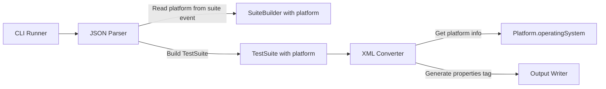
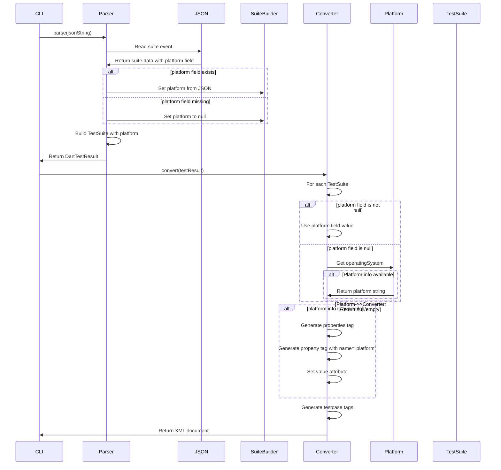

# Design Document

## Overview
testsuite-properties-platform機能は、JUnit XMLの`<testsuite>`要素に`<properties>`タグを追加し、`platform`プロパティを出力する機能を追加します。これにより、CI/CDツールでテストスイートの実行プラットフォーム情報を確認できるようになります。

**Purpose**: テストスイートの実行プラットフォーム情報をJUnit XMLに含め、CI/CDツールでの環境情報の可視性を向上させる。
**Users**: Dart開発者がテストスイートの実行プラットフォーム情報をCI/CDレポートで確認したい場合に使用する。
**Impact**: TestSuiteモデルにplatformフィールドを追加し、XMLジェネレーターで`<properties>`タグを生成する。

### Goals
- TestSuiteモデルに`platform`フィールドを追加する
- JUnit XMLの`<testsuite>`要素内に`<properties>`タグを生成する
- `<property name="platform" value="...">`を生成する
- プラットフォーム情報を`Platform.operatingSystem`から取得する
- 既存のAPIインターフェースとの後方互換性を維持する
- パフォーマンスへの影響を最小化する

### Non-Goals
- 他のプロパティの追加（platformプロパティのみ）
- プラットフォーム情報のカスタマイズ機能（標準的な`Platform.operatingSystem`のみ）
- プラットフォーム情報の検証機能（取得できない場合は無視）

## Architecture

### Existing Architecture Analysis
現在のアーキテクチャはレイヤードアーキテクチャを採用しており、以下の流れで処理が行われます：
1. **Input Layer**: JSON入力を読み込む
2. **Parser Layer**: JSONをDartTestResultに変換
3. **Converter Layer**: DartTestResultをJUnit XMLに変換
4. **Output Layer**: XMLを出力

properties機能の処理は**Parser Layer**、**Models Layer**、**Converter Layer**で実装します。Parser Layerでsuiteイベントからplatform情報を読み取り、Models Layerでplatformフィールドを追加し、Converter LayerでXMLタグを生成します。

### Architecture Pattern & Boundary Map
**Selected Pattern**: 既存のレイヤードアーキテクチャを維持し、Parser Layer、Models Layer、Converter Layerに機能を追加



**Architecture Integration**:
- パターン選択理由: 既存のアーキテクチャパターンを維持し、最小限の変更で機能を追加
- ドメイン境界: Parser Layerでsuiteイベントからplatform情報を読み取り、Models Layerでplatformフィールドを追加、Converter LayerでXML生成時にプラットフォーム情報を取得
- 既存パターンの維持: レイヤードアーキテクチャ、エラーハンドリング、Result型パターンを維持
- 新規コンポーネントの理由: なし（既存のコンポーネントを拡張）
- Steering compliance: レイヤードアーキテクチャ、単一責任の原則、依存関係の一方向性を維持

### Technology Stack
既存の技術スタックを維持します。追加の依存関係は不要です。

| Layer | Choice / Version | Role in Feature | Notes |
|-------|------------------|-----------------|-------|
| Parser | Dart SDK 3.8+ | suiteイベントからplatform情報を読み取り | 既存のParserを拡張 |
| Models | Dart SDK 3.8+ | TestSuiteモデルにplatformフィールドを追加 | 既存のモデルを拡張 |
| Converter | xml package, dart:io | propertiesタグの生成とプラットフォーム情報の取得 | 既存のConverterを拡張 |

## System Flows

### Platform Information Processing Flow



**Flow-level decisions**:
- パーサーでsuiteイベントの`platform`フィールドを読み取り、TestSuiteに設定
- platformフィールドがnullの場合、XML生成時に`Platform.operatingSystem`を使用して動的に取得
- プラットフォーム情報が取得できない場合、`<properties>`タグを生成しない
- `<properties>`タグは`<testcase>`要素の前に配置（JUnit XMLスキーマ準拠）
- `<property>`タグには`name="platform"`属性と`value`属性を設定
- XMLエスケープはxmlパッケージが自動的に処理

## Requirements Traceability

| Requirement | Summary | Components | Interfaces | Flows |
|-------------|---------|------------|------------|-------|
| 1.1 | TestSuiteにplatformフィールド追加 | TestSuite | TestSuite constructor | Properties Tag Generation Flow |
| 1.2-1.7 | platformフィールドの動作 | TestSuite | - | Properties Tag Generation Flow |
| 2.1-2.8 | propertiesタグの生成 | DefaultJUnitXmlGenerator | - | Properties Tag Generation Flow |
| 3.1-3.7 | プラットフォーム情報の取得 | DefaultDartTestParser, DefaultJUnitXmlGenerator | Platform.operatingSystem | Properties Tag Generation Flow |
| 4.1-4.6 | 後方互換性の維持 | DefaultDartTestParser, DefaultJUnitXmlGenerator, TestSuite | - | Properties Tag Generation Flow |
| 5.1-5.7 | テストと検証 | DefaultDartTestParser, DefaultJUnitXmlGenerator, Test Suite | - | Properties Tag Generation Flow |

## Components and Interfaces

### Models Layer

#### TestSuite

| Field | Detail |
|-------|--------|
| Intent | テストスイートを表現し、platform情報を保持する |
| Requirements | 1.1, 1.2, 1.3, 1.4, 1.5, 1.6 |
| Owner / Reviewers | - |

**Responsibilities & Constraints**
- テストスイートの基本情報（name、testCases、time）を保持する
- オプショナルな`platform`フィールドでプラットフォーム情報を保持する
- `platform`がnullの場合、従来通り動作する

**Dependencies**
- Inbound: なし
- Outbound: TestCase — テストケースのリスト（P0）

**Contracts**: Data Model [ ]

##### Data Model Interface
```dart
class TestSuite {
  const TestSuite({
    required this.name,
    required this.testCases,
    required this.time,
    this.systemOut,
    this.systemErr,
    this.platform,  // 新規追加: オプショナル
  });

  final String name;
  final List<TestCase> testCases;
  final Duration time;
  final String? systemOut;
  final String? systemErr;
  final String? platform;  // 新規追加
}
```

- Preconditions:
  - `name`、`testCases`、`time`は必須
  - `platform`はオプショナル（null可）
- Postconditions:
  - `platform`がnullでない場合、プラットフォーム情報（例: "vm", "chrome", "linux", "macos", "windows"）を含む
- Invariants:
  - 既存のAPIインターフェースとの後方互換性を維持（platformはオプショナル）

**Implementation Notes**
- `platform`フィールドをオプショナルパラメータとして追加
- `equals`、`hashCode`、`toString`メソッドに`platform`を含める必要がある
- 空文字列も有効な値として扱う（nullと区別）

### Parser Layer

#### DefaultDartTestParser

| Field | Detail |
|-------|--------|
| Intent | DartテストJSONをパースし、suiteイベントからplatform情報を取得してTestSuiteに設定する |
| Requirements | 3.1, 3.2 |
| Owner / Reviewers | - |

**Responsibilities & Constraints**
- JSONイベントをパースし、DartTestResultを生成する
- `suite`イベントを処理し、`platform`フィールドを読み取る
- `platform`フィールドが存在する場合、`_SuiteBuilder`に設定する
- `platform`フィールドが存在しない場合、nullのままにする

**Dependencies**
- Inbound: ErrorReporter（オプショナル）— デバッグログの出力（P1）
- Outbound: DartTestResult, TestCase, TestSuite — テスト結果モデル（P0）
- External: dart:convert — JSONパース（P0）

**Contracts**: Service [ ]

##### Service Interface
```dart
abstract class DartTestParser {
  /// Parses a JSON string into a DartTestResult.
  Result<DartTestResult, ParseError> parse(
    String jsonString, {
    ErrorReporter? errorReporter,
    String? fileRelativeTo,
  });
}
```

- Preconditions:
  - `jsonString`は有効なJSON文字列であること
- Postconditions:
  - suiteイベントに`platform`フィールドが含まれている場合、TestSuiteの`platform`フィールドに設定される
  - suiteイベントに`platform`フィールドが含まれていない場合、`platform`はnullのまま
- Invariants:
  - 既存のAPIインターフェースとの後方互換性を維持

**Implementation Notes**
- `_processSuiteEvent`メソッドでsuiteイベントの`platform`フィールドを読み取る
- `_SuiteBuilder`クラスに`platform`フィールドを追加
- `_buildResult`メソッドでTestSuiteを作成する際、`platform`を設定

#### _SuiteBuilder

| Field | Detail |
|-------|--------|
| Intent | テストスイート構築中の情報を保持し、platform情報を保持する |
| Requirements | 3.1, 3.2 |
| Owner / Reviewers | - |

**Responsibilities & Constraints**
- テストスイートの構築中にplatform情報を保持する

**Dependencies**
- Inbound: なし
- Outbound: TestCase — テストケースのリスト（P0）

**Implementation Notes**
- `platform`フィールドを`String?`型で追加
- suiteイベントから`platform`を読み取って設定

### Converter Layer

#### DefaultJUnitXmlGenerator

| Field | Detail |
|-------|--------|
| Intent | DartTestResultをJUnit XMLに変換し、propertiesタグを生成する |
| Requirements | 2.1, 2.2, 2.3, 2.4, 2.5, 2.6, 2.7, 2.8, 3.1, 3.2, 3.3, 3.4, 3.5 |
| Owner / Reviewers | - |

**Responsibilities & Constraints**
- TestSuiteの`platform`フィールドがnullでない場合、その値を使用して`<properties>`タグを生成する
- `platform`フィールドがnullの場合、`Platform.operatingSystem`を使用して動的に取得する
- プラットフォーム情報が取得できない場合、`<properties>`タグを生成しない
- `<properties>`タグを`<testcase>`要素の前に配置する
- XMLエスケープ（&lt;, &gt;, &amp;等）を適切に処理する

**Dependencies**
- Inbound: DartTestResult, TestSuite — テスト結果モデル（P0）
- Outbound: XmlDocument — XMLドキュメント（P0）
- External: xml package — XML生成（P0）
- External: dart:io — プラットフォーム情報の取得（P0）

**Contracts**: Service [ ]

##### Service Interface
```dart
abstract class JUnitXmlGenerator {
  /// Converts a DartTestResult to a JUnit XML document.
  XmlDocument convert(DartTestResult testResult);
}
```

- Preconditions:
  - `testResult`は有効なDartTestResultであること
- Postconditions:
  - プラットフォーム情報が取得可能な場合、`<properties>`タグが生成される
  - XMLエスケープが適切に処理される
- Invariants:
  - 既存のAPIインターフェースとの後方互換性を維持

**Implementation Notes**
- `_buildTestSuite`メソッド内で、`testcase`要素の前に`properties`タグを生成
- `platform`フィールドがnullの場合、`Platform.operatingSystem`を使用して動的に取得
- プラットフォーム情報が空文字列の場合、`<properties>`タグを生成しない
- `xml`パッケージの`XmlBuilder`を使用してXMLエスケープを自動処理
- `builder.element()`と`builder.attribute()`メソッドを使用してXMLを生成

##### Platform Information Retrieval
```dart
String? _getPlatformInfo(TestSuite suite) {
  // Use platform field if available
  if (suite.platform != null && suite.platform!.isNotEmpty) {
    return suite.platform;
  }
  
  // Try to get platform info dynamically
  try {
    final platform = Platform.operatingSystem;
    return platform.isNotEmpty ? platform : null;
  } catch (e) {
    // Platform info not available (e.g., Web environment)
    return null;
  }
}
```

## Data Models

### Domain Model
TestSuiteモデルに`platform`フィールド（String?型）を追加します。

### Logical Data Model
**変更内容**: TestSuiteモデルに`platform`フィールドを追加

```dart
class TestSuite {
  final String name;
  final List<TestCase> testCases;
  final Duration time;
  final String? systemOut;
  final String? systemErr;
  final String? platform;  // 新規追加
}
```

### Physical Data Model
**該当なし**: 永続化層は存在しません。

### Data Contracts & Integration
**プラットフォーム情報の形式**:
- JSONのsuiteイベントの`platform`フィールド: "vm", "chrome"など（Dartテストフレームワークが提供する値）
- `Platform.operatingSystem`が返す値: "linux", "macos", "windows", "android", "ios", "fuchsia"
- これらの値はそのまま使用する（変換なし）

**JSONイベント構造**:
- `suite`イベントの構造:
  ```json
  {
    "type": "suite",
    "suite": {
      "id": 0,
      "platform": "vm",
      "path": "test/example_test.dart"
    },
    "time": 0
  }
  ```
- `platform`フィールドはオプショナル（存在しない場合もある）

**JUnit XML構造**:
```xml
<testsuite name="..." tests="..." failures="..." errors="..." skipped="..." time="...">
  <properties>
    <property name="platform" value="linux"/>
  </properties>
  <testcase .../>
  ...
</testsuite>
```

**後方互換性**:
- `platform`フィールドがnullの場合、プラットフォーム情報が取得可能であれば動的に取得
- プラットフォーム情報が取得できない場合、`<properties>`タグを生成しない
- 既存のXML出力との互換性を維持（`<properties>`タグが追加されるのみ）

## Error Handling

### Error Strategy
プラットフォーム情報の取得はエラーを発生させません。以下の場合でも正常に処理されます：
- `Platform.operatingSystem`が例外をスローする場合（例: Web環境）
- プラットフォーム情報が空文字列の場合
- `platform`フィールドがnullの場合

これらの場合、`<properties>`タグを生成せず、エラーを発生させません。

### Error Categories and Responses
**プラットフォーム情報取得エラー**: 
- `Platform.operatingSystem`が例外をスローする場合、try-catchで捕捉し、nullを返す
- `<properties>`タグを生成しない（エラーを発生させない）

### Monitoring
デバッグモードが有効な場合、プラットフォーム情報の取得状況をログ出力することも可能ですが、現時点では実装しません（要件外）。

## Testing Strategy

### Unit Tests
1. **TestSuiteモデルのplatformフィールド**
   - `platform`がnullの場合の動作を確認
   - `platform`が空文字列の場合の動作を確認
   - `platform`が有効な値の場合の動作を確認
   - `equals`、`hashCode`、`toString`に`platform`が含まれることを確認

2. **XMLジェネレーターでのpropertiesタグ生成**
   - `platform`フィールドがnullでない場合、`<properties>`タグが生成されることを確認
   - `platform`フィールドがnullの場合、`Platform.operatingSystem`を使用して動的に取得することを確認
   - プラットフォーム情報が取得可能な場合、`<properties>`タグが生成されることを確認
   - プラットフォーム情報が取得できない場合、`<properties>`タグが生成されないことを確認
   - `platform`が空文字列の場合、`<properties>`タグが生成されないことを確認
   - XMLエスケープが適切に処理されることを確認（&lt;, &gt;, &amp;等）
   - `<properties>`タグが`<testcase>`要素の前に配置されることを確認
   - `<property>`タグが`name="platform"`属性と適切な`value`属性を持つことを確認

3. **プラットフォーム情報の取得**
   - `Platform.operatingSystem`が正常に取得できる場合の動作を確認
   - `Platform.operatingSystem`が例外をスローする場合の動作を確認（Web環境のシミュレーション）
   - プラットフォーム情報が空文字列の場合の動作を確認

4. **後方互換性**
   - `platform`フィールドがnullの場合、既存の動作に影響がないことを確認
   - 既存のテストケースの動作に影響がないことを確認
   - 既存の`<testcase>`要素、`<system-out>`要素、`<system-err>`要素の生成に影響がないことを確認

5. **パフォーマンス**
   - プラットフォーム情報の取得がパフォーマンスに大きな影響を与えないことを確認（既存の処理時間の5%以内の増加）

### Integration Tests
1. **エンドツーエンドテスト: propertiesタグの生成**
   - プラットフォーム情報が取得可能な場合、XML出力に`<properties>`タグが含まれることを確認
   - 複数のテストスイートがある場合、それぞれのスイートに`<properties>`タグが生成されることを確認
   - `<properties>`タグが`<testcase>`要素の前に配置されることを確認

2. **CLI統合テスト: プラットフォーム情報の処理**
   - プラットフォーム情報を含むXMLが正常に生成されることを確認
   - 既存のCI/CDツールとの互換性を確認

### Performance Tests
1. **大規模テストスイートでのパフォーマンス**
   - 10,000件のテストケースがある場合の処理時間を測定
   - プラットフォーム情報の取得によるオーバーヘッドが最小限であることを確認（既存の処理時間の5%以内の増加）
   - メモリ使用量が適切に管理されることを確認

## Optional Sections

### Backward Compatibility
既存のAPIインターフェースを維持するため、`TestSuite`コンストラクタにオプショナルパラメータ`platform`を追加します。これにより：
- 既存のコードは変更なしで動作する（`platform`はnullのまま）
- 新しいコードは`platform`を設定することでプラットフォーム情報を保持できる
- デフォルトの動作（`platform`なし）では、プラットフォーム情報が取得可能な場合のみ`<properties>`タグが生成される

### Migration Strategy
**該当なし**: 既存のコードへの変更は不要です。新機能はオプショナルな動作として追加されます。

## Supporting References

### JUnit XML Properties
- JUnit XML標準: `<properties>`タグは`<testsuite>`要素の子要素として配置される
- `<property>`タグは`name`と`value`属性を持つ
- 参考: https://github.com/testmoapp/junitxml

### Dart Platform Information
- `Platform.operatingSystem`: Dartの標準ライブラリでプラットフォーム情報を取得
- 返り値: "linux", "macos", "windows", "android", "ios", "fuchsia"
- Web環境では例外がスローされる可能性がある

