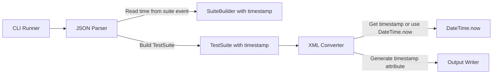
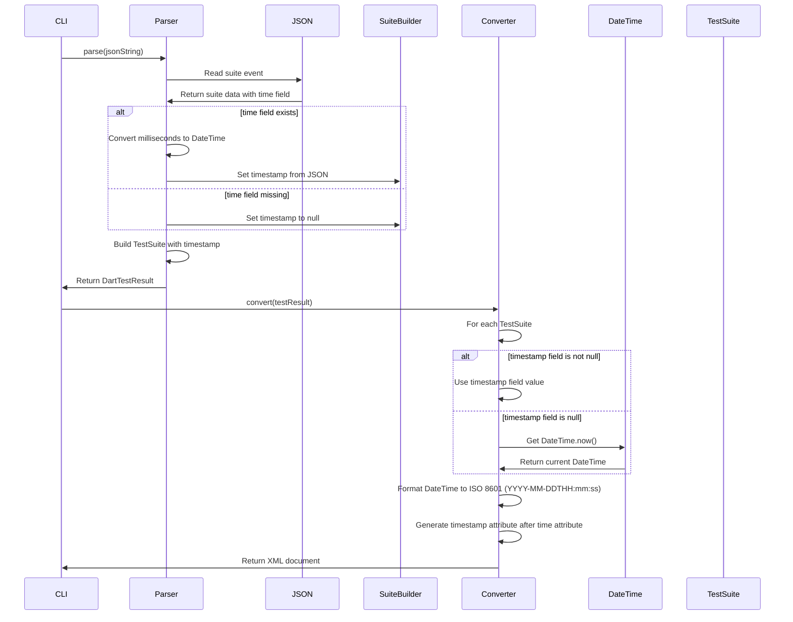

# Design Document

## Overview
testsuite-timestamp-attribute機能は、JUnit XMLの`<testsuite>`要素に`timestamp`属性を追加し、テストスイートの実行開始時刻をISO 8601形式（`YYYY-MM-DDTHH:mm:ss`、タイムゾーンなし）で出力する機能を追加します。これにより、CI/CDツールでテストスイートの実行開始時刻を確認できるようになります。

**Purpose**: テストスイートの実行開始時刻をJUnit XMLに含め、CI/CDツールでのタイムスタンプ情報の可視性を向上させる。
**Users**: Dart開発者がテストスイートの実行開始時刻をCI/CDレポートで確認したい場合に使用する。
**Impact**: TestSuiteモデルにtimestampフィールドを追加し、XMLジェネレーターで`timestamp`属性を生成する。

### Goals
- TestSuiteモデルに`timestamp`フィールドを追加する
- JUnit XMLの`<testsuite>`要素に`timestamp`属性を生成する
- `timestamp`属性を`time`属性の後に配置する（JUnit XML標準スキーマに準拠）
- ISO 8601形式（`YYYY-MM-DDTHH:mm:ss`、タイムゾーンなし）で出力する
- JSONのsuiteイベントからタイムスタンプ情報を取得する
- 既存のAPIインターフェースとの後方互換性を維持する
- パフォーマンスへの影響を最小化する

### Non-Goals
- タイムゾーン情報の出力（タイムゾーンなしの形式のみ）
- ミリ秒単位の精度（秒単位まで）
- タイムスタンプの検証機能（取得できない場合は現在時刻を使用）

## Architecture

### Existing Architecture Analysis
現在のアーキテクチャはレイヤードアーキテクチャを採用しており、以下の流れで処理が行われます：
1. **Input Layer**: JSON入力を読み込む
2. **Parser Layer**: JSONをDartTestResultに変換
3. **Converter Layer**: DartTestResultをJUnit XMLに変換
4. **Output Layer**: XMLを出力

timestamp機能の処理は**Parser Layer**、**Models Layer**、**Converter Layer**で実装します。Parser Layerでsuiteイベントからtime情報を読み取り、Models Layerでtimestampフィールドを追加し、Converter LayerでXML属性を生成します。

### Architecture Pattern & Boundary Map
**Selected Pattern**: 既存のレイヤードアーキテクチャを維持し、Parser Layer、Models Layer、Converter Layerに機能を追加



**Architecture Integration**:
- パターン選択理由: 既存のアーキテクチャパターンを維持し、最小限の変更で機能を追加
- ドメイン境界: Parser Layerでsuiteイベントからtime情報を読み取り、Models Layerでtimestampフィールドを追加、Converter LayerでXML生成時にタイムスタンプ情報を取得
- 既存パターンの維持: レイヤードアーキテクチャ、エラーハンドリング、Result型パターンを維持
- 新規コンポーネントの理由: なし（既存のコンポーネントを拡張）
- Steering compliance: レイヤードアーキテクチャ、単一責任の原則、依存関係の一方向性を維持

### Technology Stack
既存の技術スタックを維持します。追加の依存関係は不要です。

| Layer | Choice / Version | Role in Feature | Notes |
|-------|------------------|-----------------|-------|
| Parser | Dart SDK 3.8+ | suiteイベントからtime情報を読み取り、DateTimeに変換 | 既存のParserを拡張 |
| Models | Dart SDK 3.8+ | TestSuiteモデルにtimestampフィールドを追加 | 既存のモデルを拡張 |
| Converter | xml package, dart:core | timestamp属性の生成とタイムスタンプ情報の取得 | 既存のConverterを拡張 |

## System Flows

### Timestamp Processing Flow



## Requirements Traceability

| Requirement | Summary | Components | Interfaces | Flows |
|-------------|---------|------------|------------|-------|
| 1.1 | TestSuiteにtimestampフィールドを追加 | TestSuite | - | - |
| 1.2 | timestampがnullの場合の後方互換性 | TestSuite | - | - |
| 1.3 | JSONからtimestamp情報を取得 | DefaultDartTestParser | - | Timestamp Processing Flow |
| 1.4 | timestampパラメータをオプショナルとして受け入れる | TestSuite | - | - |
| 1.5 | timestampがnullの場合の動的取得 | DefaultJUnitXmlGenerator | - | Timestamp Processing Flow |
| 2.1 | timestamp属性をtime属性の後に配置 | DefaultJUnitXmlGenerator | - | Timestamp Processing Flow |
| 2.2 | timestamp属性をISO 8601形式で出力 | DefaultJUnitXmlGenerator | - | Timestamp Processing Flow |
| 2.3 | timestampがnullの場合の動的取得 | DefaultJUnitXmlGenerator | - | Timestamp Processing Flow |
| 2.4 | timestamp属性のフォーマット | DefaultJUnitXmlGenerator | - | Timestamp Processing Flow |
| 2.5 | 秒単位まで正確に出力 | DefaultJUnitXmlGenerator | - | Timestamp Processing Flow |
| 2.6 | CI/CDツールとの互換性 | DefaultJUnitXmlGenerator | - | - |
| 3.1 | JSONのtimeフィールドからDateTimeに変換 | DefaultDartTestParser | - | Timestamp Processing Flow |
| 3.2 | timeフィールドがない場合の処理 | DefaultDartTestParser | - | Timestamp Processing Flow |
| 3.3 | DateTime.now()を使用 | DefaultJUnitXmlGenerator | - | Timestamp Processing Flow |
| 3.4 | ISO 8601形式への変換 | DefaultJUnitXmlGenerator | - | Timestamp Processing Flow |
| 3.5 | タイムスタンプ取得失敗時の処理 | DefaultJUnitXmlGenerator | - | Timestamp Processing Flow |
| 3.6 | パフォーマンスへの影響 | DefaultJUnitXmlGenerator | - | - |
| 4.1-4.6 | 後方互換性の維持 | All | - | - |
| 5.1-5.7 | テストと検証 | Test Suite | - | - |

## Components and Interfaces

| Component | Domain/Layer | Intent | Req Coverage | Key Dependencies (P0/P1) | Contracts |
|-----------|--------------|--------|--------------|--------------------------|-----------|
| TestSuite | Models | テストスイートのドメインモデル | 1.1-1.5 | - | State |
| DefaultDartTestParser | Parser | JSONイベントからTestSuiteを構築 | 1.3, 3.1, 3.2 | TestSuite (P0) | Service |
| DefaultJUnitXmlGenerator | Converter | TestSuiteからJUnit XMLを生成 | 2.1-2.6, 3.3-3.6 | TestSuite (P0), dart:core (P0) | Service |

### Models Layer

#### TestSuite

| Field | Detail |
|-------|--------|
| Intent | テストスイートのドメインモデルにtimestampフィールドを追加 |
| Requirements | 1.1, 1.2, 1.4 |

**Responsibilities & Constraints**
- テストスイートの実行開始時刻を保持する
- timestampフィールドはオプショナル（null可能）
- timestampフィールドがnullの場合でも既存の動作を維持する

**Dependencies**
- Inbound: DefaultDartTestParser — timestamp情報の設定 (P0)
- Outbound: DefaultJUnitXmlGenerator — timestamp情報の取得 (P0)

**Contracts**: State [✓]

##### State Management
- State model: TestSuiteは不変（immutable）オブジェクトとして設計
- Persistence & consistency: 永続化層なし、メモリ内でのみ保持
- Concurrency strategy: 単一スレッドでの処理を想定

**Implementation Notes**
- Integration: TestSuiteコンストラクタに`DateTime? timestamp`パラメータを追加
- Validation: timestampフィールドはnullまたは有効なDateTime値を受け入れる
- Risks: timestampフィールドの追加により、equals/hashCodeメソッドの更新が必要

### Parser Layer

#### DefaultDartTestParser

| Field | Detail |
|-------|--------|
| Intent | JSONイベントからTestSuiteを構築（timestampフィールドは常にnull） |
| Requirements | - |

**Responsibilities & Constraints**
- TestSuiteのtimestampフィールドは常にnullのままにする
- timestamp情報はXML生成時に動的に取得される

**Dependencies**
- Inbound: JSONイベント — suiteイベントの読み取り (P0)
- Outbound: TestSuite — timestamp情報は設定しない（常にnull）(P0)

**Contracts**: Service [✓]

##### Service Interface
```dart
// 既存のインターフェースを拡張（変更なし）
Result<DartTestResult, ParseError> parse(String jsonString);
```

- Preconditions: jsonStringは有効なJSON形式であること
- Postconditions: パース成功時、TestSuiteのtimestampフィールドはnullのまま
- Invariants: timestampフィールドは常にnull

**Implementation Notes**
- Integration: `_processSuiteEvent`メソッドではtimestamp情報を設定しない
- Validation: なし（timestampはXML生成時に動的に取得される）
- Risks: なし

### Converter Layer

#### DefaultJUnitXmlGenerator

| Field | Detail |
|-------|--------|
| Intent | TestSuiteのtimestamp情報を取得し、ISO 8601形式でXML属性として出力 |
| Requirements | 2.1-2.6, 3.3-3.6 |

**Responsibilities & Constraints**
- TestSuiteのtimestampフィールドを取得する
- timestampフィールドがnullの場合、以下の優先順位でタイムスタンプを取得する:
  - `--timestamp`オプションが指定されている場合:
    - `now`が指定されている場合、現在時刻（`DateTime.now()`）を使用する
    - `none`が指定されている場合、timestamp属性を生成しない
    - `yyyy-MM-ddTHH:mm:ss`形式の文字列が指定されている場合、その値をDateTimeに変換して使用する
  - `--timestamp`オプションが指定されていない場合:
    - `--input`オプションが使われている場合、そのファイルの変更日時を使用する
    - それ以外の場合、`DateTime.now()`を使用して現在時刻を取得する
- DateTimeをISO 8601形式（`YYYY-MM-DDTHH:mm:ss`、タイムゾーンなし）に変換する
- `timestamp`属性を`time`属性の後に配置する

**Dependencies**
- Inbound: TestSuite — timestamp情報の取得 (P0)
- Inbound: CliRunner — inputPath情報とtimestampOption情報の取得 (P0)
- Outbound: XmlBuilder — XML属性の生成 (P0)
- External: dart:core — DateTime.now()の使用 (P0)
- External: dart:io — File.stat()の使用（ファイル変更日時の取得）(P0)

**Contracts**: Service [✓]

##### Service Interface
```dart
// 既存のインターフェースを拡張（inputPathとtimestampOptionパラメータを追加）
XmlDocument convert(
  DartTestResult testResult, {
  String? inputPath,
  String? timestampOption,
});
```

- Preconditions: testResultは有効なDartTestResultであること、timestampOptionは`now`、`none`、または`yyyy-MM-ddTHH:mm:ss`形式の文字列であること
- Postconditions: 生成されたXMLに`timestamp`属性が含まれる（timestamp情報が取得可能で、`timestampOption`が`none`でない場合）
- Invariants: `timestamp`属性は`time`属性の後に配置される

**Implementation Notes**
- Integration: `_buildTestSuite`メソッドで`time`属性の後に`timestamp`属性を追加
- Integration: CliRunnerからinputPathとtimestampOptionを渡し、`_getTimestamp`メソッドでタイムスタンプを取得
- Integration: timestampOptionが`none`の場合、timestamp属性を生成しない
- Validation: timestamp情報を取得できない場合（例: Web環境、ファイルが存在しない）でもエラーを発生させず、フォールバック処理を実行
- Validation: timestampOptionに無効な値が指定された場合、エラーメッセージを表示し、処理を終了する
- Risks: ファイルの変更日時取得がパフォーマンスに影響を与える可能性があるが、XML生成時に1回のみ呼び出されるため影響は最小限

## Data Models

### Domain Model
TestSuiteエンティティに`timestamp`フィールドを追加します。このフィールドはオプショナルで、テストスイートの実行開始時刻を表します。

### Logical Data Model

**Structure Definition**:
- TestSuiteエンティティに`DateTime? timestamp`フィールドを追加
- timestampフィールドはnull可能で、テストスイートの実行開始時刻を表す
- timestampフィールドがnullの場合は、XML生成時に現在時刻を使用する

**Consistency & Integrity**:
- timestampフィールドは不変（immutable）で、TestSuiteオブジェクトの作成時に設定される
- timestampフィールドの値は有効なDateTime値またはnullである必要がある

### Data Contracts & Integration

**JSONイベント構造**:
- suiteイベントの`time`フィールドはミリ秒単位のタイムスタンプ（整数）として解釈される
- `time`フィールドが存在しない場合、timestampフィールドはnullのままになる

**XML出力構造**:
- `<testsuite>`要素の`timestamp`属性はISO 8601形式（`YYYY-MM-DDTHH:mm:ss`、タイムゾーンなし）で出力される
- `timestamp`属性は`time`属性の後に配置される

## Error Handling

### Error Strategy
タイムスタンプ情報の取得と変換におけるエラーハンドリングは、既存のエラーハンドリングパターンに従います。

### Error Categories and Responses
**User Errors** (4xx): 該当なし（入力エラーは既存のパーサーで処理）

**System Errors** (5xx): 
- DateTime変換エラー: `time`フィールドの値が無効な場合、エラーを発生させず、timestampフィールドをnullのままにする
- DateTime.now()取得エラー: Web環境などで`DateTime.now()`が取得できない場合、エラーを発生させず、timestamp属性を生成しない

**Business Logic Errors** (422): 該当なし

### Monitoring
タイムスタンプ情報の取得と変換に関するエラーは、既存のエラーレポート機能を使用して記録されます。

## Testing Strategy

### Unit Tests
- TestSuiteモデルのtimestampフィールドの追加を検証
- DefaultDartTestParserのsuiteイベントからのtimestamp取得を検証
- DefaultJUnitXmlGeneratorのtimestamp属性生成を検証
- DateTimeのISO 8601形式への変換を検証
- timestampフィールドがnullの場合の動的取得を検証

### Integration Tests
- JSONイベントからXML出力までのエンドツーエンドフローを検証
- timestamp属性が`time`属性の後に配置されることを検証
- timestamp属性のフォーマットが正しいことを検証

### Performance Tests
- timestamp情報の取得と変換がパフォーマンスに大きな影響を与えないことを検証（既存の処理時間の5%以内の増加）

## Supporting References

### DateTimeフォーマット仕様
Dartの`DateTime`型をISO 8601形式（`YYYY-MM-DDTHH:mm:ss`、タイムゾーンなし）に変換するには、以下のようなフォーマット関数を使用します：

```dart
String _formatTimestamp(DateTime dateTime) {
  final year = dateTime.year.toString().padLeft(4, '0');
  final month = dateTime.month.toString().padLeft(2, '0');
  final day = dateTime.day.toString().padLeft(2, '0');
  final hour = dateTime.hour.toString().padLeft(2, '0');
  final minute = dateTime.minute.toString().padLeft(2, '0');
  final second = dateTime.second.toString().padLeft(2, '0');
  return '$year-$month-${day}T$hour:$minute:$second';
}
```

この関数は、DateTimeオブジェクトを`YYYY-MM-DDTHH:mm:ss`形式の文字列に変換します。タイムゾーン情報は含まれません。

