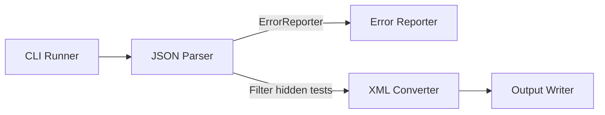
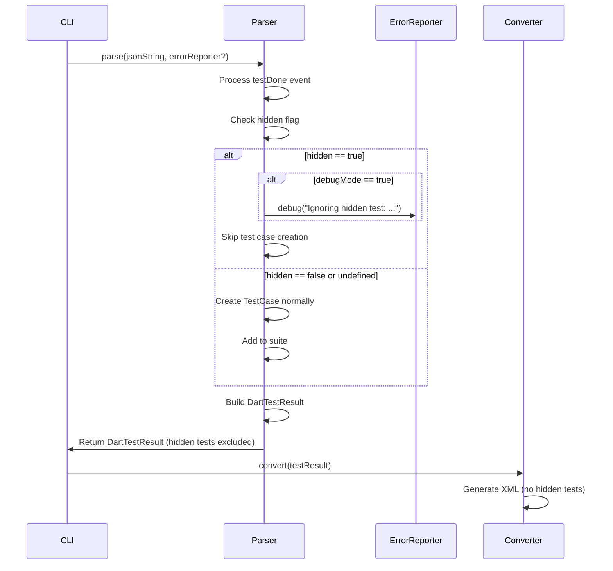

# Design Document

## Overview
hidden-flag-support機能は、DartテストJSON出力の`hidden`フラグが`true`の場合に、そのテストケースを完全に無視する機能を追加します。これにより、hiddenテストがJUnit XMLに含まれず、統計情報からも除外されます。

**Purpose**: hiddenテストをJUnit XMLから除外し、CI/CDツールでのテストレポートをクリーンに保つ。
**Users**: Dart開発者がhiddenテストをCI/CDレポートから除外したい場合に使用する。
**Impact**: パーサー段階でhiddenテストをフィルタリングし、後続の処理（変換、出力）に影響を与えない。

### Goals
- hiddenフラグが`true`のテストケースをパース段階で完全に無視する
- デバッグモード時のみログを出力し、通常モードではサイレントに処理する
- 統計情報（totalTests、failures等）からhiddenテストを除外する
- 既存のAPIインターフェースとの後方互換性を維持する

### Non-Goals
- hiddenフラグの設定や変更機能（読み取り専用）
- hiddenテストの統計情報を別途出力する機能
- hiddenフラグ以外のフィルタリング機能

## Architecture

### Existing Architecture Analysis
現在のアーキテクチャはレイヤードアーキテクチャを採用しており、以下の流れで処理が行われます：
1. **Input Layer**: JSON入力を読み込む
2. **Parser Layer**: JSONをDartTestResultに変換
3. **Converter Layer**: DartTestResultをJUnit XMLに変換
4. **Output Layer**: XMLを出力

hiddenフラグの処理は**Parser Layer**で実装します。これにより、hiddenテストは後続の処理（Converter、Output）に到達しません。

### Architecture Pattern & Boundary Map
**Selected Pattern**: 既存のレイヤードアーキテクチャを維持し、Parser Layerにフィルタリング機能を追加



**Architecture Integration**:
- パターン選択理由: 既存のアーキテクチャパターンを維持し、最小限の変更で機能を追加
- ドメイン境界: Parser Layer内でhiddenフラグの処理を完結させ、他のレイヤーに影響を与えない
- 既存パターンの維持: レイヤードアーキテクチャ、エラーハンドリング、Result型パターンを維持
- 新規コンポーネントの理由: ErrorReporterをParserに注入することで、ログ出力を可能にする
- Steering compliance: レイヤードアーキテクチャ、単一責任の原則、依存関係の一方向性を維持

### Technology Stack
既存の技術スタックを維持します。追加の依存関係は不要です。

| Layer | Choice / Version | Role in Feature | Notes |
|-------|------------------|-----------------|-------|
| Parser | Dart SDK 3.8+ | hiddenフラグの検出とフィルタリング | 既存のParserを拡張 |
| Error Reporting | ErrorReporter interface | デバッグログの出力 | 既存のErrorReporterを使用 |

## System Flows

### Hidden Flag Processing Flow



**Flow-level decisions**:
- hiddenフラグのチェックは`_processTestDoneEvent`メソッド内で実施
- hiddenテストはTestCaseオブジェクトを作成せず、スイートに追加しない
- デバッグログはErrorReporterが有効な場合のみ出力
- 統計情報の計算は既存の`_buildResult`メソッドで自動的に除外される（TestCaseが存在しないため）

## Requirements Traceability

| Requirement | Summary | Components | Interfaces | Flows |
|-------------|---------|------------|------------|-------|
| 1.1 | hiddenフラグの検出 | DefaultDartTestParser | DartTestParser.parse() | Hidden Flag Processing Flow |
| 1.2 | テストケースの完全スキップ | DefaultDartTestParser._processTestDoneEvent() | - | Hidden Flag Processing Flow |
| 1.3 | 従来通りの処理（hidden=false） | DefaultDartTestParser._processTestDoneEvent() | - | Hidden Flag Processing Flow |
| 1.4 | hiddenとskippedの優先順位 | DefaultDartTestParser._processTestDoneEvent() | - | Hidden Flag Processing Flow |
| 2.1 | デバッグログの出力 | DefaultDartTestParser, ErrorReporter | ErrorReporter.debug() | Hidden Flag Processing Flow |
| 2.2 | ログメッセージの形式 | DefaultDartTestParser | ErrorReporter.debug() | Hidden Flag Processing Flow |
| 3.1-3.4 | 統計情報からの除外 | DefaultDartTestParser._buildResult() | - | Hidden Flag Processing Flow |
| 3.5 | 空のテストスイートの処理 | DefaultDartTestParser._buildResult() | - | Hidden Flag Processing Flow |
| 4.1-4.5 | XML変換時の除外 | DefaultJUnitXmlGenerator | - | Hidden Flag Processing Flow |
| 5.1-5.5 | 後方互換性の維持 | DefaultDartTestParser | DartTestParser.parse() | Hidden Flag Processing Flow |

## Components and Interfaces

### Parser Layer

#### DefaultDartTestParser

| Field | Detail |
|-------|--------|
| Intent | DartテストJSONをパースし、hiddenフラグが`true`のテストケースを除外する |
| Requirements | 1.1, 1.2, 1.3, 1.4, 2.1, 2.2, 3.1-3.5, 5.1-5.5 |
| Owner / Reviewers | - |

**Responsibilities & Constraints**
- JSONイベントをパースし、DartTestResultを生成する
- `testDone`イベントで`hidden`フラグをチェックし、`true`の場合はTestCaseを作成しない
- hiddenテストを検出した場合、デバッグモードが有効な場合のみログを出力する
- hiddenフラグが`false`、`null`、または未定義の場合は従来通り処理する
- hiddenフラグがboolean以外の型の場合は`false`として扱う

**Dependencies**
- Inbound: ErrorReporter（オプショナル）— デバッグログの出力（P1）
- Outbound: DartTestResult, TestCase, TestSuite — テスト結果モデル（P0）
- External: dart:convert — JSONパース（P0）

**Contracts**: Service [ ]

##### Service Interface
```dart
abstract class DartTestParser {
  /// Parses a JSON string into a DartTestResult.
  /// 
  /// [errorReporter] is optional and used for debug logging when hidden tests are detected.
  Result<DartTestResult, ParseError> parse(
    String jsonString, {
    ErrorReporter? errorReporter,
  });
}
```

- Preconditions:
  - `jsonString`は有効なJSON文字列であること
- Postconditions:
  - hiddenフラグが`true`のテストケースはDartTestResultに含まれない
  - デバッグモードが有効な場合、hiddenテストのログが出力される
- Invariants:
  - 既存のAPIインターフェースとの後方互換性を維持（errorReporterはオプショナル）

**Implementation Notes**
- `_processTestDoneEvent`メソッド内でhiddenフラグをチェック
- hiddenフラグが`true`の場合、TestCaseを作成せず、早期リターン
- hiddenフラグの型チェック: `event['hidden'] as bool? ?? false`
- ログメッセージ形式: `"Ignoring hidden test: ${testInfo.suiteName}::${testInfo.name}"`
- ErrorReporterが提供され、デバッグモードが有効な場合のみログを出力
- 既存の`parse(String jsonString)`メソッドは後方互換性のため維持（errorReporterなしで呼び出し可能）

## Data Models

### Domain Model
既存のデータモデル（DartTestResult、TestSuite、TestCase）は変更しません。hiddenテストはTestCaseオブジェクトとして作成されないため、既存のモデルで自然に除外されます。

### Logical Data Model
**変更なし**: 既存のデータモデルを維持します。

### Physical Data Model
**該当なし**: 永続化層は存在しません。

### Data Contracts & Integration
**JSONイベント構造**:
- `testDone`イベントに`hidden`フィールドが追加される可能性がある
- `hidden`フィールドの型: `boolean | null | undefined`
- `hidden`が`true`の場合、そのテストケースは無視される

**後方互換性**:
- `hidden`フィールドが存在しないJSONも正常に処理される
- `hidden`が`false`または`null`の場合は従来通り処理される
- `hidden`がboolean以外の型の場合は`false`として扱われる

## Error Handling

### Error Strategy
hiddenフラグの処理はエラーを発生させません。以下の場合でも正常に処理されます：
- `hidden`フィールドが存在しない
- `hidden`が`null`
- `hidden`がboolean以外の型（`false`として扱う）

### Error Categories and Responses
**該当なし**: hiddenフラグの処理はエラーを発生させない設計です。

### Monitoring
デバッグモードが有効な場合、hiddenテストが検出された際にログが出力されます。これにより、処理の可視性が確保されます。

## Testing Strategy

### Unit Tests
1. **hiddenフラグが`true`の場合のテストケース除外**
   - `testDone`イベントで`hidden: true`のテストケースが除外されることを確認
   - TestCaseオブジェクトが作成されないことを確認

2. **hiddenフラグが`false`の場合の通常処理**
   - `hidden: false`のテストケースが通常通り処理されることを確認

3. **hiddenフラグが未指定の場合の通常処理**
   - `hidden`フィールドが存在しない場合、通常通り処理されることを確認

4. **hiddenフラグがboolean以外の型の場合**
   - `hidden`が文字列、数値等の場合、`false`として扱われることを確認

5. **hiddenとskippedの両方が`true`の場合**
   - hiddenフラグが優先され、テストケースが除外されることを確認

6. **デバッグログの出力**
   - ErrorReporterが提供され、デバッグモードが有効な場合のみログが出力されることを確認
   - ログメッセージの形式が正しいことを確認

7. **統計情報からの除外**
   - hiddenテストがtotalTests、failures、errors、skipped、実行時間から除外されることを確認

8. **すべてのテストがhiddenの場合**
   - 空のテストスイートとして扱われ、エラーが発生しないことを確認

### Integration Tests
1. **エンドツーエンドテスト: hiddenテストの除外**
   - JSON入力にhiddenテストが含まれる場合、XML出力に含まれないことを確認
   - 統計情報が正確に反映されることを確認

2. **CLI統合テスト: デバッグモード**
   - `--debug`フラグ付きで実行した場合、hiddenテストのログが出力されることを確認
   - デバッグモードなしの場合、ログが出力されないことを確認

### Performance Tests
1. **大規模テストスイートでのパフォーマンス**
   - 10,000件のテストケースのうち、一部がhiddenの場合の処理時間を測定
   - hiddenテストの除外によるオーバーヘッドが最小限であることを確認

## Optional Sections

### Backward Compatibility
既存のAPIインターフェースを維持するため、`DartTestParser.parse()`メソッドにオプショナルパラメータ`errorReporter`を追加します。これにより：
- 既存のコードは変更なしで動作する
- 新しいコードはErrorReporterを渡すことでデバッグログを有効化できる
- デフォルトの動作（errorReporterなし）ではログを出力しない

### Migration Strategy
**該当なし**: 既存のコードへの変更は不要です。新機能はオプショナルな動作として追加されます。

